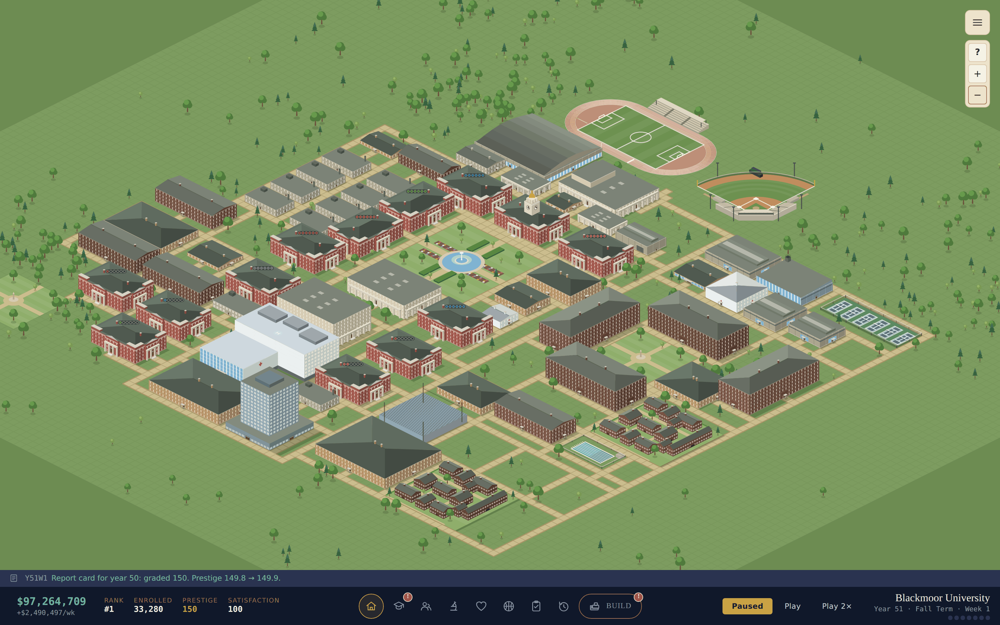
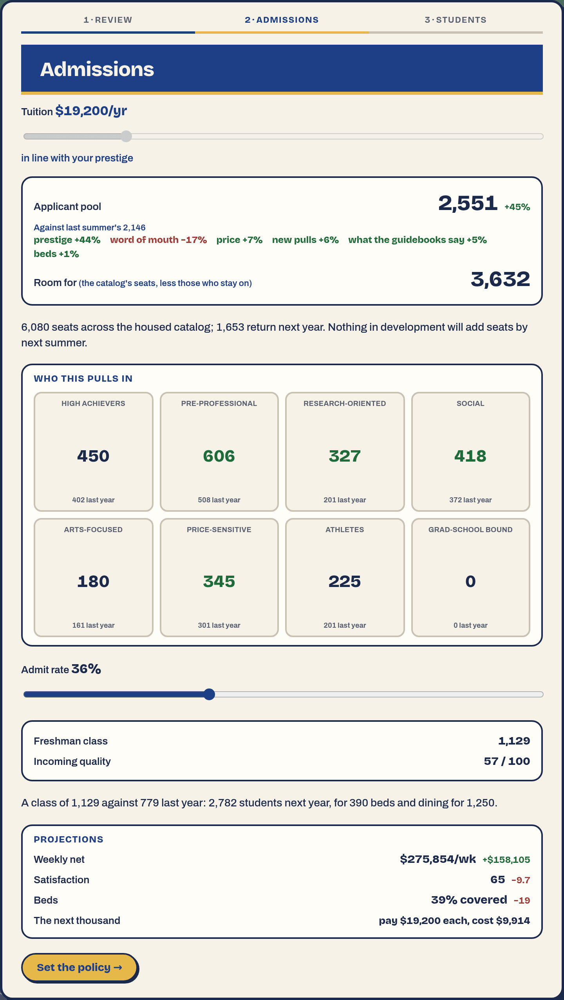

# UniSchool



A university management simulation about building an institution from a small
college into a major university.

Develop academic programs, hire faculty, expand your campus, attract students,
conduct research, and shape your institution over decades. UniSchool is
inspired by the long-term building and management loops of Cities: Skylines,
RollerCoaster Tycoon, Civilization and Football Manager, with a particular
focus on the feeling of watching an institution grow. There is no win
condition — it is an indefinite sandbox that tapers once the curriculum is
built out and the rankings are topped.

**Status:** in active development ·
**Stack:** React + TypeScript + Vite ·
**Genre:** university management / simulation ·
**Perspective:** campus map + full-screen management interfaces

## What you do

- 🏫 **Expand the campus** with academic buildings, dormitories, dining,
  recreation, health facilities and athletics venues.
- 📚 **Develop the curriculum** across 421 courses, 42 majors and seven
  schools.
- 👩‍🏫 **Hire faculty** with different teaching and research strengths — and
  decide who teaches what.
- 🔬 **Conduct research** by commissioning a topic, a team and a depth out of a
  specific facility, producing publications, breakthroughs and prizes.
- 🎓 **Manage admissions** once a year, setting tuition and selectivity and
  living with the class those two decisions draw.
- 🏛️ **Develop student life** through clubs, Greek life, varsity athletics and
  the facilities they need.
- 📈 **Build prestige** over decades through academic breadth, teaching
  quality, student quality, research, campus life and financial resources.
- ⚖️ **Deal with the unexpected** — donor offers, faculty departures, facility
  failures, chapter scandals and student demands.

## The core loop

```
        Develop programs & facilities
                    ↓
        Prestige is graded each summer
                    ↓
        Attract more / better students
                    ↓
              Tuition revenue
                    ↓
        Expand campus & capabilities
                    ↺
```

Growth is slow on purpose: prestige is a stock graded once a year, stepping
toward what the school earned that year — slowly up, faster down — rather
than a tally that jumps when something finishes, so standing is earned over
decades and can be lost. The freshman class cannot exceed the seats the
catalogue has room to teach; everything else — beds, dining, health — is
crowding, which costs standing and students rather than capping them.

Money is the pacing mechanism, and cost leads revenue — every commitment is
charged up front while every payoff waits for the next summer admissions
boundary, and what a section, a service and a salary cost rises with the
school's standing. A cash shortfall stalls expansion; it never ends the run.

<p align="center">
  
</p>

<p align="center"><em>The summer decision: set a price blind, see the pool it
drew, then choose how much of it to admit.</em></p>

## Current state

UniSchool is a playable, systems-first prototype. The core simulation is
implemented: curriculum development and the milestone chain, campus
construction on a tile map, faculty hiring and course assignment, annual
admissions, finances, student life and athletics, research, prestige and
rankings, decision events, graduate programs, and save/load.

The current focus is presentation and player experience — the campus map,
the management interfaces, curriculum presentation, faculty interaction and
the research systems. There is no art pipeline yet; everything on screen is
drawn from data.

## Run it

```bash
cd unischool
npm install
npm run dev
```

Open the printed localhost URL. Name your school, pick private or public, and
start the clock.

## Controls

| Key | Action |
| --- | --- |
| `W` `A` `S` `D`, arrows | Pan the camera |
| Middle mouse drag | Pan |
| Scroll / pinch, `+` `−` | Zoom |
| `Space` | Pause / resume |
| `1` `2` | Game speed |
| `P` | Path tool |
| `R` | Rotate the picked-up building |
| `Esc` | Back / close |
| `Enter` | Dismiss the interrupt on screen |
| `C` `F` `L` | Curriculum, Faculty, Student Life |

`src/components/hotkeys.ts` is the source of truth for how these behave; see
[docs/architecture/ui-shell.md](docs/architecture/ui-shell.md).

## Architecture

UniSchool uses a data-driven simulation architecture:

- A central **`GameState`** is the single source of truth.
- **Systems** advance the simulation through pure weekly `tick(state)`
  functions, composed in a fixed order.
- The **reducer** owns the game loop and interprets every action. UI dispatches
  actions; systems never dispatch.
- **Game content lives in `src/data/`** — the curriculum, buildings, rivals and
  the authored decision-event table.
- Courses, buildings, dorms and facilities share one **Buildable** abstraction:
  one develop/build flow, one prereq resolver, one completion-effects applier.
- **UI components read state and dispatch actions** rather than implementing
  simulation rules.

See [docs/architecture/](docs/architecture/) for the detailed technical
documentation.

## Project structure

```
unischool/
├── src/
│   ├── state/        GameState, initial state, actions
│   ├── engine/       the reducer (game loop) and store hook
│   ├── systems/      one folder per system, each a pure tick(state)
│   ├── data/         seed content: curriculum, buildings, events, rivals
│   ├── components/   campus map, build rail, chrome, interrupt modal
│   └── tabs/         one component per full-screen view
├── test/             suites run by `npm test`
└── sim/              headless balance runs (`npm run sim`)
```

## Development

UniSchool is built iteratively. Current priorities:

1. Campus map and visual presentation
2. Curriculum and faculty UX
3. Research gameplay
4. Student-life depth
5. Events and institutional storytelling
6. Art and presentation

Before opening a PR, run `npm run build`, `npm run lint` and `npm test` — and
`npm run sim` for anything that moves a number the economy depends on. See
[docs/architecture/README.md](docs/architecture/README.md) for the working
conventions.

To look at a change rather than read about it: `npm run scenario -- --list`
builds a save at any point in a run — year 8 of a balanced school, year 40 of
a finished one, the week a championship modal is pending — and `?debug=1` on
the URL opens a panel that loads it, reads the simulation, sets cash or
prestige, jumps years and forces events. See
[docs/architecture/playtesting.md](docs/architecture/playtesting.md).

See [BACKLOG.md](BACKLOG.md) for planned work.

## Documentation

| Where | What |
|---|---|
| `README.md` | What UniSchool is, and how to run it |
| [`BACKLOG.md`](BACKLOG.md) | Work that is going to happen but has not |
| [`docs/design/`](docs/design/) | How each game system works today |
| [`docs/architecture/`](docs/architecture/) | Technical documentation for the codebase |
| [`docs/architecture/playtesting.md`](docs/architecture/playtesting.md) | How to stand the game up somewhere and measure a change |
| [`docs/plans/`](docs/plans/) | Closed records of how work was sequenced and shipped |

Three tenses, three homes: the docs describe the game as it **is**, the backlog
what **will** happen, the plans what **did**. Nothing belongs in two of them at
once.
