# UniSchool


A university management simulation about building an institution from a small
college into a major university.

Develop academic programs, hire faculty, expand your campus, attract students,
conduct research, and shape your institution over decades. UniSchool is
inspired by the long-term building and management loops of Cities: Skylines,
RollerCoaster Tycoon, Civilization and Football Manager, with a particular
focus on the feeling of watching an institution grow. A run is **fifty
years**: the fiftieth summer files a final report — six graded axes and a name
for what the school became — and seals it as the record. There is no score;
there is a legacy, and more than one way to earn a good one.

**Status:** in active development ·
**Stack:** React + TypeScript + Vite ·
**Genre:** university management / simulation ·
**Perspective:** campus map + full-screen management interfaces

## What you do

- 🏫 **Expand the campus** with academic buildings, dormitories, dining,
  recreation, health facilities and athletics venues.
- 📚 **Develop the curriculum** across 427 courses, 42 majors and seven
  schools.
- 👩‍🏫 **Hire faculty** with different teaching and research strengths — and
  decide who teaches what.
- 🔬 **Conduct research** by commissioning a topic, a team and a depth out of a
  specific facility, producing publications, breakthroughs and prizes.
- 🎓 **Manage admissions** once a year, setting tuition and selectivity and
  living with the class those two decisions draw.
- 🏛️ **Develop student life** through clubs, Greek life, varsity athletics and
  the facilities they need.
- 📈 **Build prestige** over decades across four pillars — academics,
  research, student life and athletics — and choose, once and for good, the
  one the college will be the very best at.
- 🏛️ **Leave a legacy**: twenty ambitions to reach along the way, and at fifty
  years a final report that grades the run on six axes and names what the
  school became.
- ⏩ **Play on after the Final Report**: the college keeps running into the
  Epilogue, and every tenth summer adds a decade to the record.
- 🧪 **Sandbox mode**, from the title screen: unlimited funds and instant
  building, every building open, to lay out a campus without waiting.
- ⚖️ **Deal with the unexpected** — donor offers, faculty departures, facility
  failures, chapter scandals and student demands.

## The core loop

```
        Develop programs & facilities
                    ↓
        Prestige is graded each summer
                    ↓
        Attract more / better students
                    ↓
              Tuition revenue
                    ↓
        Expand campus & capabilities
                    ↺
```

Growth is slow on purpose: prestige is a stock graded once a year, stepping
toward what the school earned that year — slowly up, faster down — rather
than a tally that jumps when something finishes, so standing is earned over
decades and can be lost. The freshman class cannot exceed the seats the
catalogue has room to teach; everything else — beds, dining, health — is
crowding, which costs standing and students rather than capping them.

Money is the pacing mechanism, and cost leads revenue — every commitment is
charged up front while every payoff waits for the next summer admissions
boundary, and what a section, a service and a salary cost rises with the
school's standing. A cash shortfall stalls expansion; it never ends the run.

<p align="center">
  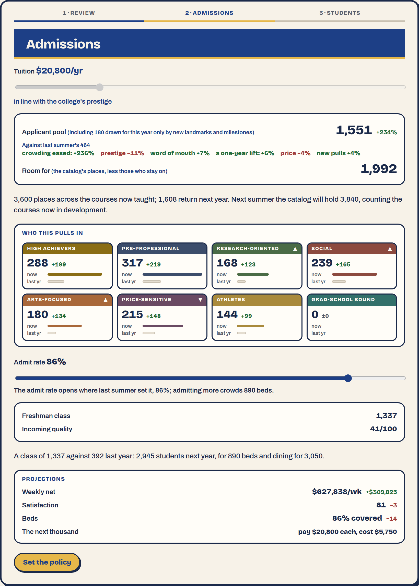
</p>

<p align="center"><em>The summer decision: set a price blind, see the pool it
drew, then choose how much of it to admit.</em></p>

## Four pillars, one specialization

Prestige is a blend of four pillars: academics, research, student life and
athletics. A school can be excellent at all four, but it can be the very best
at only one. The first summer the college stands in the guide's top 30 — or,
from Year 20, in the top 10 of any one pillar — the board offers it a single
specialization: the faculty training program, the research park, the downtown
and its festival, or the athletic performance complex. Each brings a building
and a way of working only it has, and fills the share of its pillar that only
it can fill: without one, no pillar reaches the top. The choice is kept for
good, and the rivals make theirs too.

## Current state

UniSchool is a playable, systems-first prototype. The core simulation is
implemented: curriculum development and the milestone chain, campus
construction on a tile map, faculty hiring and course assignment, annual
admissions, finances, student life and athletics, research, prestige (its four
pillars and the specialization) and
rankings, decision events, graduate programs, and save/load.

The current focus is presentation and player experience — the campus map,
the management interfaces, curriculum presentation, faculty interaction and
the research systems. There is no art pipeline yet; everything on screen is
drawn from data.

## Five architectures, eight colours

A school chooses its architecture and its colours at its founding; the map,
the banner and every screen wear them. The same fifty-year campus as above, in
the other four architectures, each in another of the eight colour pairs:

| | |
|---|---|
| 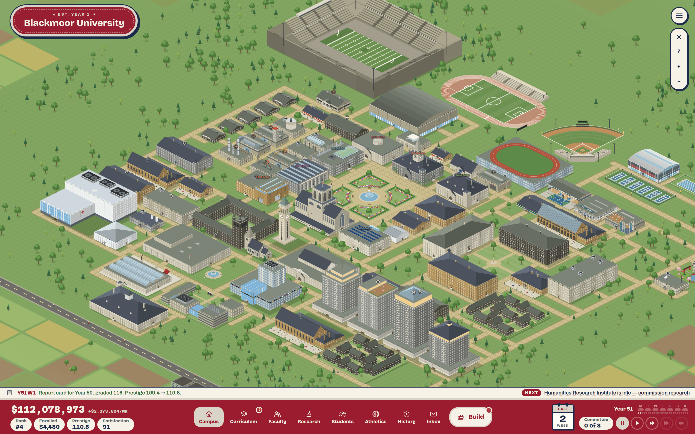 | 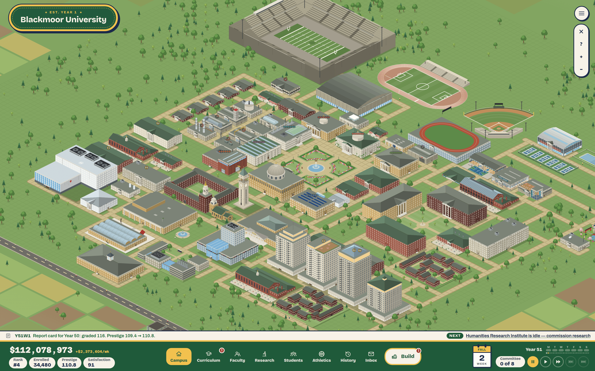 |
| **Collegiate Gothic** · crimson and silver | **Classical** · forest and gold |
| 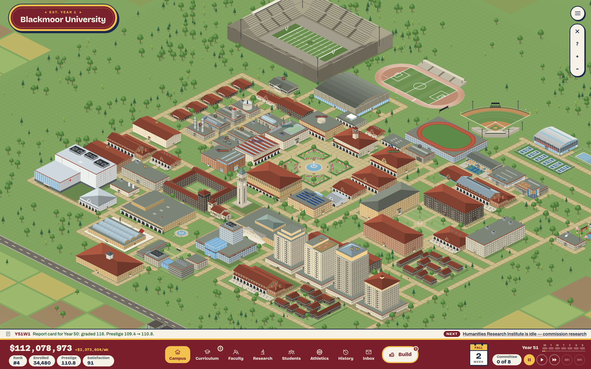 | 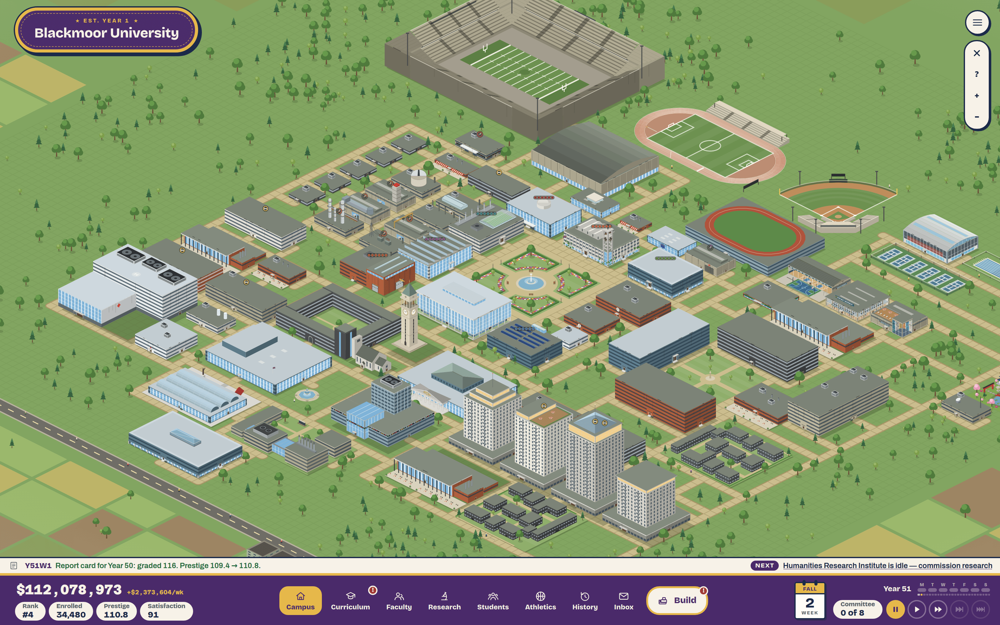 |
| **Mission** · maroon and gold | **Modern** · purple and gold |

## The interfaces

Every view other than the map is a full screen laid over it, with the dock
kept on top. These are year 51 of a finished school — the same run as the
campus above — one screen per tab, in the toolbar's order, each in a
different pair of school colours.

| | |
|---|---|
| 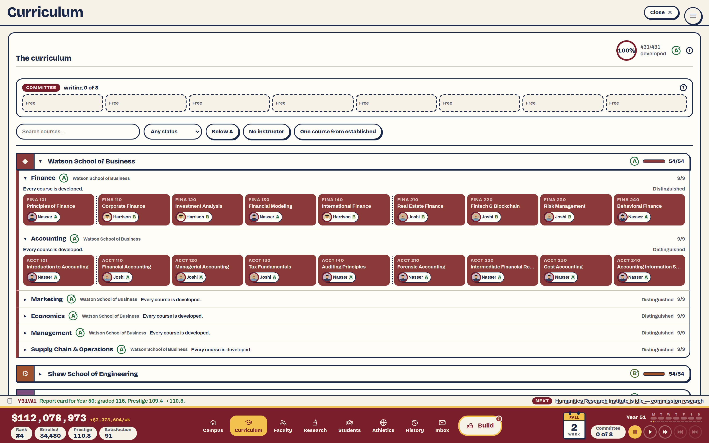 | 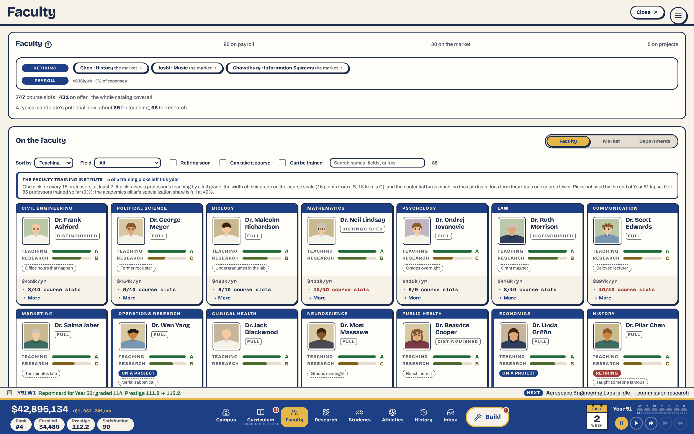 |
| **Curriculum** — the catalogue by school and program, each with who teaches it and the grade they earn; a finished school folds away. | **Faculty** — the people: a grid of faces, each with a career, quirks and the courses they carry, under one row of figures; the market and the departments a switch away. |
| 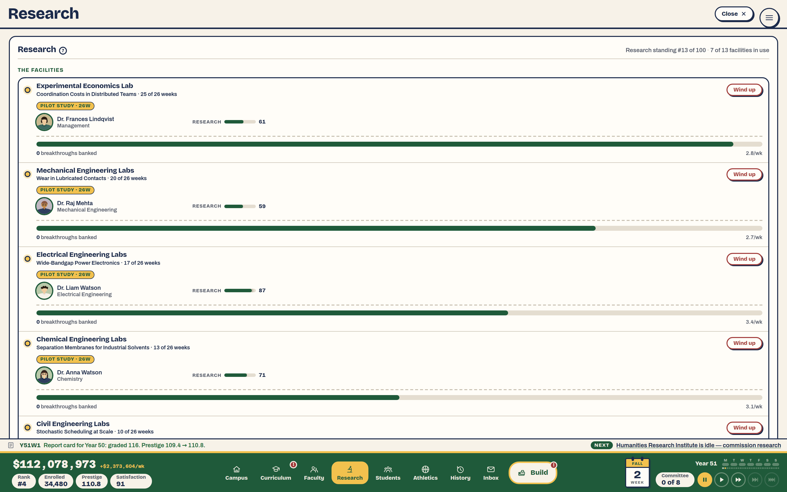 | 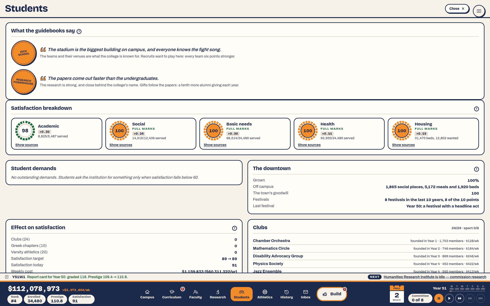 |
| **Research** — each lab's running initiative: the topic, the team, the depth and what it has produced. | **Students** — satisfaction by attribute and what serves it, the clubs, the chapters and the demands. |
| 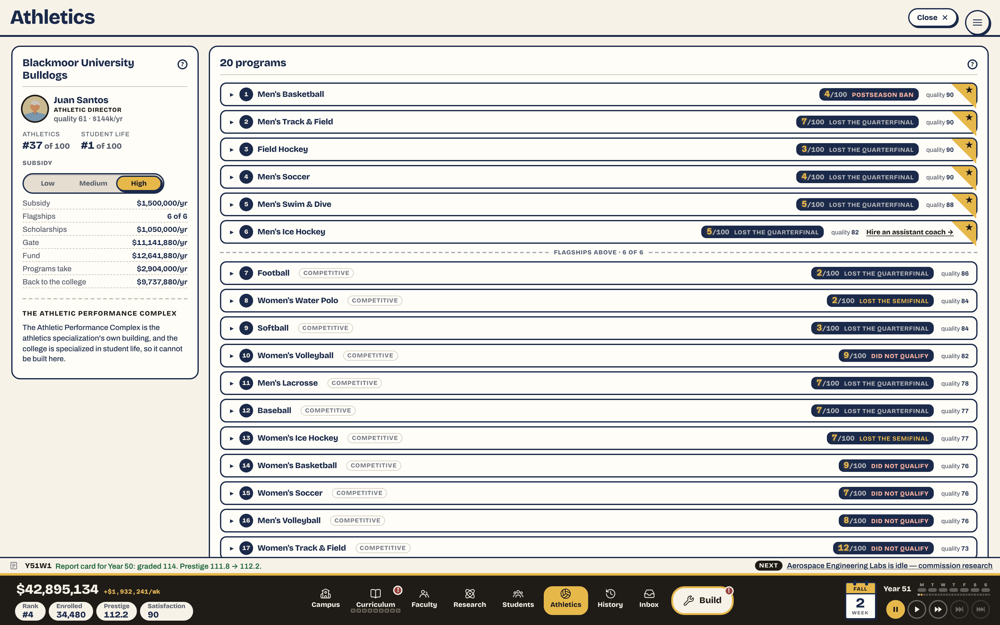 | 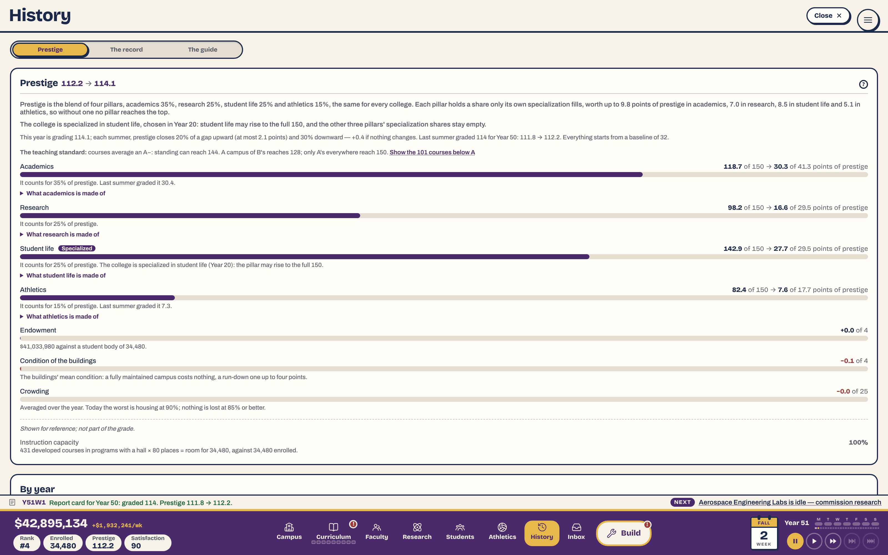 |
| **Athletics** — the director, the subsidy and the gate at the side; every program one line, its rank in its sport and its last season, opening to its staff and money. | **History** — three views: prestige with its four pillars and every input that grades them, the record and the legacy once sealed, and the guide. |
| 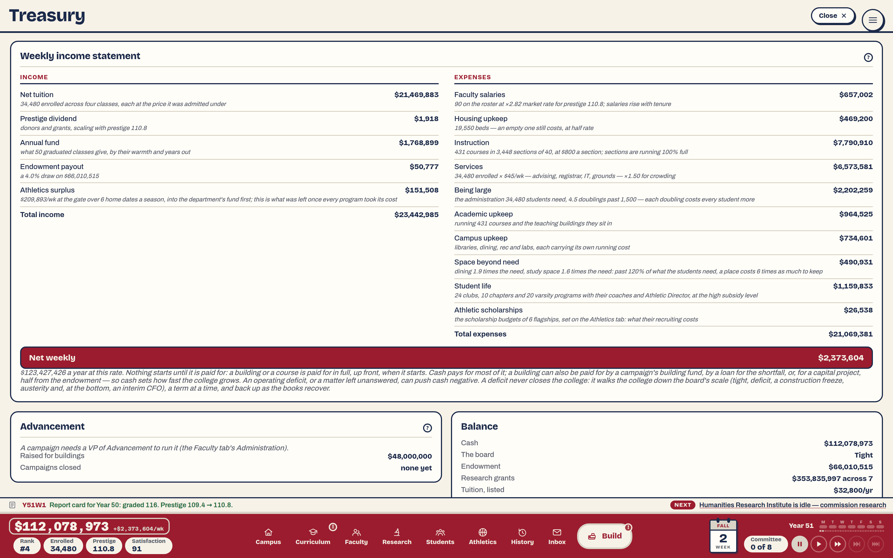 | |
| **Treasury** — the weekly income statement, the endowment campaign and the balance sheet, reached through the funds figure. | |

## Run it

```bash
cd unischool
npm install
npm run dev
```

Open the printed localhost URL. Name your school, pick its architecture and
its colours, and a short walkthrough takes you through the first clicks —
raise Founders Hall, see the three programs it already teaches, found a
fourth — before the clock starts.

## Controls

| Key | Action |
| --- | --- |
| `W` `A` `S` `D`, arrows | Pan the camera |
| Middle mouse drag | Pan |
| Scroll / pinch, `+` `−` | Zoom |
| `Space` | Pause / resume |
| `1` `2` | Game speed |
| `P` | Path tool |
| `Q` `E` | Turn the view a quarter turn |
| `Z` `X` | Tilt the view flatter / steeper |
| `Home` | Back to the opening view |
| `R` | Rotate the picked-up building |
| `Esc` | Back / close |
| `Enter` | Dismiss the interrupt on screen |
| `C` `F` `L` | Curriculum, Faculty, Student Life |

`src/components/hotkeys.ts` is the source of truth for how these behave; see
[docs/architecture/ui-shell.md](docs/architecture/ui-shell.md).

## Architecture

UniSchool uses a data-driven simulation architecture:

- A central **`GameState`** is the single source of truth.
- **Systems** advance the simulation through pure weekly `tick(state)`
  functions, composed in a fixed order.
- The **reducer** owns the game loop and interprets every action. UI dispatches
  actions; systems never dispatch.
- **Game content lives in `src/data/`** — the curriculum, buildings, rivals and
  the authored decision-event table.
- Courses, buildings, dorms and facilities share one **Buildable** abstraction:
  one develop/build flow, one prereq resolver, one completion-effects applier.
- **UI components read state and dispatch actions** rather than implementing
  simulation rules.

See [docs/architecture/](docs/architecture/) for the detailed technical
documentation.

## Project structure

```
unischool/
├── src/
│   ├── state/        GameState, initial state, actions
│   ├── engine/       the reducer (game loop) and store hook
│   ├── systems/      one folder per system, each a pure tick(state)
│   ├── data/         seed content: curriculum, buildings, events, rivals
│   ├── components/   campus map, build rail, chrome, interrupt modal
│   └── tabs/         one component per full-screen view
├── test/             suites run by `npm test`
└── sim/              headless balance runs (`npm run sim`)
```

## Development

UniSchool is built iteratively. Current priorities:

1. Campus map and visual presentation
2. Curriculum and faculty UX
3. Research gameplay
4. Student-life depth
5. Events and institutional storytelling
6. Art and presentation

Before opening a PR, run `npm run build`, `npm run lint` and `npm test` — and
`npm run sim` for anything that moves a number the economy depends on. See
[docs/architecture/README.md](docs/architecture/README.md) for the working
conventions.

To look at a change rather than read about it: `npm run scenario -- --list`
builds a save at any point in a run — year 8 of a balanced school, year 40 of
a finished one, the week a championship modal is pending — and `?debug=1` on
the URL opens a panel that loads it, reads the simulation, sets cash or
prestige, jumps years and forces events. See
[docs/architecture/playtesting.md](docs/architecture/playtesting.md).

See [BACKLOG.md](BACKLOG.md) for planned work.

## How UniSchool is made

One developer designs and directs it; an AI coding assistant (Claude Code)
writes the code and the text from the developer's briefs, plan by plan, and
the developer chooses between the designs and plays the game between plans.
The campus and the faculty portraits are drawn by that code, and the music
is synthesized by it. No image, sound or voice comes from a generator, and
the game generates nothing while you play: it makes no network calls. The
capsule art and the logo will be commissioned from an artist. The full
disclosure, as worded for Steam and itch.io, is
[`docs/store/ai-disclosure.md`](docs/store/ai-disclosure.md).

## Documentation

| Where | What |
|---|---|
| `README.md` | What UniSchool is, and how to run it |
| [`BACKLOG.md`](BACKLOG.md) | Work that is going to happen but has not |
| [`docs/design/`](docs/design/) | How each game system works today |
| [`docs/architecture/`](docs/architecture/) | Technical documentation for the codebase |
| [`docs/architecture/playtesting.md`](docs/architecture/playtesting.md) | How to stand the game up somewhere and measure a change |
| [`docs/plans/`](docs/plans/) | Closed records of how work was sequenced and shipped |
| [`docs/reviews/`](docs/reviews/README.md) | Reviews of the game on a given date, and the evidence plans cite |
| [`docs/assets/`](docs/assets/) | Every buildable asset in every vernacular, as the game draws it |

Three tenses, three homes: the docs describe the game as it **is**, the backlog
what **will** happen, the plans what **did**. Nothing belongs in two of them at
once.
