# The asset gallery

Every buildable asset in all nine vernaculars (the five founding sets, then the four a run unlocks), drawn by the game itself from the opening camera (azimuth 45°). Vernaculars run down each image and assets across it. Written by `npm run gallery:assets` (unischool/tools/assetGallery.mjs, Plan 75C); run it again after any change to how a building is drawn.

112 assets in 27 images.

## Academic halls and the school signature halls

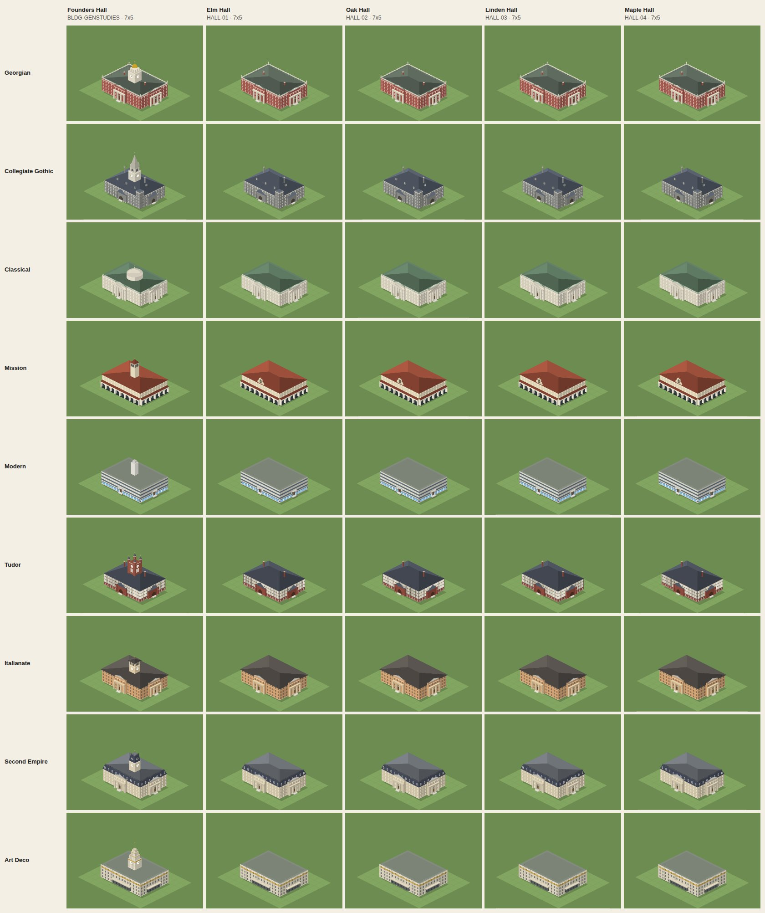

- **Founders Hall**: BLDG-GENSTUDIES · 7x5
- **Elm Hall**: HALL-01 · 7x5
- **Oak Hall**: HALL-02 · 7x5
- **Linden Hall**: HALL-03 · 7x5
- **Maple Hall**: HALL-04 · 7x5

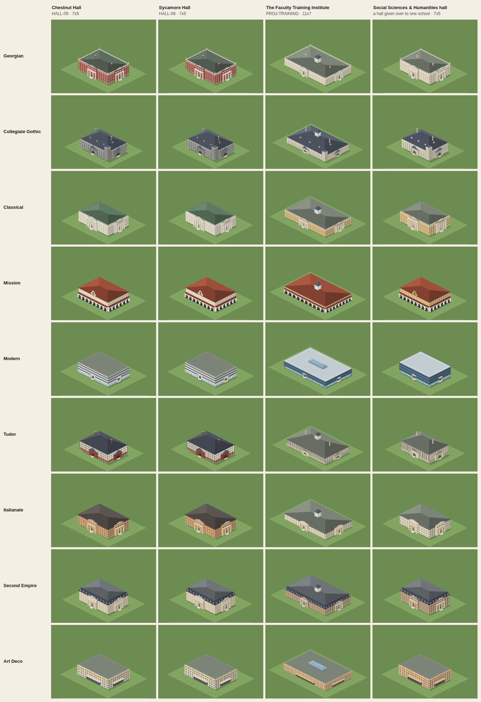

- **Chestnut Hall**: HALL-05 · 7x5
- **Sycamore Hall**: HALL-06 · 7x5
- **Walnut Hall**: HALL-07 · 7x5
- **The Faculty Training Institute**: PROJ-TRAINING · 11x7
- **Social Sciences & Humanities hall**: a hall given over to one school · 7x5

## Civic porticos: library, gallery, museum, the professional schools

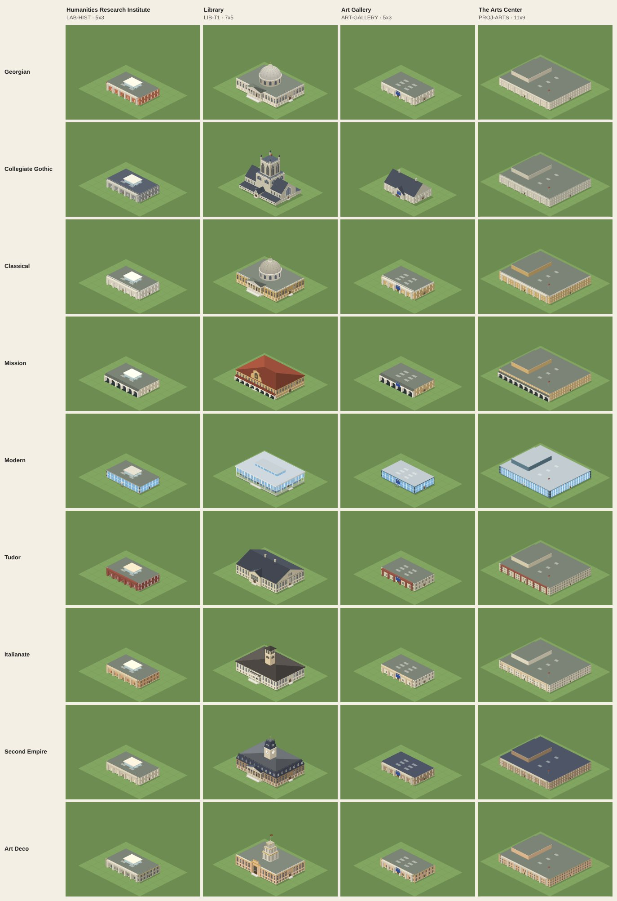

- **Humanities Research Institute**: LAB-HIST · 5x3
- **Library**: LIB-T1 · 7x5
- **Art Gallery**: ART-GALLERY · 5x3
- **The Arts Center**: PROJ-ARTS · 11x9

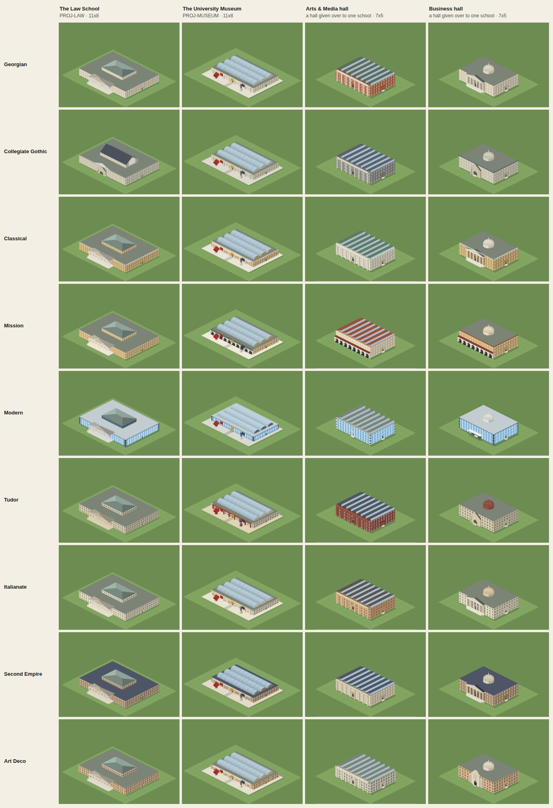

- **The Law School**: PROJ-LAW · 11x8
- **The University Museum**: PROJ-MUSEUM · 11x8
- **Arts & Media hall**: a hall given over to one school · 7x5
- **Business hall**: a hall given over to one school · 7x5

## Pavilions: dining, the student center, the grocery, chapter houses

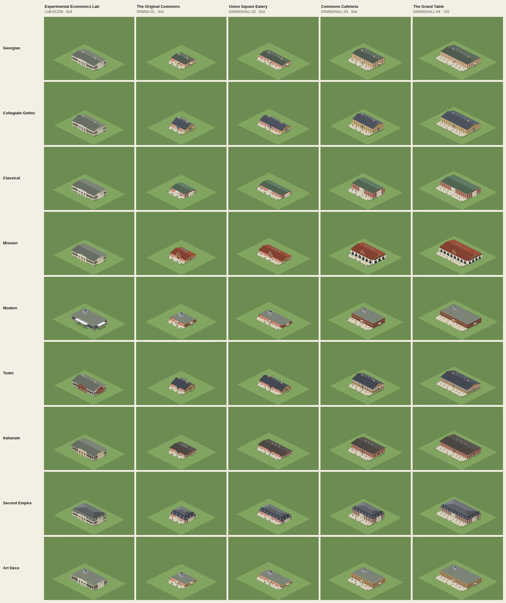

- **Experimental Economics Lab**: LAB-ECON · 5x3
- **The Original Commons**: DINING-01 · 3x3
- **Union Square Eatery**: DININGHALL-02 · 5x3
- **Commons Cafeteria**: DININGHALL-03 · 5x4
- **The Grand Table**: DININGHALL-04 · 7x5

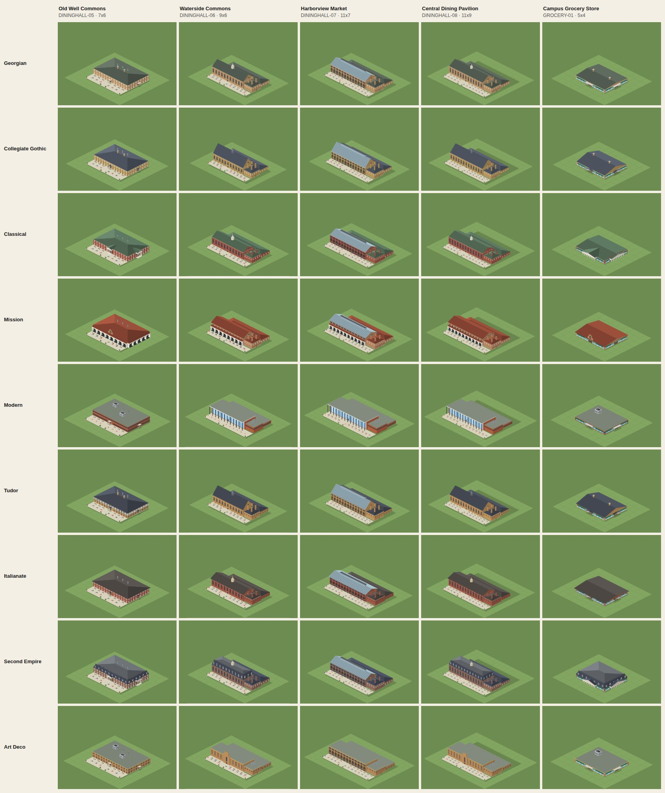

- **Old Well Commons**: DININGHALL-05 · 7x6
- **Waterside Commons**: DININGHALL-06 · 9x6
- **Harborview Market**: DININGHALL-07 · 11x7
- **Central Dining Pavilion**: DININGHALL-08 · 11x9
- **Campus Grocery Store**: GROCERY-01 · 5x4

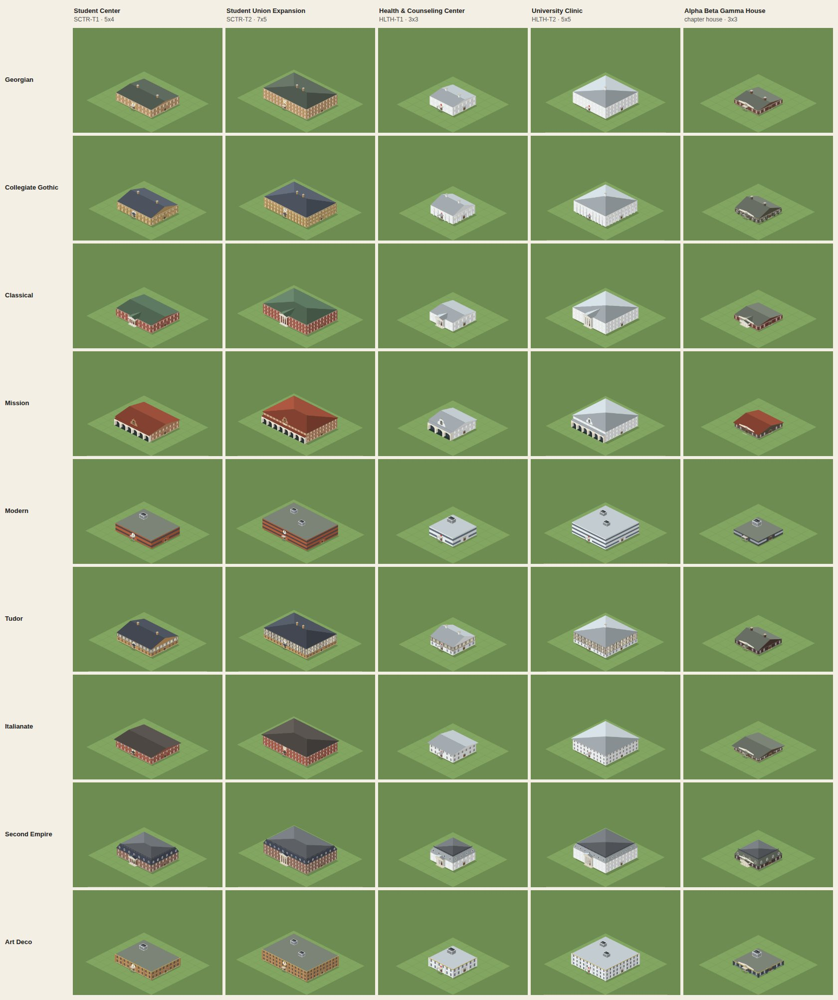

- **Student Center**: SCTR-T1 · 5x4
- **Student Union Expansion**: SCTR-T2 · 7x5
- **Health & Counseling Center**: HLTH-T1 · 3x3
- **University Clinic**: HLTH-T2 · 5x5
- **Alpha Beta Gamma House**: chapter house · 3x3

## The chapel: a nave, a tower and a chancel, in each set

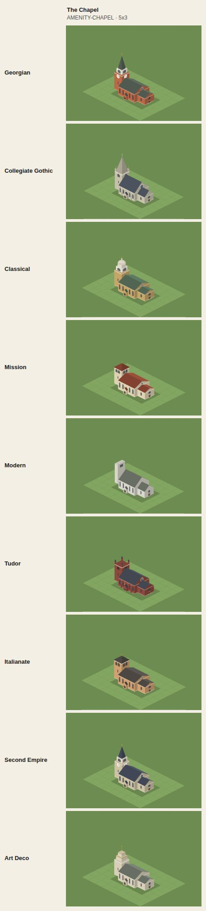

- **The Chapel**: AMENITY-CHAPEL · 5x3

## Residence halls

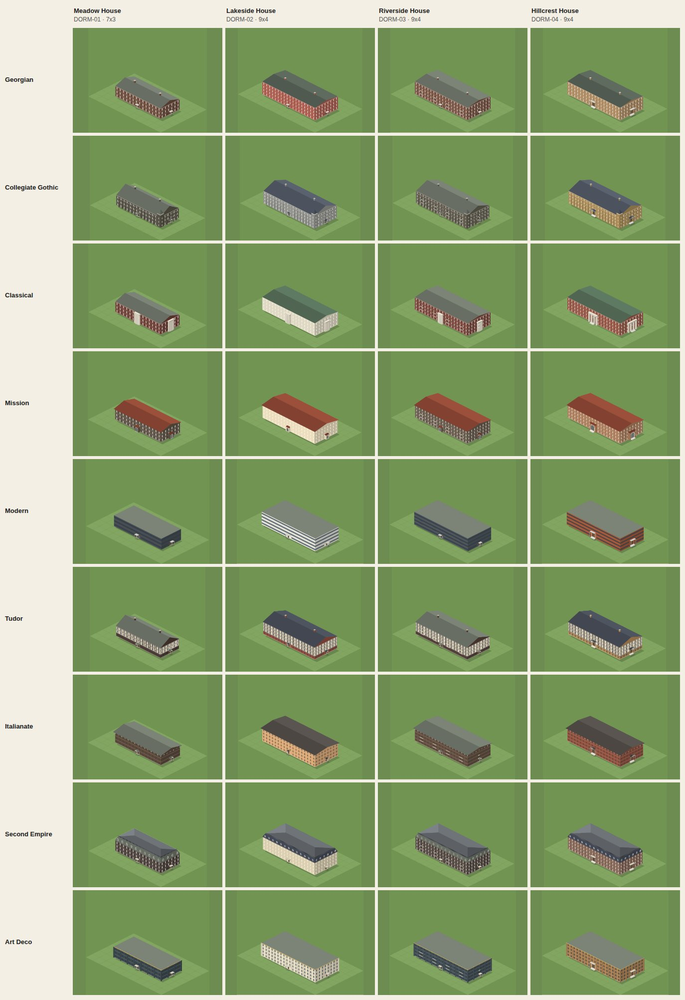

- **Meadow House**: DORM-01 · 7x3
- **Lakeside House**: DORM-02 · 9x4
- **Riverside House**: DORM-03 · 9x4
- **Hillcrest House**: DORM-04 · 9x4

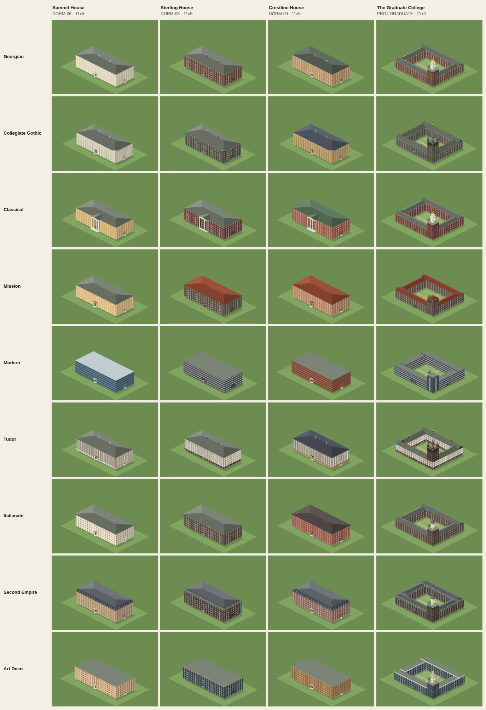

- **Summit House**: DORM-06 · 11x5
- **Sterling House**: DORM-08 · 11x5
- **Crestline House**: DORM-09 · 11x5
- **The Graduate College**: PROJ-GRADUATE · 11x9

## Residential villages

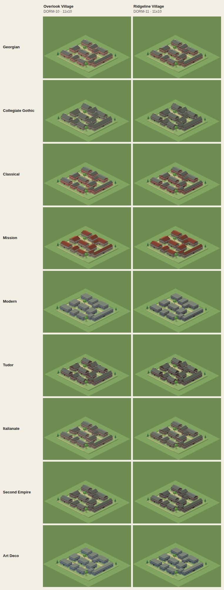

- **Overlook Village**: DORM-10 · 11x10
- **Ridgeline Village**: DORM-11 · 11x10

## Residential towers

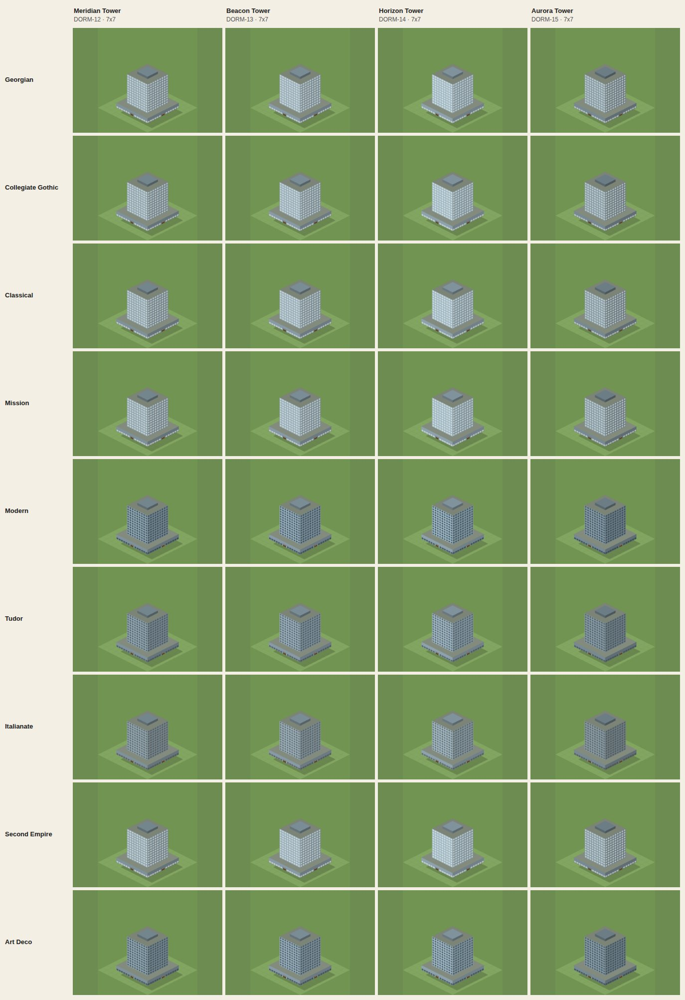

- **Meridian Tower**: DORM-12 · 7x7
- **Beacon Tower**: DORM-13 · 7x7
- **Horizon Tower**: DORM-14 · 7x7
- **Aurora Tower**: DORM-15 · 7x7

## Blocks: labs, clinics, the Medical Center

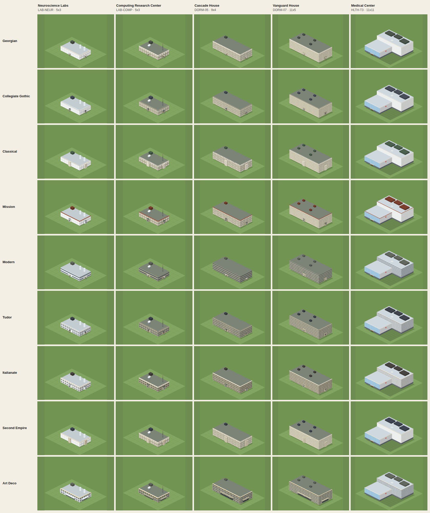

- **Neuroscience Labs**: LAB-NEUR · 5x3
- **Computing Research Center**: LAB-COMP · 5x3
- **Cascade House**: DORM-05 · 9x4
- **Vanguard House**: DORM-07 · 11x5
- **Medical Center**: HLTH-T3 · 11x11

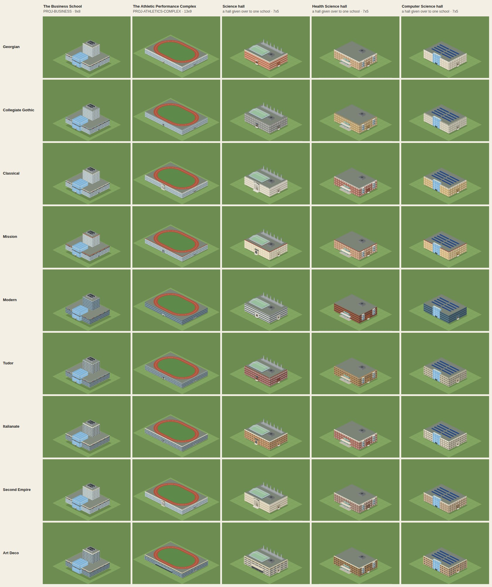

- **The Business School**: PROJ-BUSINESS · 9x8
- **The Athletic Performance Complex**: PROJ-ATHLETICS-COMPLEX · 13x9
- **Science hall**: a hall given over to one school · 7x5
- **Health Science hall**: a hall given over to one school · 7x5
- **Computer Science hall**: a hall given over to one school · 7x5

## Works: laboratories with plant

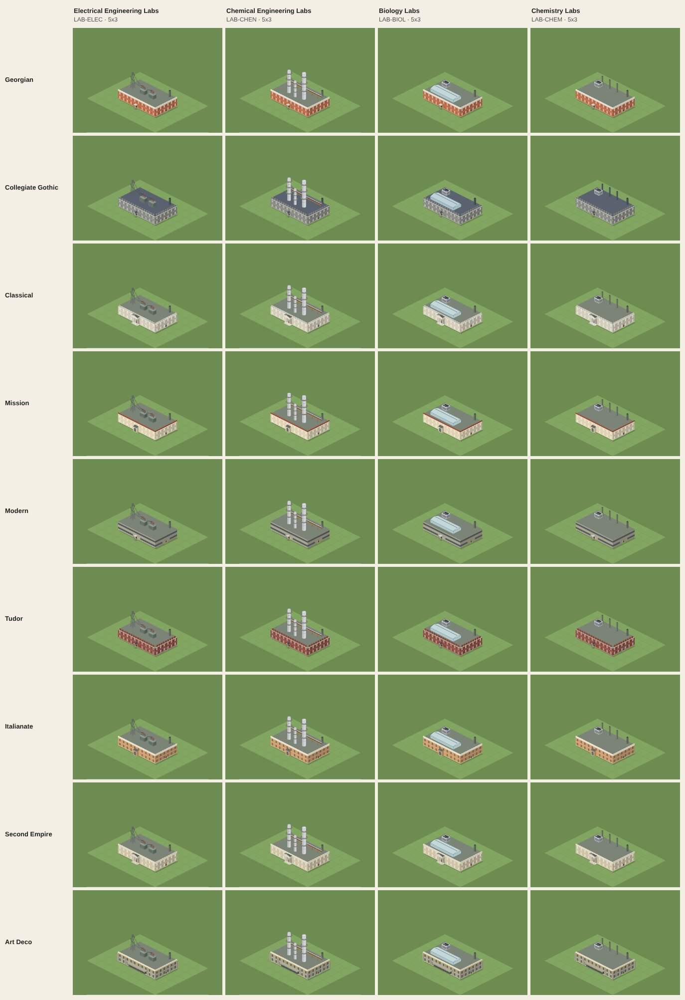

- **Electrical Engineering Labs**: LAB-ELEC · 5x3
- **Chemical Engineering Labs**: LAB-CHEN · 5x3
- **Biology Labs**: LAB-BIOL · 5x3
- **Chemistry Labs**: LAB-CHEM · 5x3

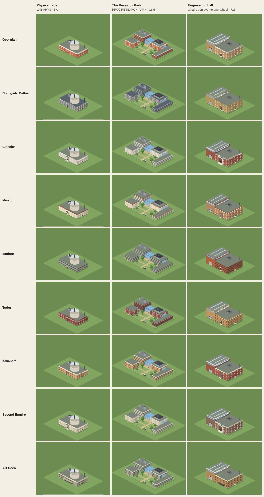

- **Physics Labs**: LAB-PHYS · 5x3
- **The Research Park**: PROJ-RESEARCH-PARK · 13x8
- **Engineering hall**: a hall given over to one school · 7x5

## Clear-span sheds: gyms, arenas, the natatorium, test halls, the studio

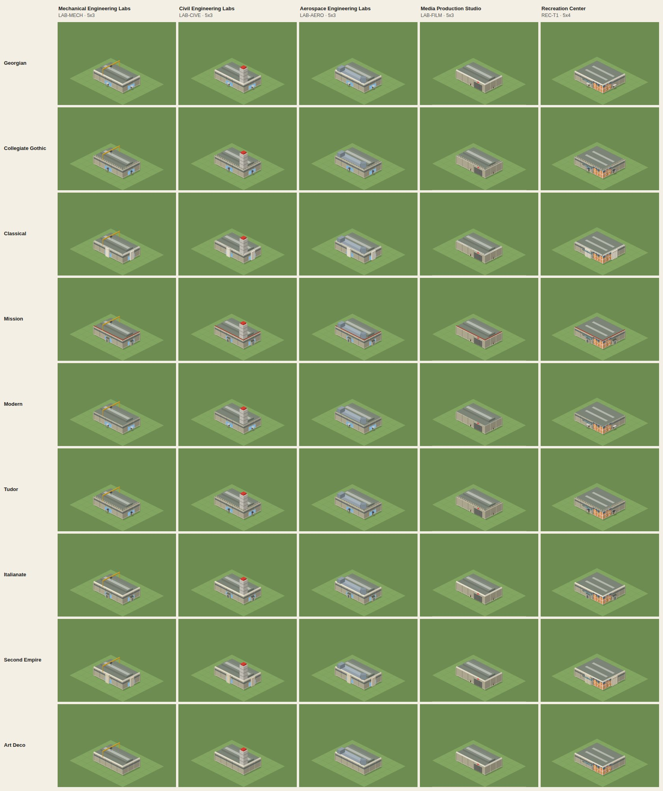

- **Mechanical Engineering Labs**: LAB-MECH · 5x3
- **Civil Engineering Labs**: LAB-CIVE · 5x3
- **Aerospace Engineering Labs**: LAB-AERO · 5x3
- **Media Production Studio**: LAB-FILM · 5x3
- **Recreation Center**: REC-T1 · 5x4

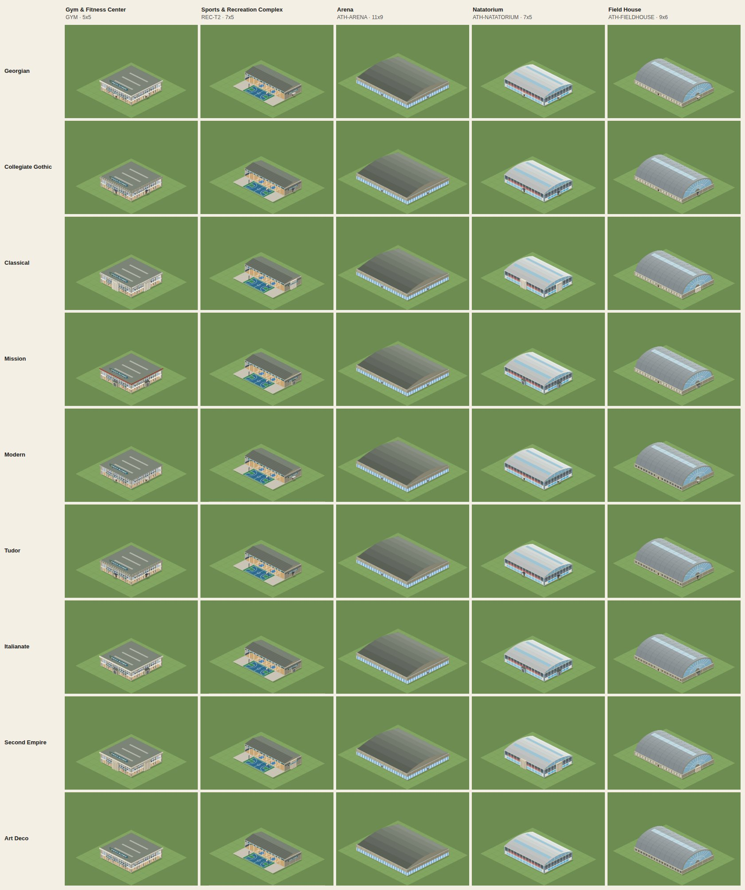

- **Gym & Fitness Center**: GYM · 5x5
- **Sports & Recreation Complex**: REC-T2 · 7x5
- **Arena**: ATH-ARENA · 11x9
- **Natatorium**: ATH-NATATORIUM · 7x5
- **Field House**: ATH-FIELDHOUSE · 9x6

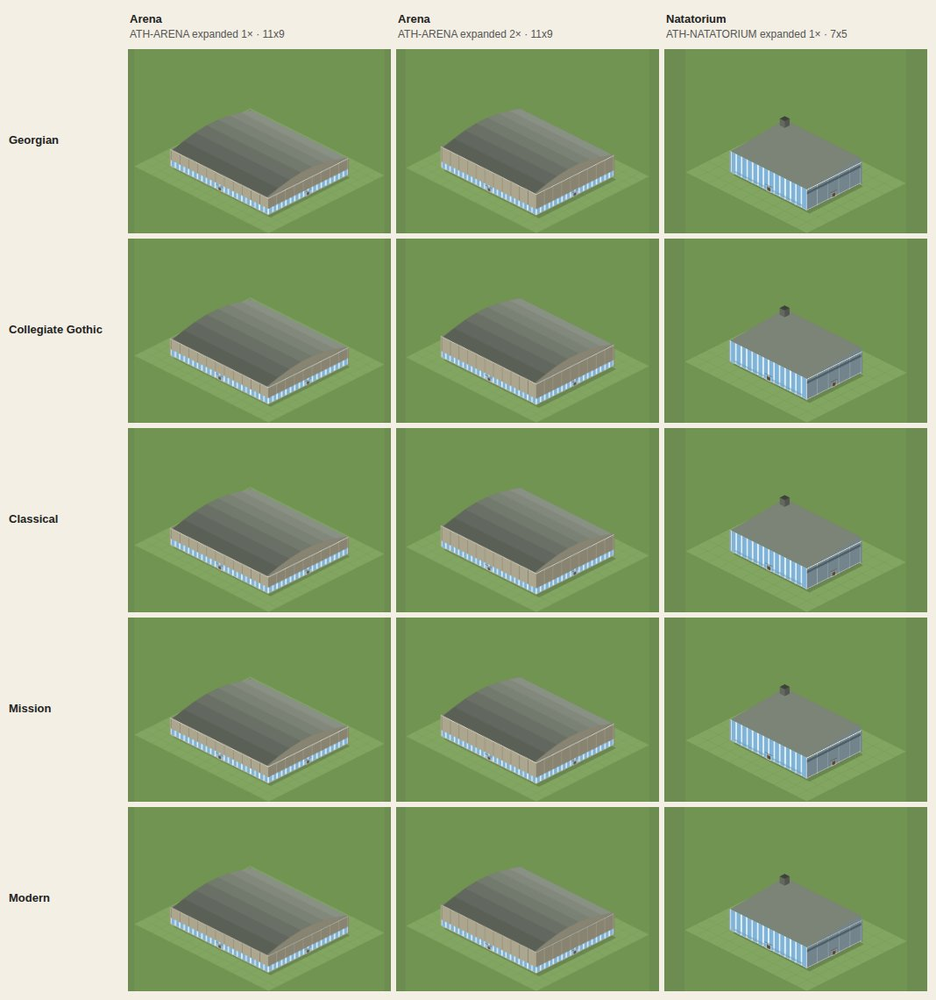

- **Arena**: ATH-ARENA expanded 1× · 11x9
- **Arena**: ATH-ARENA expanded 2× · 11x9
- **Natatorium**: ATH-NATATORIUM expanded 1× · 7x5

## The stadium at each stage

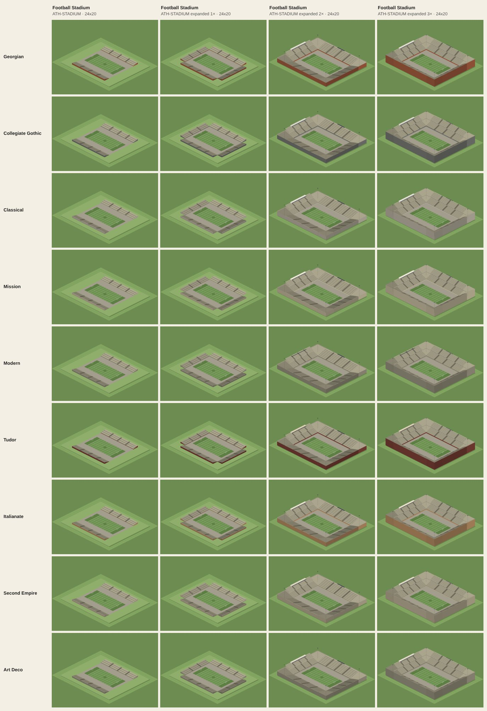

- **Football Stadium**: ATH-STADIUM · 24x20
- **Football Stadium**: ATH-STADIUM expanded 1× · 24x20
- **Football Stadium**: ATH-STADIUM expanded 2× · 24x20
- **Football Stadium**: ATH-STADIUM expanded 3× · 24x20

## Open ground: fields, courts, quads, gardens, amenities

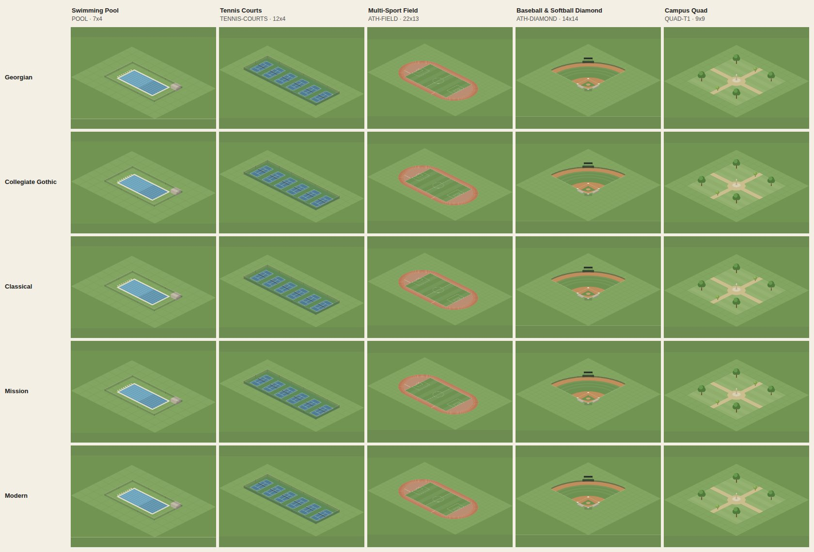

- **Swimming Pool**: POOL · 7x4
- **Tennis Courts**: TENNIS-COURTS · 12x4
- **Multi-Sport Field**: ATH-FIELD · 22x13
- **Baseball & Softball Diamond**: ATH-DIAMOND · 14x14
- **Campus Quad**: QUAD-T1 · 9x9

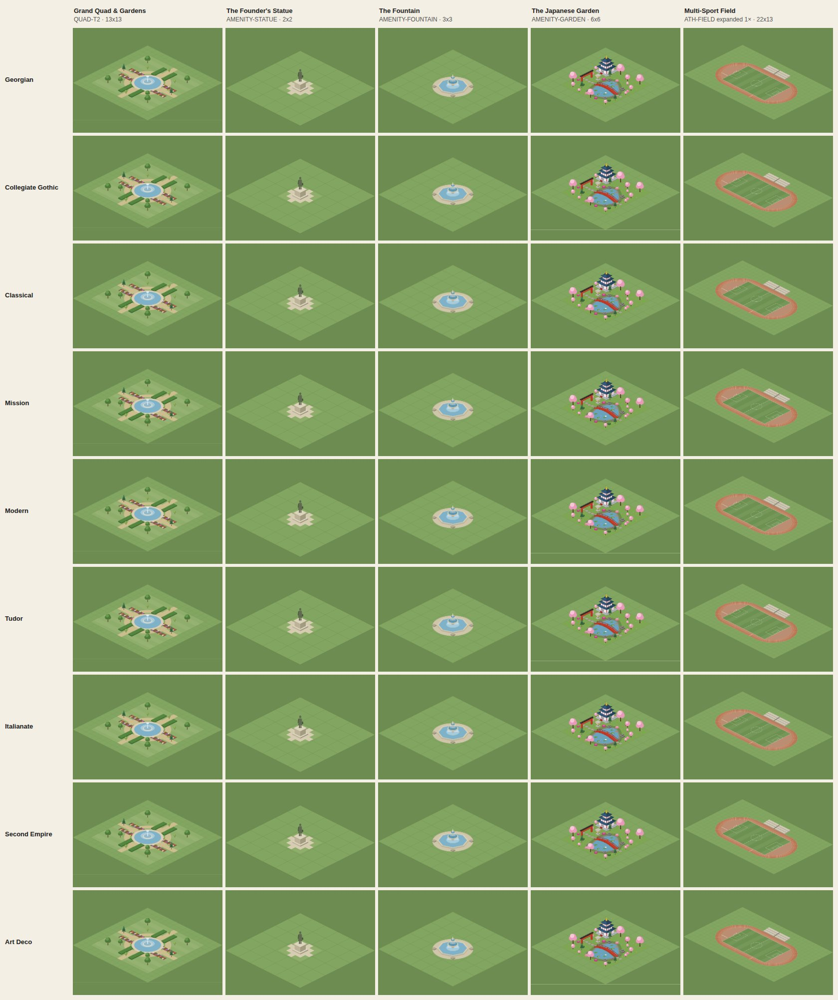

- **Grand Quad & Gardens**: QUAD-T2 · 13x13
- **The Founder's Statue**: AMENITY-STATUE · 2x2
- **The Fountain**: AMENITY-FOUNTAIN · 3x3
- **The Japanese Garden**: AMENITY-GARDEN · 6x6
- **Multi-Sport Field**: ATH-FIELD expanded 1× · 22x13

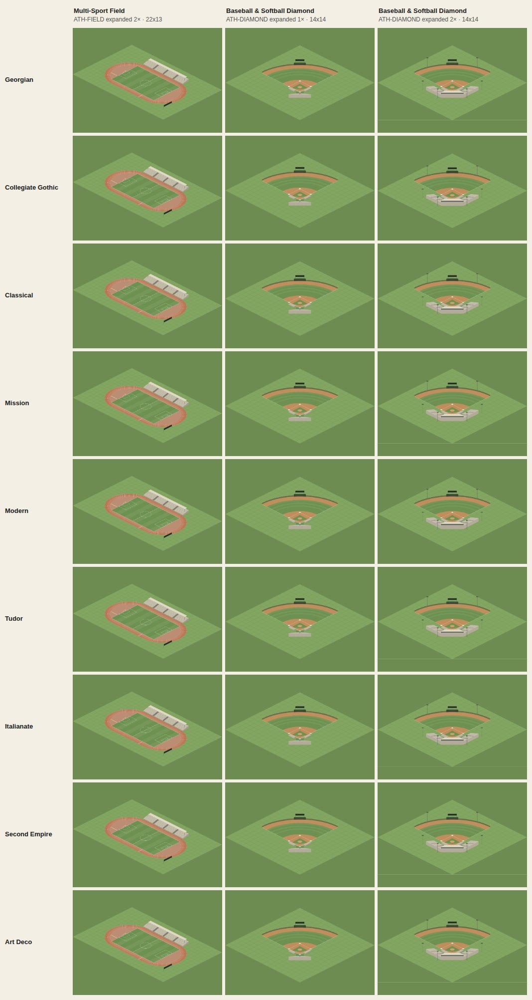

- **Multi-Sport Field**: ATH-FIELD expanded 2× · 22x13
- **Baseball & Softball Diamond**: ATH-DIAMOND expanded 1× · 14x14
- **Baseball & Softball Diamond**: ATH-DIAMOND expanded 2× · 14x14

## The grand landmarks and the bell tower

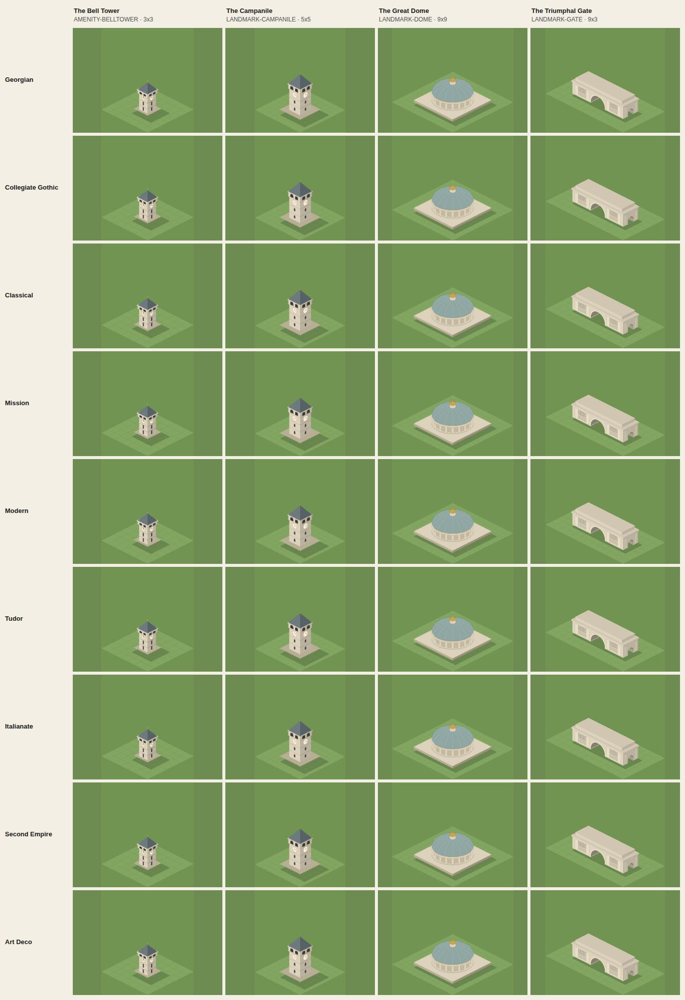

- **The Bell Tower**: AMENITY-BELLTOWER · 3x3
- **The Campanile**: LANDMARK-CAMPANILE · 5x5
- **The Great Dome**: LANDMARK-DOME · 9x9
- **The Triumphal Gate**: LANDMARK-GATE · 9x3

## One of each form under construction

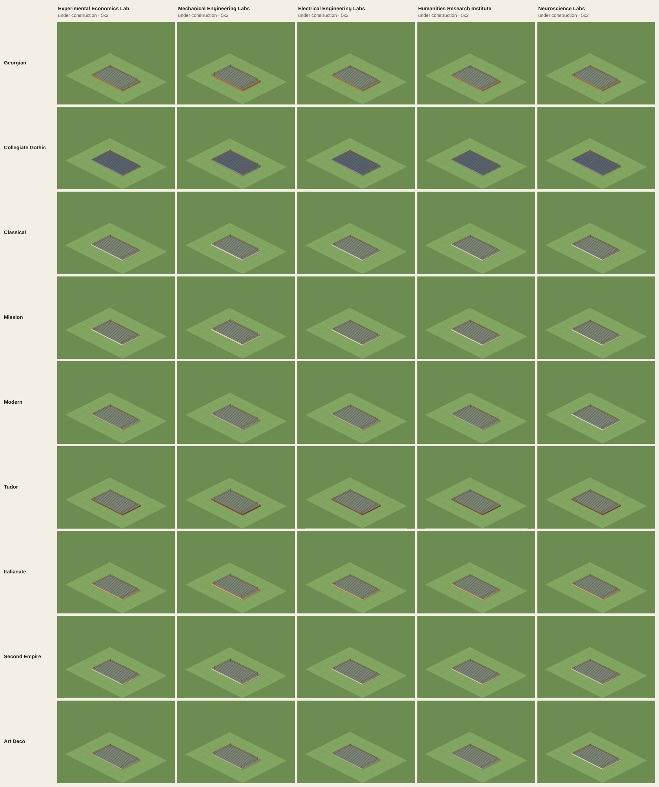

- **Experimental Economics Lab**: under construction · 5x3
- **Mechanical Engineering Labs**: under construction · 5x3
- **Electrical Engineering Labs**: under construction · 5x3
- **Humanities Research Institute**: under construction · 5x3
- **Neuroscience Labs**: under construction · 5x3

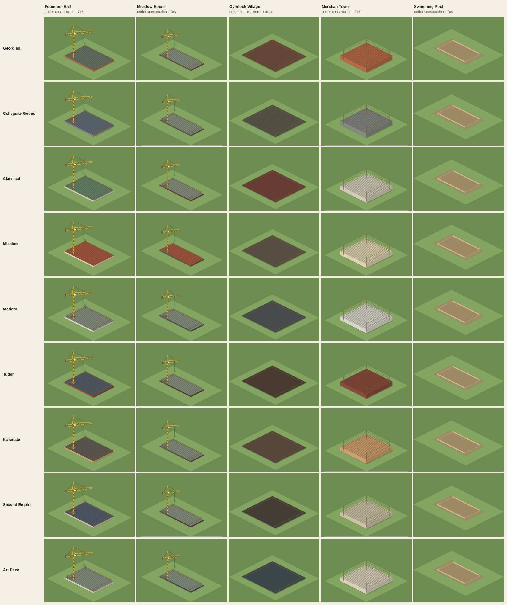

- **Founders Hall**: under construction · 7x5
- **Meadow House**: under construction · 7x3
- **Overlook Village**: under construction · 11x10
- **Meridian Tower**: under construction · 7x7
- **Swimming Pool**: under construction · 7x4

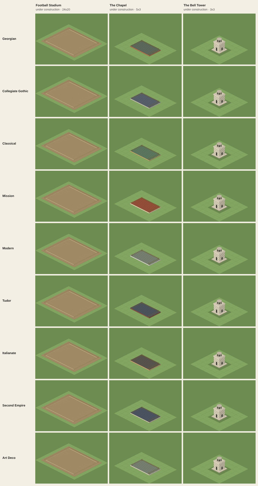

- **Football Stadium**: under construction · 24x20
- **The Chapel**: under construction · 5x3
- **The Bell Tower**: under construction · 3x3
