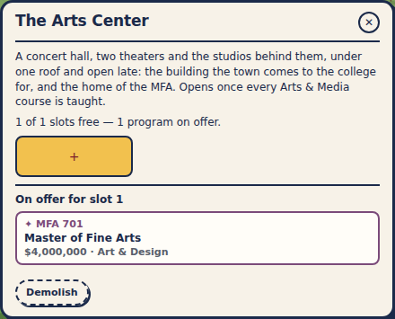
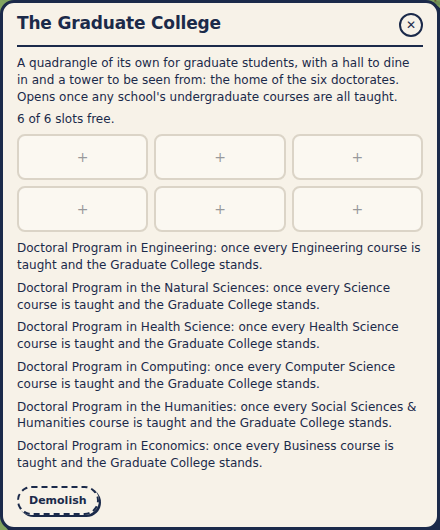
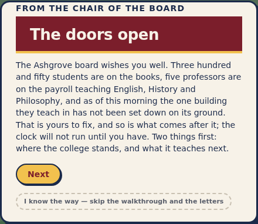

# Plan 51 — Graduate schools

*Planning document only. Its job is to turn the owner's answers into a PR.*

**Status: Landed.**

---

## 0. The answers

The owner asked for one structure for every graduate program: finish the
undergraduate curriculum, build a capital project, and the program unlocks
there. They chose:
- **The Arts Center** replaces the Performing Arts Center.
  - It opens from Year 10, once the whole Arts & Media curriculum is taught.
  - It unlocks and houses the MFA, with no hall overlay on the map.
  - Music's courses no longer wait on a building.
  - It keeps the old project's cost, build time, experience lift and
    beauty, but not the Performing Arts Center's social seats.
- **The School of Medicine** waits on the Medical Center (Plan 50) and on
  the Health Science curriculum.
- **The Law School and the Business School** are new capital projects, one
  for each professional school.
- **The Graduate College** houses the doctorates. Later the owner added a
  sixth, the Doctoral Program in Economics, so it has six slots in the same
  3×2 grid as a hall.
- **The Art Gallery** still gates Studio Art's capstones.

## 1. The PR

- **One gate** (`graduateGateMet`): every undergraduate course of the home
  school is done (`curriculumComplete`), and the program's host stands
  (`projectData.ts`'s `GRADUATE_HOSTS`). The established-majors count, the
  lab gate and medicine's two-school gate are gone.

  | School | Program | Housed in |
  |---|---|---|
  | Arts & Media | MFA | The Arts Center |
  | Health Science | School of Medicine (MD) | The Medical Center |
  | Health Science | Doctorate in Health Science | The Graduate College |
  | Social Sciences & Humanities | School of Law (JD) | The Law School |
  | Social Sciences & Humanities | Doctorate in the Humanities | The Graduate College |
  | Business | MBA | The Business School |
  | Business | Doctorate in Economics (new) | The Graduate College |
  | Science | Doctorate in the Natural Sciences | The Graduate College |
  | Engineering | Doctorate in Engineering | The Graduate College |
  | Computer Science | Doctorate in Computing | The Graduate College |

- **The hosts** (`CapitalProject.curriculum`):

  | Host | Opens from | Also waits on |
  |---|---|---|
  | The Arts Center | Year 10 | the Arts & Media curriculum |
  | The Law School | Year 15 | its school's curriculum |
  | The Business School | Year 15 | its school's curriculum |
  | The Graduate College | Year 20 | any school's curriculum (`ANY_SCHOOL`) |
  | The Medical Center | Year 15 | no curriculum (health chain, Plan 50) |

  - The Law School is $35M over 130 weeks, drawn as a limestone portico.
  - The Business School is $35M over 130 weeks, drawn as a five-storey
    glass block.
  - Each lifts academics by 3.
- **Housing:**
  - A host has one slot for each program it houses, filled the way a
    hall's are.
  - A graduate program goes only to its host. A major goes only to an
    academic hall, from the three drawn offers, which never hold a graduate
    program.
  - A graduate program can't be relocated.
- **The panel** (`BuildingInfoPanel.tsx`):
  - A standing host shows its slots with the hall's grid and founding flow.
  - It offers the programs it houses that are earned.
  - The others say what they wait on.

  
  
- **The Doctoral Program in Economics** (`PHDB`): four doctoral courses in
  Economics and Accounting & Finance. Its research joins the economics
  lab's.
- **The Performing Arts Center** leaves:
  - the catalog, the build menu, the drawings, the footprints and the
    facility types;
  - its fly tower and roof flag now crown the Arts Center;
  - the cohort signal counts the Arts Center with the gallery.
- **Letters:** the Next or Continue button and "I know the way" sit in one
  spaced, aligned row that wraps as a pair (the owner's note).

  
- **Save 75**, with a one-off carry from 74:
  - the Performing Arts Center leaves, along with every prerequisite that
    named it;
  - the catalog's new nodes join the save;
  - the hosts take their slots;
  - a graduate program in a hall moves to its host if the host stands, and
    otherwise stays where it is.
- **Design docs:** `graduate-programs.md` and `curriculum.md`.

**As implemented:** as above.
- **Left for the owner:** the hall chain still has a second hall for each
  school, built for the graduate programs that no longer need them. Whether
  the chain should shrink is the owner's call.
- **Harness:** not updated. It no longer founds graduate programs, and the
  sim suite is being rebuilt.
