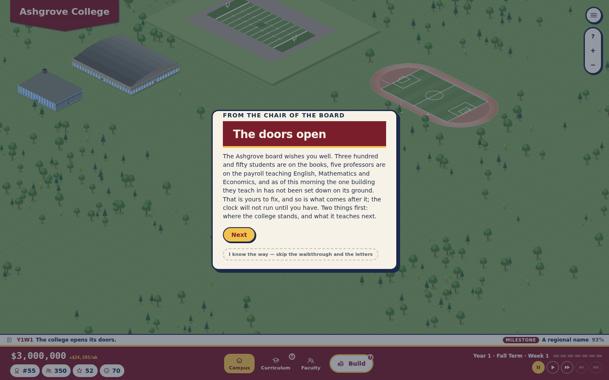
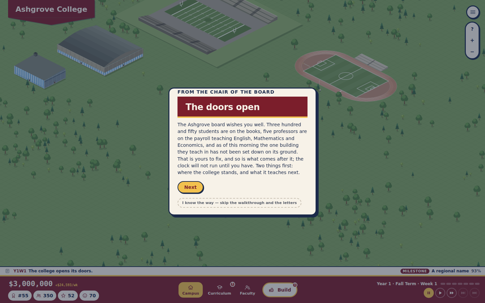
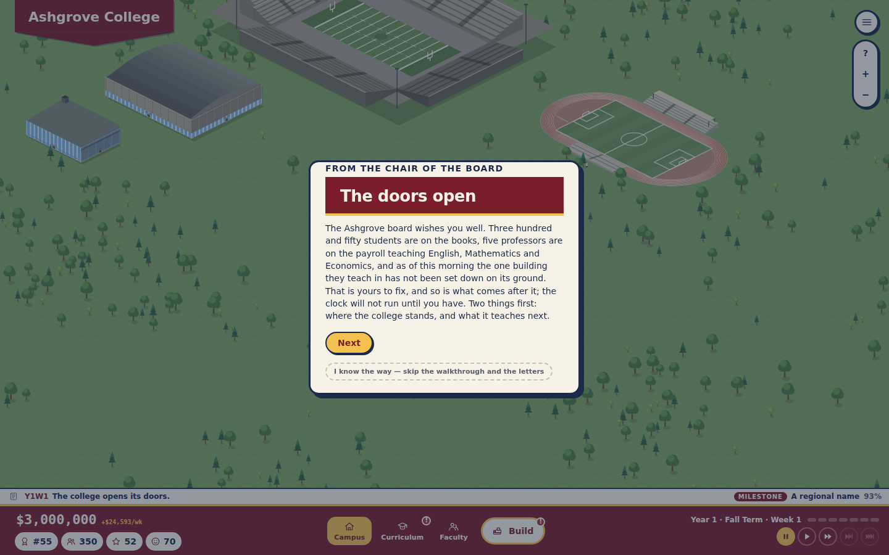
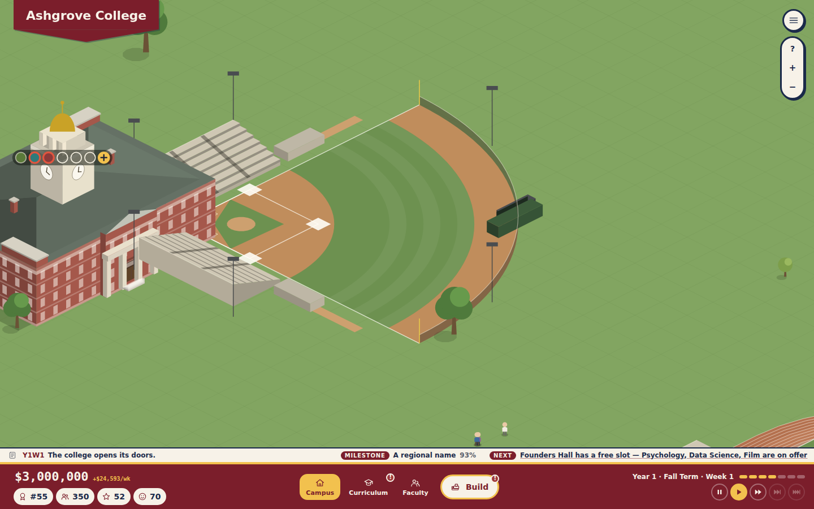

# Plan 54 — Venue stages

*Planning document only. Its job is to turn the owner's answers into a PR.*

**Status: Landed.**

---

## 0. The answers

The owner asked for athletic venue upgrades to show on the map:
- the football stadium, the diamond and the multi-sport field each start
  with the field itself, then get a small set of stands, then full stadium
  seating;
- the fully expanded football stadium is the Championship Stadium's
  drawing (Plan 50 retired that project);
- the natatorium rises one level with one upgrade, and the arena two.

## 1. The PR

- **The football stadium** (`bowl` motif, `t.expansions`):

  | Stage | What stands |
  |---|---|
  | Base | the field and its apron on the lawn |
  | First expansion | a low stand down each touchline |
  | Second expansion | the full bowl, drawn at the stadium's own 24×20 |

  The field keeps its place and size, so the seating grows around it.
- **The multi-sport field** (`groundProps` → `pitchProps`, by stage):

  | Stage | What stands |
  |---|---|
  | Base | the field alone |
  | First expansion | a low open bleacher |
  | Second expansion | the covered grandstand, with a bleacher facing it |

- **The diamond** (`diamondProps`, by stage):

  | Stage | What stands |
  |---|---|
  | Base | the diamond, its fence, backstop and dugouts |
  | First expansion | the stand behind the plate |
  | Second expansion | the covered horseshoe down both lines, and the light towers |

- **The arena and the natatorium** rise a storey with each expansion
  (`wallHeightOf`).
  - The natatorium takes one expansion (`venueExpansionsMax`), the rest
    two.
- **During an expansion** the venue stands at its current stage: it is no
  longer drawn as a building site while the work goes on. The layout's
  change key reads the expansion count.
- **Tests:**
  - new `venue-stages.test.ts`: the stands by stage, the halls rising, and
    the natatorium's single expansion;
  - `depth-sort.test.ts` reads the full stage.

**As implemented:** as above.
- **No save bump:** the expansion count is already saved.
- **Unchanged:** the natatorium's seats and costs are its one expansion's,
  as before.
