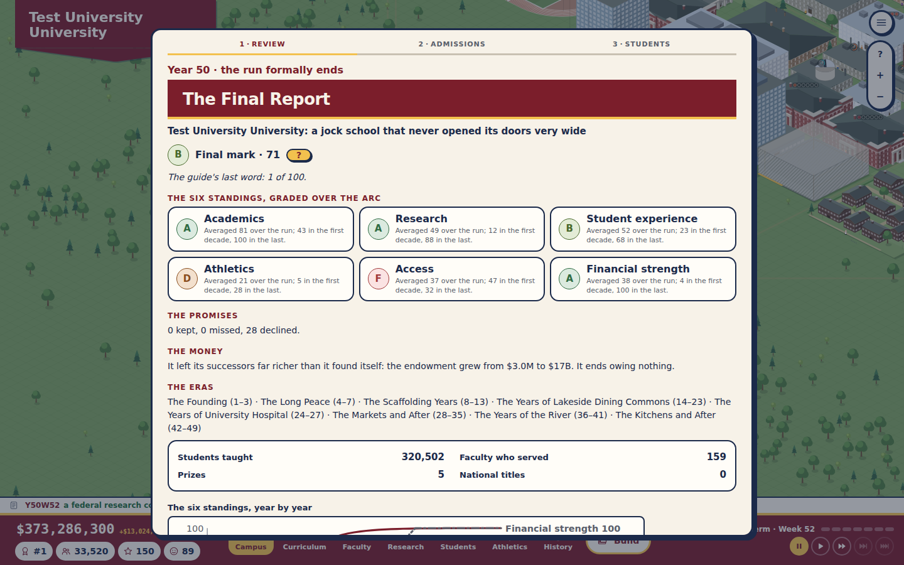
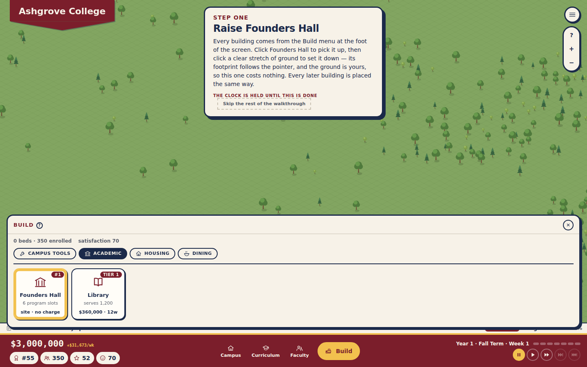
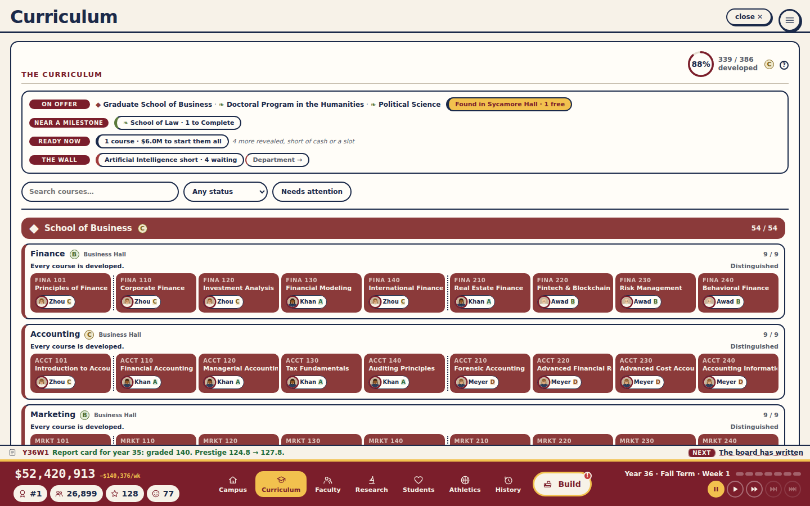

# UniSchool: a consistency review

*A read of the whole game except its balance: the simulation's logic, the run's flow and its modals, the screens, the authored data, the words, and the map as the camera turns. It asks four questions everywhere: what looks off, what looks off when the camera turns, what contradicts itself, and what is said or built twice. It covers `main` at `5274502` (after Plan 42). The fixes are three PRs: [Plan 43](../plans/43-consistency-review.md) (logic, flow, screens and data, with this document), [Plan 44](../plans/44-the-map-in-every-view.md) (the map in every view) and [Plan 45](../plans/45-the-words-agree.md) (the words). Numbers were not run: nothing here is a tuning judgement.*

## How it was done

- **Six read-only reviews in parallel**, each told to cite the code behind every claim and to mark each finding *clear-fix* (one right answer) or *judgment* (a design call):
  - the simulation's logic and state;
  - the run's flow, modals, save and load;
  - every tab, panel and piece of chrome;
  - the authored data (518 buildables, 249 research topics, the course and faculty tables), with a throwaway script that cross-checked every reference;
  - every player-facing string;
  - the map in all four views and at every tilt.
- **A browser pass** over five saves (Years 2, 8, 20, 35 and 50, the Balanced builder with paths added): every tab, the build menu, the four views at the default tilt, and the low and top-down tilts. The screenshots below come from it.
- **Fixed as it went**, as the owner asked. Every clear-fix is fixed, with the exceptions named below. The judgment calls are in [the open questions](#open-questions), each with a recommendation.

## What mattered most

1. **The resolve path let the player dodge or double things.**
   - Naming the mascot ran week 1 twice: two weeks of income, research and countdowns in one.
   - Pressing Enter on a decision event cleared it with no choice at all, so "A chapter in disgrace" had no consequence. Pressing Enter on the varsity petition made it come back every week.
   - With cash below zero, a free choice cleared the modal but did nothing.
   - Enter on the fiftieth summer's report skipped the hall of fame. Enter on the promise offer declined the promises just ticked.
2. **Demolition and in-place work left the campus in two minds** (Plan 39's edges).
   - A demolished venue's teams kept playing for a gate of zero, until a reload benched them.
   - Demolishing the Graduate College kept its 600 beds, and so did disbanding a housed chapter.
   - Calling off a rebuild could settle the old building's loan.
   - "Standing" had five definitions across the code.
3. **The front screens did not stop the game.**
   - Space or 1–4 on the title screen resumed the clock behind it.
   - C, F, L, Escape and the map keys acted behind the title, settings, hall and credits screens.
   - A save taken mid-modal reopened with the modal drawn over the title screen.
   - The main menu and the pennant painted over the interrupt modal's backdrop and stayed clickable.
4. **The catalogue's placeholders filled wrong** in ways every player sees: "the the class of 7", "The Men's Soccer Team team", "Science has appeared in a guidebook", "A section of roof has come off Campus Quad" (Plan 45).
5. **The map was right only from the opening view** in three families of drawing (Plan 44):
   - roof slopes and the stadium bowl painted in a fixed order;
   - corner towers, doors and the hospital's cross placed by screen corner instead of grid corner;
   - tones taken from the screen's left wall, so whole building types brightened or darkened by up to a fifth as the view turned.

---

## 1. Logic and state

**Fixed (Plan 43):**

| Finding | Fix | Commit |
|---|---|---|
| `RESOLVE_MASCOT` cleared the interrupt without advancing the clock, so the TICK that raised it ran again. | Advances the clock like every other resolve. Every `RESOLVE_*` now returns at once when nothing is pending, so a double dispatch cannot skip a week. | `38eb465` |
| A decision event could be resolved with no choice, with an unoffered choice, or with an unaffordable one, and cleared anyway. A free choice failed `0 <= cash` when cash was negative. | An invalid or unaffordable pick falls to the event's free choice, which always applies. `defaultAnswers` picks from the offered choices only. | `0d1dc6d` |
| A demolished venue's teams stayed active (gate 0); reload benched them. Saving mid-expansion benched them too. | One predicate, `standsOnCampus` (finished, or open through in-place work), used by `sanitizeTeams` and `venueSeats`. Demolition benches a category's teams when no other venue stands. | `cb9477a` |
| Demolition took back beds only for dorms; the Graduate College's 600 stayed. A disbanded housed chapter kept its house's beds. | Any kind's `capacityBonus` comes off (and a dorm's storeys); a dissolved housed chapter's beds come off. | `cb9477a` |
| Calling off a build settled every loan with that building id, including a demolished predecessor's. | Settles only when this build was financed by a loan (`t.financing`). | `cb9477a` |
| The housing drawer left out storeys and project beds, so it did not add up to capacity. | It counts every standing building's beds and a dorm's storeys; checked equal to capacity on five saves. | `a1cbba1` |
| A finished renovation re-ran its apply-once effects (latent: no renovatable building has one today). | Only a first finish applies them. | `a1cbba1` |
| The Plan 36 letter ("from here, every time the college doubles…") was keyed to the health gate, which equals the cost's threshold only by coincidence. | A test holds them equal. | `a1cbba1` |
| Dead or duplicated code: the finished-course count inlined seven times; two unused exports; "remove a professor and orphan their courses" written three times; the `'demand'` interrupt and two pre-v72 save deletes that no loadable save can reach; the library ratio copied from satisfaction; alumni warmth uncapped in the catalogue but capped in giving. | `coursesDone`, `leaveFaculty`; the dead code removed; the ratio imported; the warmth capped. | `a1cbba1`, `f83d1a9`, `c626955` |
| Stale comments: quads "never read by a tick system" (beauty reads them); demand progress "cannot move backwards" (demolition moves it); `raiseDemand` "raises the interrupt"; labs' upkeep filed as academic. | Corrected. | `c626955` |

**Open:** in-place work reuses `'developing'` ([Q1](#q1)); campaigns close on the calendar year ([Q2](#q2)); the construction freeze does not stop storeys, expansions or library floors ([Q3](#q3)); relocation reads differently in three places ([Q4](#q4)); `PLANT_TREE` draws from the game's random stream ([Q5](#q5)); the same topic can run in two labs at once ([Q6](#q6)); the resolves check that *something* is pending, not *which* ([Q7](#q7)).

## 2. Flow, modals, save and load

**Fixed (Plan 43):**

| Finding | Fix | Commit |
|---|---|---|
| Enter on a decision event dismissed it; Enter on the Final Report skipped the hall; Enter on the promise offer declined the ticked promises. | Enter no longer answers a decision event, the Final Report beat or a promise offer; those take their buttons. | `0d1dc6d` |
| Hotkeys (1–4, Space, C/F/L, Escape, every map key) acted behind the title, settings, hall and credits screens. | All of them are silent while a front screen is up (`ShellOverlays.frontUp`; the gate test now covers 32 states). | `9324424` |
| The interrupt modal and the walkthrough drew over the title screen. | Neither renders while a front screen is up; the modal waits. | `9324424` |
| New Game kept the last run's open tab, pickup, path tool, menus and reported gates, so the second run in a session never announced its tabs. | All reset when a run ends. | `9324424` |
| The guided opening could hold the clock for ever (a fourth program unaffordable, the offers gone), with no way out but New Game. | Every coach card can skip the rest of the walkthrough; the letters stay on. | `9324424` |
| An unknown board-letter id sat first in the queue unshown and held every note behind it. | Dropped on load. | `9324424` |
| After Year 50 the "written" Final Report's figures and chart kept moving. | The figures are kept in the report; the chart stops at its year. | `9324424` |
| The tuition slider went below the austerity floor, so the preview showed a price that would not be charged. | The slider starts at the floor, and says why. | `9324424` |
| The menu and pennant painted over the interrupt modal's backdrop and stayed clickable; the keyboard reached the game behind it. | The modal and walkthrough render outside `.app`'s stacking context; everything behind a modal is `inert`; the modal is marked as a dialog. | `e0033e4` |
| Escape in the menu, a help hint or the building panel also closed whatever the shell's ladder closed. | Each captures its own Escape; the building panel leaves Escape to the map's back-out. | `4553dd9`, `9324424` |
| A typed "Ashgrove College" became "Ashgrove College College". | The typed suffix is dropped. | `87c0d7e` |

**Open:** the blind tuition lock is lost on reload ([Q8](#q8)); a guided player cannot turn the letters off ([Q8](#q8)); a save-version bump drops a run without a word ([Q9](#q9)); several presentation questions ([Q13](#q13)).

## 3. The screens

**Fixed (Plan 43):**

| Finding | Fix | Commit |
|---|---|---|
| The History tab's Chronicle panel vanished after Year 2 (a Plan 35 de-duplication removed the wrong copy). | Restored. | `f83d1a9` |
| Salaries: roster cards and the Curriculum drawer showed the ask; the listings and payroll use the market rate. The appointment log line showed the ask. | Every card and log line shows what the college pays. | `f83d1a9`, `bff1578` |
| Appoint refused a college in deficit in the Curriculum drawer only (appointing costs nothing up front). | The gate is gone. | `bff1578` |
| Promote (to a seat) and dismissing a scholar on a project lost something with one click; Dismiss warns. | Both take a second click that names what is lost. | `f83d1a9`, `bff1578` |
| The build menu and the log popups opened on top of each other; the notes covered the building panel. | One closes the other; the left-hand notes wait while a panel is open. | `6202ca8` |
| Program-row course titles were cut with no ellipsis. | Ellipsis, and the full title on hover. | `6202ca8` |
| The text-size setting missed 22 fixed pixel sizes; the colour-vision setting missed the alert badge and the map's refusal tooltip, and a help line said "a red bar". | Both reach them. | `6202ca8` |
| A picked promise looked unpicked; two colour tokens were undefined; about 35 classes were dead (51 rules). | Styled; replaced; removed. | `f83d1a9`, `dd8943a` |
| The build menu collapsed tiles under an unnamed group; the faculty header clipped "USED/HAVE"; a coach's age was a bare number; the research card's Wind up wrapped. | Named, widened, labelled, kept top right. | `35289f7`, `d9ca779`, `a426f0b` |
| Unlabelled inputs (the name field, Curriculum search and filter); radio semantics on the seat policies; the funds button labelled "Open Treasury" when open; the Final Report's mark hint twice. | Labelled, corrected, once. | `6202ca8`, `bff1578` |
| The map's help called paths "purely decorative" (they shape quads and displace trees) and documented no hotkey outside the map. | Rewritten, with every hotkey. | `f51a440` |

**Open:** conventions (close controls, dismiss verbs, date formats, heading case, confirmations) and the terminology the words PR did not settle ([Q13](#q13)); the debug panel on a school named "Test" ([Q11](#q11)).

## 4. Authored data

The data is sound where a mistake would break the game: every reference resolves, no id or title is duplicated, every cost and duration is positive, every research topic can run somewhere.

**Fixed (Plan 43, `9b9323f`, `18fd435`):**

- `the-vegan-counter` listed the need `dining-hall` twice.
- Graduate course codes showed internal ids ("MBAX 501", "LAWS 501"); graduate programs now carry a display code (MBA, MFA, LAW).
- Generated course text read "taught inside School of Medicine" and "Founds the MFA program (MFA)".
- `INDE101` was "Systems"; `BIOL101` was "Biology I" with no Biology II.
- The Football Stadium's description was garbled and wrong about size; the Arena left out hockey and the Natatorium water polo.
- Law had no research interests, so every Law bio read "research centres on the field".
- The Grocery and Health Center used different unlock wording from the Clinic.
- Stale comments: "18 sports" (there are 20), a nonexistent Chemistry II, Physics and Chemistry's topic counts, "Lab" for "Labs", every field having a market entry.

**Open ([Q12](#q12)):**

- Id and code schemes: `DINING-01` then `DININGHALL-02…`; `CHEM` for Chemical Engineering and `CHMY` for Chemistry.
- Names shared across kinds: "Commons" for residences, dining halls, a project and a quad; "X Hall" for both residences and academic halls.
- Near-duplicates: seven course-title pairs, four research-topic pairs, and capital projects that repeat buildings (the Medical Center and the Hospital, the Arts Center and the PAC, the Campanile and the Bell Tower).
- The Graduate College's beds against the rule that graduate students have no housing.
- Uneven lab restrictions on cross-field topics, which shut the Civil and Mechanical labs out of their own pairs.
- Three near-identical rust hues in the school palette; "Mariners" used twice; `ELITE_RIVAL_IDS` leaving out Ashcombe (r1), which sits in the elite band.

## 5. The words (Plan 45)

Plan 45 carries this section; its plan has the detail.

- **Placeholders:** `{class}`, `{sport}`, `{school}` and `{building}` now fill correctly.
- **Assembly:** "An new…", "The The…", plurals and "Year N" are fixed.
- **Text that contradicted the code:** promise goals now match their titles; the week-9 letter names only what is missing; the year in review counts campaigns correctly; the prestige hints and the Treasury describe the rules truthfully.
- **Terminology:** one name each for the college, the guide (no longer "U.S. News"), the offices, residence halls, the interim CFO and campus life.
- **Spelling:** British in prose. "Program", building names ending in "Center", tab names and course titles are kept as they are.
- **Quotes:** straight ASCII quotes.

Plan 43 carries the same rules into the two files it owned (`f51a440`, `937d7ab`, `351c953`).

**Open ([Q14](#q14)):**
- choices labelled as paid that cost nothing;
- three stories built twice, once in each event system;
- dates in event text that cannot be true yet;
- amounts in text that do not match the effects;
- mentions of the retired scholarships;
- real names: the NSF and NEH as funders, six real rivalry trophies, the mascots "Crusaders" and "Quakers", and Nightingale College.

## 6. The map as the camera turns (Plan 44)

*[Filled in from Plan 44's result.]*

---

## Open questions

Each is a design call. Each has a recommendation; none has been acted on.

**Q1. In-place work reuses `'developing'`.** A library floor or venue expansion flips the building to `'developing'` with `renovatingFrom` set. Satisfaction, venue seats and team status now treat it as standing (`standsOnCampus`). Prestige's library adequacy, upkeep, a building's prestige contribution, historic status and beauty still drop it for the weeks of the work, and it re-logs as newly "Developed". *Recommend:* route those readers through `standsOnCampus` too (small, mechanical), and log a renovation's end as a renovation. A separate `renovatingUntil` field is cleaner but touches the save.

**Q2. Campaigns close on the calendar year.** A three-year campaign launched in week 40 runs about 2.2 years against a three-year target. *Recommend:* store the due week.

**Q3. The construction freeze** (the distress ladder's "no new construction") stops new builds but not added storeys, venue expansions or library floors. *Recommend:* freeze those too; they are construction.

**Q4. A relocating program reads differently in three places.**
- Reassigning an instructor is allowed; swapping is refused.
- The Treasury counts the program's seats; the admissions ceiling does not.

*Recommend:* one rule, "a program in transit is not taught", applied everywhere.

**Q5. Planting a tree draws from the game's random stream**, so decorating the map shifts later event rolls. It replays deterministically. *Recommend:* seed it from the tile, as promises and program offers are.

**Q6. The same research topic can run in two labs at once.** Nothing forbids it, and the Research tab showed it on the Year-35 save. *Recommend:* take a running topic out of every other lab's offers.

**Q7. The resolves check that an interrupt is pending, not which one.** A held Enter (`e.repeat`) can still answer the next modal unseen. *Recommend:* have each resolve check its interrupt's type, and ignore repeated keydowns in `useHotkeys`.

**Q8. Two small memory gaps in the summer and the letters.**
- The blind tuition lock lives in component state, so a reload unlocks the price after the pool is seen.
- "I know the way — no more letters" is offered only on the first letter, which a guided founding marks read, so a guided player can never turn the letters off.

*Recommend:* keep the lock in the summer payload, and offer the opt-out on the first letter actually delivered.

**Q9. A save-version bump drops the run silently.** Saves load only at exactly the current version, so the title screen simply loses Continue. `CLAUDE.md` says "versioned with migrations from day one". *Recommend:* say so on the title screen when a save was found but could not be read. Either write migrations or amend the rule to match what is done.

**Q10. Authored text in a save is frozen.** Buildable names and descriptions live in the save, so a data correction (this review's included) reaches new runs only. *Recommend:* refresh the static text from the catalogue on load, leaving run-generated names alone.

**Q11. Naming the college "Test" turns on the debug panel and the sandbox speed.** *Recommend:* a query parameter or a key sequence instead.

**Q12. Data naming and duplicates** (section 4). *Recommend:*
- Keep "Commons" for dining, and give residences their own pattern (House or Residence).
- Rename Chemistry to `CHEM` and Chemical Engineering to `CHEN`, with a save migration.
- Cut or differentiate the capital projects that repeat existing buildings.
- Drop the Graduate College's beds, or reword it.
- Make the cross-topic lab lists consistent.
- Add r1 to the elite list; that is a sim change, so re-fit the references after.

**Q13. Presentation conventions.**
- **Verbs:** one dismiss verb per kind (Noted, Continue, Dismiss and Understood are all used today).
- **Formats:** one date format and one week unit; sentence case for headings.
- **Confirmations:** one pattern for destructive actions. Today there are three, and five actions have no confirmation.
- **Announcements:** "From the board" means both a note and a modal. A founded school, the first lab and the first club are each announced three times. One unread note hides the others.
- **The opening:** it opens the Curriculum just as it sends the player to Founders Hall.
- **Year 51:** after the Final Report, a blind tuition decision follows.

*Recommend:* a presentation pass after Plans 43–45, taking these as a list.

**Q14. Words that need a decision** (section 5). *Recommend:*
- Give the "paid" choices a cost, or reword them.
- Cut the catalogue copies of the recruiting scandal, the coach poached and naming rights.
- Gate the dated texts on the year.
- Replace the real funders, trophies and the "Crusaders" mascot with invented ones.
