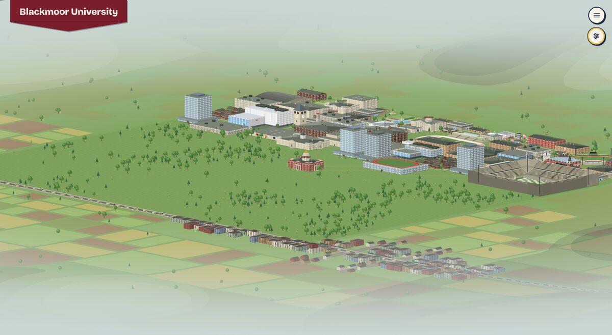
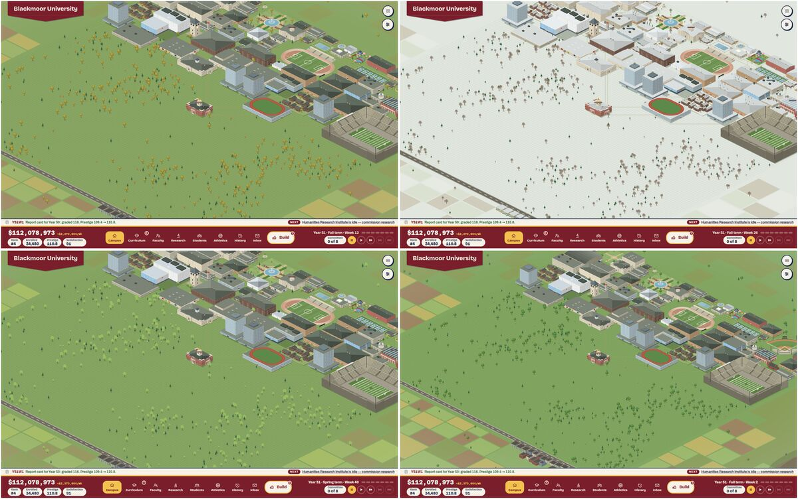
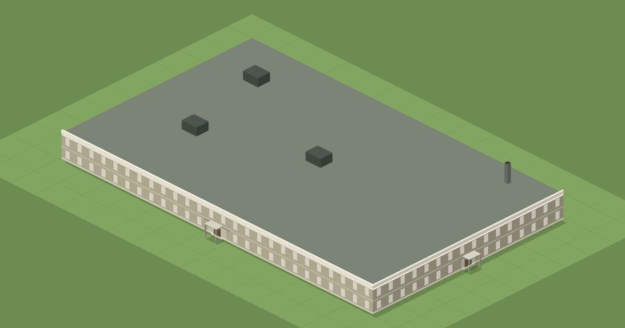
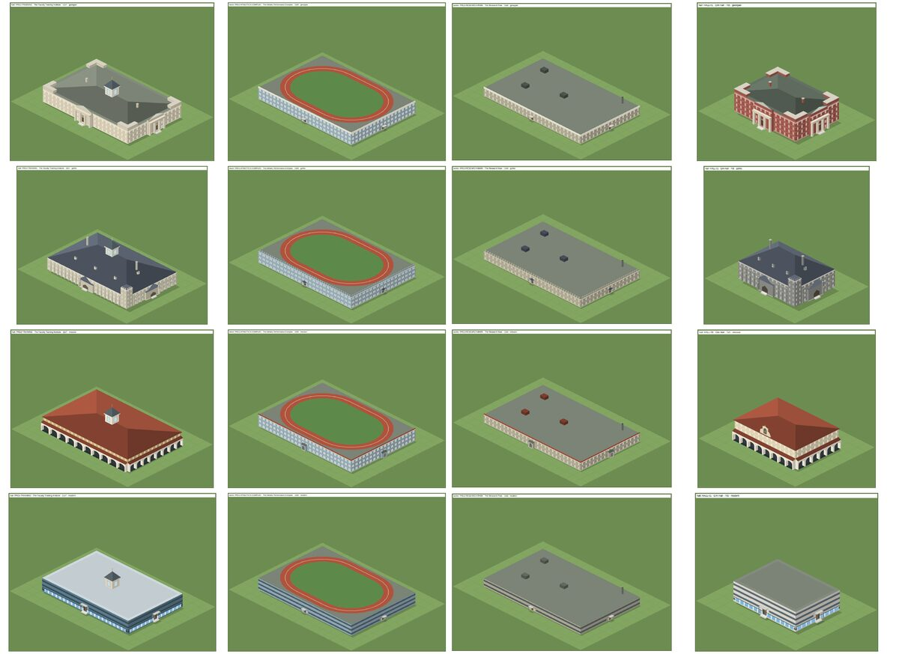
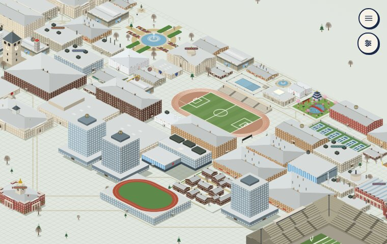
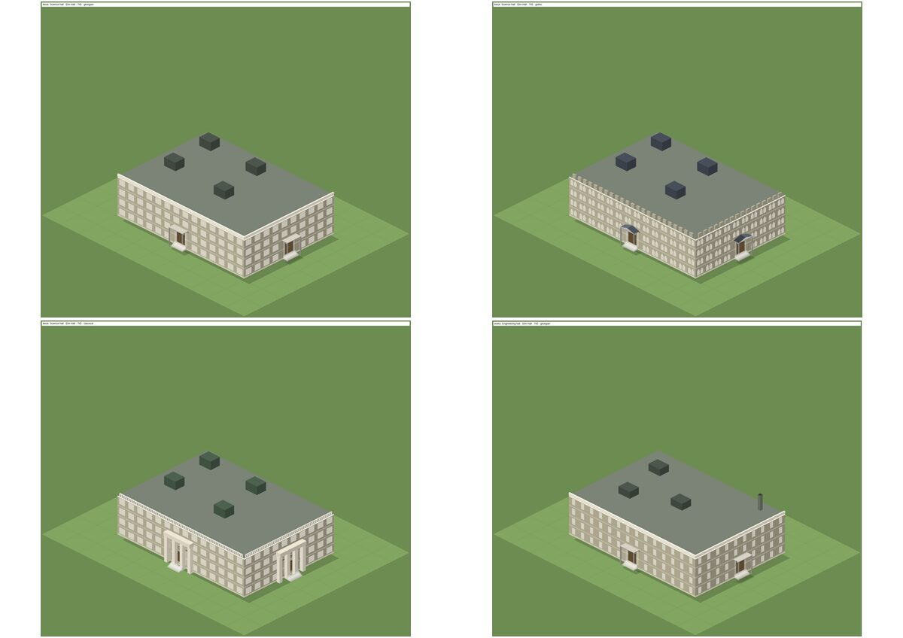

# 1. Aesthetics

Plan 86, area 1. Commit read: `4062bfb` (main, with Plans 74–85 landed). This is the second time the review has looked at area 1. The first, `docs/reviews/2026-10-game-review/1-aesthetics.md`, read `58fa3fd`.

Everything below comes from the game's own renderer:
- every placeable drawn by itself in all nine vernaculars (`npm run sheet -- --every`, 111 cells per vernacular, three more than October's 108);
- the asset gallery, regenerated (`npm run gallery:assets`) and compared with the committed one in `docs/assets/`;
- 14 test arrangements in each founding vernacular, plus a new one for this review (`npm run review:arrangements`), photographed from all four views on the production build (`npm run review:views`);
- the doors-and-depth checker over those 75 saves and over three year-51 campuses (`npm run review:doors`);
- the probes (`npm run review:probe -- vernacular | weather | catalogue | backlog`);
- year-51 campuses from `npm run scenario` (Completionist with every asset stood, Natural and Guided as they played), each shot on the canvas and on the SVG fallback (`?map=svg`), at the opening zoom, the widest zoom and the lowest pitch, at weeks 2, 12, 26 and 40, and at phone size.

Where a finding is a judgment about looks, it is labelled as **the reviewer's eye**. The reviewer is a model, so treat that label as one opinion, not a verdict.

**As run.**
- `tools/review/arrangements.ts` gained one arrangement, `specialized`: the Faculty Training Institute, the Athletic Performance Complex and the Research Park in a row along one walk. No arrangement placed Plan 85's buildings, so neither the views nor the door checker would have seen them. No other tool needed a fix.
- The views and shots were taken on the production build (`CAMPUS_URL=http://localhost:4173/`). Every shot reported the canvas as the map that was up, with nothing it could not draw.
- The base save for the arrangements is a Completionist run to year 51 with `--build-all`. That stands the three specialization buildings on one campus, which no real game produces. It is used for photographs only.

## What works

These are worth protecting. They are **the reviewer's eye**, checked against the renders.

- **The October fixes landed and hold.** The Great Dome is whole, with ribs, a peristyle and a lantern. The Campanile has clock faces and arched belfry openings, and the Gate has pilasters, relief panels and real passages. The stadium opens with stands. The Gothic library has a tower, and Mission's halls have tile. See the October table below.
- **The canvas map is the SVG map.** On a year-51 campus at the opening view, the canvas and `?map=svg` differ only along edges, from anti-aliasing: 65,457 of 1,296,000 pixels differ by more than 3%, with an RMSE of 1.8%. Not one shape is missing or moved (`img/b1-canvas-vs-svg-diff.jpg`). In every shot the map's probe reported nothing the canvas could not draw.
- **The campus is now a place.** Plan 81's ring of land works: the road runs on, the farms sit by it, the town stands along it and the far side dissolves into haze. At the lowest pitch the campus sits in a valley rather than on a board.

  
- **Seasons read at a glance.** Gold in the fall, white roofs and bare trees at the turn of the terms, buds in spring. This is the best screenshot the game has.

  
- **Two of Plan 85's three buildings say what they are.** The Athletic Performance Complex's rooftop track reads at every zoom, and from every camera. The Faculty Training Institute is a limestone academic hall under a glazed cupola, and reads as an institute beside the halls (`img/b1-specialized.jpg`).
- **The bonus vernaculars are strong.** October did not review them. Tudor's half-timbering and clock tower, Second Empire's mansards with dormers, and Italianate's brick and belvedere are among the best-dressed halls in the catalogue (`npm run gallery:assets`, `hall-1.jpg`).
- **Nothing is derelict at full funding.** On three 50-year games, 0 buildings are derelict at year 51. In October it was 44–52 of about 70.
- **Depth is still right.** Over 78 saves and four views each, the checker finds no depth-order error, no unreachable door and no walled-in building.

## The October findings

| October | What | On `4062bfb` | Evidence | Now |
|---|---|---|---|---|
| A1-1 | The vernacular restyles only about half of a grown campus | **Partly fixed** | 74E gave block, works and hangar the vernacular's windows, entrance and crest. On three year-51 campuses, 92–95% of buildings wear the vernacular's surface, but only 51–58% its massing and walls. 21 placeables share one render wall in every set | B1-3 |
| A1-2 | Different buildings share one drawing | **Fixed** | `review:probe -- vernacular`: 66 distinct looks on the Completionist campus. The only repeats left are the four residence towers, the chapter houses and the two villages | (B1-8, polish) |
| A1-3 | The Great Dome draws its drum's top in front of the dome | **Fixed** | Contact sheet, and `docs/reviews/2026-10-campus-fixes/landmarks-close.png` | — |
| A1-4 | The grand landmarks look like placeholders | **Fixed** | Clock, belfry arches, pilasters, relief, ribs and peristyle on the sheet | — |
| A1-5 | The Football Stadium opens as a bare field | **Fixed** | As built it has two touchline stands; each expansion adds stands, then the bowl, then the deck | — |
| A1-6 | Late campuses end derelict at full funding, and the derelict look is too faint | **Fixed** | `review:probe -- backlog` (`data/b1-backlog.txt`): derelict at year 51 is 0 of 82, 0 of 73 and 0 of 73, and Founders Hall's condition is 0.90–0.93. Events still add $9M–$22M of backlog each, and it heals. The hoarding and tarpaulin read at the opening zoom | — |
| A1-7 | Diagonal and curved walks draw as staircases | **Open** (backlog, Plan 74) | `diagonal` and `curve` arrangements | B1-4 |
| A1-8 | Doors open onto lawn, seams, trees and racks | **Open** (backlog, Plan 74) | The 12 October layouts give 1,842 hits, the same count Plan 74 recorded; see B1-5 | B1-5 |
| A1-9 | Style slips within a vernacular | **Fixed** | Mission tile on the limestone halls; a Gothic library and gallery; the Modern hall glazed; benches with backs; arcades with arches | — |
| A1-10 | The map never changes with time | **Fixed, with a gap** | Trees, lawn, roofs, fields and the ring follow the week. Open ground does not | B1-2 |
| (sites) | Construction sites don't grow | **Fixed on the map** | 74H's three stages. The gallery shows only the first stage | B1-6 |

## Findings

Severity: blocker, major, minor, polish. Effort: S (an hour), M (a PR), L (a plan).

| Id | Finding | Severity | Effort | Was |
|---|---|---|---|---|
| B1-1 | The Research Park, the research specialization's building, is the plainest thing on the map | major | S/M | — |
| B1-2 | Seasons stop at the open ground: fields, quads, pools and the cherry garden stay in summer under snow | minor | S/M | A1-10 (gap) |
| B1-3 | The vernacular still stops at the walls of the invariant half | minor | M | A1-1 |
| B1-4 | Diagonal and curved walks draw as staircases | minor | M | A1-7 |
| B1-5 | Doors open onto lawn, seams, trees and racks | minor | S/M | A1-8 |
| B1-6 | The committed asset gallery is stale | minor | S | — |
| B1-7 | The downtown's lights burn at noon, and the district is off the opening view | minor | M | — |
| B1-8 | Identical towers and chapter houses | polish | S | A1-2 (remainder) |
| B1-9 | Small slips on Plan 85's buildings | polish | S | — |

### B1-1. The Research Park, the research specialization's building, is the plainest thing on the map — major, S/M

**What.** Plan 85F made the Research Park the building of the research specialization: only a research college may build it, and it carries the Landmark initiatives. On the map it is a 13×8, two-storey render shed with a flat gray deck, three plant boxes, one flue and two small door canopies. **The reviewer's eye:** it reads as a distribution warehouse. Of the three specialization buildings it is the largest and the least legible, and it looks more like a parking deck than the Training Institute or the Performance Complex do.

**Where.**
- `buildingSpec.ts`: `'PROJ-RESEARCH-PARK': 'works'` (`:76`), `{ storeys: facilityStoreys('lab', 0), material: 'render' }` (`:333`).
- It has no entry in `SIGNIFIERS_BY_ID` (`:125-138`), which gives the Training Institute its `cupola` and the Complex its `track`. It has no lab feature either.
- Both 50-year harness games that specialize choose research. Natural and Guided, seed 12345, each hold the park at year 51. So this is the specialization building a player is most likely to see.

**Why it matters.** A specialization is the game's one big identity choice after the vernacular, and the building is its trophy on the map. The research college's trophy is the one building on campus a player would not screenshot.

**Fix.** Give it a signifier and break the slab:
- S: a glazed entrance atrium the full height of the long front, and a lattice of rooftop plant with a dish (the Computing lab's `mast` at park scale).
- M: draw it as a park. Make it three or four lab pavilions round a planted court, joined by glazed links. That is what Stanford Research Park, the Research Triangle and Cambridge's science parks are built as. The court is visible from every camera.

### B1-2. Seasons stop at the open ground — minor, S/M

**What.** At week 26 the roofs, the lawn, the trees and the ring are white, but nothing on the open ground changes:
- the soccer field and the stadium's turf stay green;
- the quads' parterres stay green;
- the rooftop track's infield stays green;
- the open-air pool stays blue;
- the Japanese garden's cherry trees stay in pink blossom.

**Where.**
- `src/components/groundMarkings.tsx` reads no season and no snow. `seasonStyle` (`seasons.ts`) sets `--grass`, `--lawn`, the leaf colors and the fields' colors, and the grounds draw in literal fills.
- `.jg-sakura` (`styles.css:1258-1263`) fixes the blossom's pink.

**Why it matters.** The seasons are the map's best screenshot (area 6). The green rectangles in a white campus are what the eye goes to, and blossom in midwinter reads as a bug. **The reviewer's eye.**

**Fix.**
- Draw the turf, the parterres and the rooftop infield in `--lawn` (or a `--turf` token that `seasonStyle` dulls and whitens less than the lawn, since pitches are kept clear).
- Pool water: a cover color while snow lies.
- Blossom only in spring (weeks 34–40, `bud` in `seasonOf`), green leaves in summer, the leaf tokens after that.

S for the tokens, M if every ground's literal fills are swept.

### B1-3. The vernacular still stops at the walls of the invariant half — minor, M (was A1-1)

**What.** Plan 74E gave the invariant forms the vernacular's surface: windows (Gothic lancets, Mission arches), the entrance, the crest (merlons, balustrade, tile coping) and the roof color on the plant. Close up it works. At the opening zoom it is a few pixels, and the wall itself, the largest area on screen, stays the same buff render in every vernacular. **The reviewer's eye:** the Georgian, Gothic and Classical Science halls read as one building, and Science and Engineering still differ only by one flue and one fewer plant box.

**Where.**
- `review:probe -- catalogue`: 21 of the 80 placeables wear the render wall `#b0a992` in all five founding sets.
- `review:probe -- vernacular`:

  | Campus (year 51) | Buildings | Massing and walls follow the vernacular | Surface follows the vernacular |
  |---|---:|---:|---:|
  | Completionist, every asset stood | 74 | 41 (55%; 49% of area) | 67 (91%; 79% of area) |
  | Natural, seed 12345 | 65 | 38 (58%; 50%) | 62 (95%; 82%) |
  | Guided, seed 12345 | 61 | 31 (51%; 46%) | 56 (92%; 77%) |
  | Natural, Collegiate Gothic, year 31 | 56 | 31 (55%; 45%) | 53 (95%; 76%) |
  | Completionist, Mission, year 31 | 63 | 37 (59%; 54%) | 61 (97%; 83%) |

  October's massing share was 54–57%. It has not moved, by design: 74E kept the massing and the materials.

**Why it matters.** A1-1's reason stands, at a smaller scale. The vernacular is the player's first creative choice, and by year 50 a third of the campus's area is the same buff box in every set.

**Fix.**
- Let the block and works school signatures take the vernacular's wall: brick in Georgian and Tudor, ashlar in Gothic, limestone in Classical and Second Empire, stucco in Mission. Keep render for Modern and Art Deco, where it fits. The massing stays.
- Give the Science hall a signifier of its own, such as a row of fume-hood stacks along the ridge line or a rooftop greenhouse, so it parts from Engineering.

### B1-4. Diagonal and curved walks draw as staircases — minor, M (was A1-7)

Unchanged since October. Plan 74 sent it to the backlog. A diagonal walk is still a zigzag ribbon of square tiles. **The reviewer's eye:** in a campus that now has a real landscape round it, the zigzag stands out more, not less.

**Fix** as October's: draw a walk as a polyline through its tiles' centres with rounded joins, or fill the triangle between diagonally adjacent walk tiles. M.

### B1-5. Doors open onto lawn, seams, trees and racks — minor, S/M (was A1-8)

**What and where.** Unchanged since October; Plan 74 sent it to the backlog.
- **The 12 October arrangements** (60 saves): 1,842 hits, the count Plan 74 recorded. Of these, 1,180 are door-onto-lawn, 210 door-on-seam, 115 door-behind-mass and 40 door-under-tree.
- **The two chapel arrangements** (Plan 80I) have a walk to all four doors and score 0 hits.
- **The new `specialized` arrangement** scores 65 hits: 55 door-onto-lawn on the back and side walls, and 10 door-on-seam on the Research Park's 8-tile ends.
- **Three year-51 campuses** (`data/b1-doors-grown.md`):

  | Rule | Hits | Buildings |
  |---|---:|---:|
  | door-onto-lawn | 814 | 187 |
  | door-on-seam | 88 | 44 |
  | door-onto-ground | 22 | 18 |
  | door-under-tree | 20 | 20 |
  | overhang | 15 | 12 |
  | door-under-prop | 3 | 3 |
  | prop-on-tree | 1 | 1 |

  Nearly every building on a grown campus has a door onto grass. Bike racks still stand on the Business School's and two residences' north doors (`dressing.tsx`). The even-wall seam rule is still `entrancesOf` (`walkRoutes.ts:96`).
- The full tables are `data/b1-doors-arrangements.md` and `data/b1-doors-grown.md`.

**Fix** as October's:
- an even wall's door on the tile nearest a walk (S);
- racks and the flag skip door tiles, and trees are cleared from a door's tile when a building is placed (S);
- a short path drawn from each door to the nearest walk (M).

The last one is the one a player sees.

### B1-6. The committed asset gallery is stale — minor, S

**What.** `docs/assets/` was written by Plan 75C (#219) and has not been rerun since. Regenerated on `4062bfb`, the gallery is 27 images and 5.9 MB, where the committed one is 25 images and 3.4 MB. The committed gallery:
- lacks the Faculty Training Institute and the Athletic Performance Complex;
- lists the chapel among the pavilions as a 5×3 pavilion, where Plan 80I made it a form of its own (`chapel.jpg`);
- has no chapel under construction;
- and was drawn before Plans 80I, 81 and 85 changed the art.

Separately, its "under construction" images show only the first stage, a slab with its scaffold, because the sheet has no countdown. So the gallery never shows 74H's frame or closed shell.

**Why it matters.** The gallery is how the owner and any later reviewer see every asset without playing (Plan 75's note 3), and `docs/README.md` points to it.

**Fix.**
- Rerun `npm run gallery:assets` in this PR or the next art PR, and add "rerun the gallery" to the art PR checklist.
- Have `sheet.tsx`'s construction cells draw the frame stage (pass a countdown at half), so the gallery shows the stage that differs most from the finished building.

### B1-7. The downtown's lights burn at noon, and the district is off the opening view — minor, M

**What.**
- **The lights.** Plan 85H's district is "lit" for three weeks after a festival and through the snow weeks: windows and shopfronts turn warm, the bulbs glow and pools of light lie on the street. The map has no night, so the light is drawn in daylight. **The reviewer's eye:** at noon the pools read as yellow paint on the road, not as light (`docs/reviews/2026-10-pillars/85h-district-lit.jpg`).
- **Off screen.** The district is in the ring along the road, not on the parcel. At the opening zoom of a year-51 campus it is out of frame, and a player sees it only by zooming out to the widest view or flattening the pitch (`img/b1-ring-low-pitch.jpg`). The student-life specialization is the only one whose payoff on the map is not a building on campus.

**Where.** `downtownData.ts:54` (`FESTIVAL_LIT_WEEKS`) and `:128-129` (`districtLit`); `CampusMap.tsx:2099`; `ringLand.ts`'s `buildDistrict`.

**Fix.**
- Light the district only under a dusk tint. A1-10's later step, "a dusk tint over the summer beats", would give it one. Until then, show a festival with bunting and crowds in the street rather than light.
- At the specialization choice, and the first time the district grows a step, ease the camera to it once, the way the map brings a keyboard-focused building into view.

### B1-8. Identical towers and chapter houses — polish, S (A1-2's remainder)

`review:probe -- vernacular` lists the only looks still drawn more than once:
- the four residence towers (DORM-12 to DORM-15, all 7×7 glass towers);
- the chapter houses, five or six per grown campus, all one 3×3 dark-brick pavilion;
- the two villages.

Each repeat is the same function, so Plan 74F's rule allows it. **The reviewer's eye:** four identical glass towers in a row is the one place on a grown campus that reads as copy-paste. **Fix:** pick a crown, a band color or a podium form by a hash of the id, as trees pick species. Do the same for a chapter house's door color and porch.

### B1-9. Small slips on Plan 85's buildings — polish, S

- **The Modern Training Institute** wears the cupola, a hipped lantern with a gilt finial, on a flat Modern roof (`img/b1-specialized.jpg`, bottom left). A Modern set wants a glazed rooftop pavilion or a skylight box.
- **The door canopies on the Complex and the Park** are the halls' small canopies on 117 m and 108 m fronts. At the opening zoom the doors are invisible. A big building wants a big entrance: a double-height glazed bay.
- **Two complexes.** The map now has an "Athletics Complex" (REC-T2, `facilitiesData.ts:681`) and "the Athletic Performance Complex" (Plan 85G). On the tooltip and the keyboard list they are one word apart. That is for area 2, but a player meets it on the map.

## Each vernacular against its style

**The reviewer's eye**, from the contact sheets and the regenerated gallery. October's table stands, with what Plan 74 added.

| Vernacular | Since October | Still missing, most visible first |
|---|---|---|
| Georgian | Its surface on the invariant halls (canopies, stone coping) | Fanlights and quoins. The signature halls keep the buff render wall (B1-3) |
| Collegiate Gothic | A Gothic library with a tower; lancets and merlons on the blocks; slate on the limestone halls | Gables with finials on the residences; the signature halls' wall (B1-3) |
| Classical | A small portico and a balustrade on the blocks | The portico is now on nearly everything, so the hierarchy is flatter still |
| Mission | Tile on the pitched limestone halls; arcades that read as arches; tile coping on the flat roofs | Courtyards, the thing Mission campuses are built round |
| Modern | A glazed ground floor; taller ribbons | Pilotis or a cantilever; the Training Institute's cupola (B1-9) |
| Tudor, Italianate, Second Empire, Art Deco (bonus; first look) | — | Strong on the halls. They share the founding sets' invariant half and its render wall, so B1-3 applies to them too |

## Repetition across the catalogue

`npm run review:probe -- catalogue` now counts 80 placeables:
- **pavilion:** 14 (the chapel left it);
- **hangar:** 10;
- **grounds:** 9;
- **hall:** 8 (with the Training Institute);
- **residential:** 8;
- **block:** 7 (with the Performance Complex);
- **works:** 6 (with the Research Park);
- **portico:** 6;
- **tower:** 4;
- **landmark:** 4;
- **village:** 2;
- **bowl:** 1;
- **chapel:** 1.

The pavilion no longer has to stand for worship, and the signifiers part what it still covers.

In every founding set, 12 placeables have no entrance part, down from 33. These are the grounds-like forms, the towers and the landmarks.

## Construction sites and walkers

- **Sites now rise** through footings, the frame and the closed shell (74H), and the canvas draws them correctly since #279 fixed the black shells. The gallery shows only footings (B1-6).
- **Walkers** are drawn in the depth order on the canvas (Plan 83D) and stay with the scene through a turn (Plan 82). Nothing to fix.

## Decorative assets worth adding, re-ranked

Seasons, October's first, is done (B1-2 is its gap). The ring of land changed what the edge of the campus needs. Value is **the reviewer's eye**; cost uses the effort scale.

| Rank | Asset | What it adds | How it fits now | Cost | October |
|---:|---|---|---|---|---:|
| 1 | Paths from doors to the walks (B1-5) | Every building meets its campus; the most-seen defect on a grown map | A short drawn path from each door tile to the nearest walk, drawn as walks are | M | — |
| 2 | Water: a pond or a lake edge, with a boathouse | A second natural material, and the ring now gives it somewhere to sit: a river along the valley floor | A tile kind on the parcel, and a strip of water in `ringLand.ts`'s valley | L | 2 |
| 3 | Walls and gates at the road | The road now runs past a real town; the campus has no front door to it | Props along `ROAD_FIRST_ROW`, a gate piece where a walk meets the road | M | 3 |
| 4 | A dusk tint | Gives the downtown's lights (B1-7), the lamps and the windows a reason; a second screenshot | A tint over the map and the ring for the summer beats and the festival's weeks, through the same tokens as the seasons | M | (in 1) |
| 5 | Signage at the doors | Legibility on an 80-building map | A plate by the door tile, its text at zoom 3 and above | S | 7 |
| 6 | A bandstand or a quad clock | A focal point that is not the fountain | A `grounds` amenity with a raised prop | S | 4 |
| 7 | Sculpture, several kinds | Variety where the one statue repeats | The statue's prop, with its silhouette picked by a hash | S | 5 |
| 8 | Parking beside the road | Realism for a 34,000-student school | A `grounds` lot against the road | M | 6 |

Benches, lamps and bike racks still need B1-5's fixes, not more kinds.

## How to look again

- `npm run sheet -- --every` and `npm run sheet:shot -- <sheet.html> <dir> --cells`.
- `npm run gallery:assets` (rerun after any art change, B1-6).
- `npm run review:arrangements -- --base <year-51 save> --out <dir>` (now 15 layouts, with `specialized`), then `npm run review:views -- <dir>/*.json --zoom=2` with `CAMPUS_URL` pointed at the production build.
- `npm run review:doors -- <saves>`; `npm run review:probe -- vernacular <saves>`, `-- catalogue`, `-- backlog`.
- For the canvas against the fallback, load the same save with and without `?map=svg` and compare the two shots.
