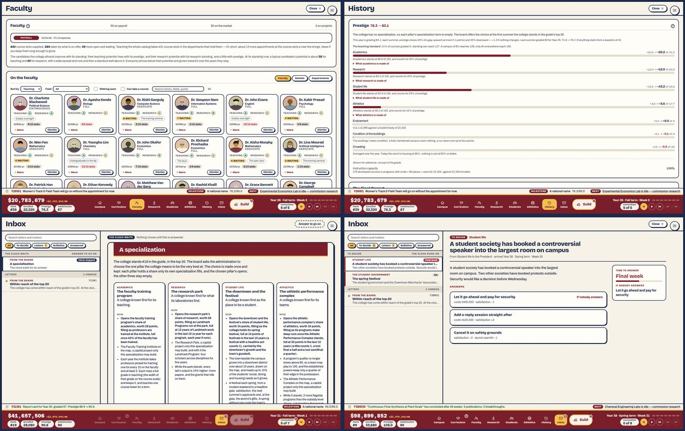
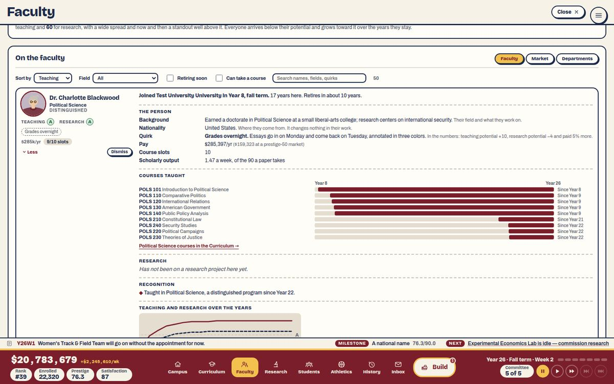
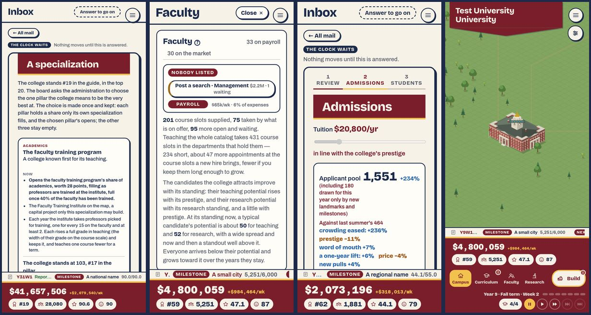

# 2. UI and text

Plan 86, area 2. Commit read: `4062bfb`.

**As run.** Both of this area's tools needed small changes for Plans 77–85, made here and kept to `tools/`:

- `tools/review/gallery.mjs`: the Inbox is a tab (Plan 77), so the tour opens it and its first item; a stop is answered in the inbox's reading pane (Plan 77C), so a held card is counted as itself (layer "Inbox › summer"), as October counted the modal; the Faculty tab has three views and a person page (Plan 84), so the tour captures Market, Departments and one person; the map is a canvas (Plan 83), so Founders Hall is found through the map's review probe (`tools/mapReview.mjs`'s `mapBuildings`) instead of an SVG node.
- `tools/review/strings.ts`: Plan 85's six files had no screen and fell into "Other" (3,198 words); they are now "Specialization (choice and notice)" and "Specialization programs", and History's new panels (`StandingBreakdown`, `RankingsPanel`, `RankingsTable`) are "History tab". "Pillar", "specialization", "potential" and "training pick" joined the jargon list.
- `tools/scenarios.ts` (shared): the `training` scenario ran out the clock, because the Guided player's own rule no longer picks academics since Plan 85I. It now names academics, as the research-park, complex and downtown scenarios name theirs.
- Not changed, for the lead: `demand` still fails (as in October), and the harness founds every college as "Test University" (`sim/harness/game.ts:44`), which the charter turns into "Test University University" in every capture after year 7.

**What was done.**

| Pass | Tool or method | What it covered |
|---|---|---|
| Screen gallery | `npm run review:gallery` | 788 captures of every tab, the Inbox and its first item, the Faculty grid, market, departments and a person, the Build menu, the main menu, Settings, Founders Hall's panel and every stop held in 21 scenario saves and a fresh start (week one to year 41, and the Final Report: 314 words, October 294), at 1440×900 and 390×844, against the production build. A second pass of 116 at the largest text size with colour-safe signals and reduced motion. Full table: [`data/gallery.md`](data/gallery.md). |
| String table | `npm run review:strings` | 7,451 strings, 54,036 words (October: 6,821 and 47,015), with the house-style checks. |
| Consistency | an audit | Against the register as Plan 76H rewrote it and Plan 47's glossary → [`2c-consistency.md`](2c-consistency.md). |
| Voice | an audit | The scanner over everything; by hand, the 850 strings Plans 77–85 added or rewrote; October's issue rows spot-checked → [`2d-voice.md`](2d-voice.md). |
| Course descriptions | an audit | All 431 sentences again, Plan 76G's rewrites checked one by one, and the catalog's shape → [`2a-course-descriptions.md`](2a-course-descriptions.md). |
| Flavor against the code | an audit | October's 308 false and vague claims looked up on `HEAD`, and 83 claims in the new text → [`2b-flavor-and-mechanics.md`](2b-flavor-and-mechanics.md), rows in `data/`. |

October's four appendices had four readers. This time one reader, a model, did all four and checked the headline claims against the code; every row cites a file and line. Judgments of feel are labeled as the reviewer's.

```sh
npm run scenario -- year-8-balanced /tmp/sc/y8.json            # and the rest of the list in data/gallery.md
npm run scenario -- --player Completionist --year 31 --from-year 30 --modal summer /tmp/sc/summer30.json
npm run scenario -- --player Guided --year 2 --modal summer /tmp/sc/summer1.json
CAMPUS_URL=http://localhost:4173/ npm run review:gallery -- /tmp/sc/*.json --out /tmp/gallery
CAMPUS_URL=http://localhost:4173/ npm run review:gallery -- /tmp/sc/{y8,summer,spec}.json \
  --settings '{"textScale":1.3,"vision":"safe","motion":"reduce"}' --out /tmp/gallery-large
npm run review:strings -- --out /tmp/strings
```

## The October findings

| October | Title | On `HEAD` | Evidence | Carried as |
|---|---|---|---|---|
| A2-1 | The Curriculum tab is the heaviest screen | **Fixed.** The load moved to other tabs. | Year 8: 2,244 words and 282 controls → 762 and 47; year 16: 3,649 and 474 → 1,118 and 57; year 25: 1,340 and 181 → 574 and 42. "Below A" and "No instructor" filters beside "Needs attention" (`tabs/curriculumFilter.ts`); the head is pinned on a wide screen. | B2-1 (the new heaviest screens) |
| A2-2 | Flavor text promises mechanics the game doesn't have | **Fixed** for October's claims; **new ones** since. | Of 109 false claims, none is still false and 6 are now vague; of 199 vague, 24 remain (Plan 76D's backlog list). Four new false claims, all from later plans changing rules under old words. | B2-2 |
| A2-3 | Money and figures written several ways | **Fixed.** | One money rule (`format.ts`), one precision per figure, `.stat-warn` on cream; `test/number-format.test.ts` scans `src/`. One polish item from the mono face (2c D9). | — |
| A2-4 | The voice slips in the places every player reads | **Mostly fixed.** | Engine words 68 → 0, British spellings 38 → 0, contractions 4 → 0; the rankings and admissions modals in the house voice; the glossary in Plan 47. 37 strings still say "you" (October 58). New slips on the new screens. | B2-5 |
| A2-5 | Course descriptions: real errors in places | **Sentences fixed; shape open.** | 118 of 122 October rows took the proposed sentence word for word, the other 4 as Plan 76G chose; flagged courses 126 (29%) → 25 (6%). The catalog's shape (no 300/400 level, the JD's Professional Responsibility, MED550, five missing core courses) is in the backlog, untouched. | B2-6 |
| A2-6 | Buttons and headings have no system | **Fixed.** | One button base and four roles, one close control, `ConfirmButton` everywhere October named, a six-level heading scale; 424 of 428 font sizes on tokens. Two new armed labels and a fifth button role depart (2c D1, D4). | B2-5 |
| A2-7 | The phone layout crowds the map and breaks words | **Fixed.** | The dock folds to its figures under a tab (206 → 85 px); the tabs scroll beside Build; cohort cards two to a row, whole names at the largest text; beat headers number over word; the pennant two lines. New phone issues are small (B2-7). | B2-7 |
| A2-8 | The register is out of date | **Fixed.** | `ui-shell.md` matches the code on the tabs, gears, toasts, faces, palette, camera, `L`, `I` and the inbox. One glossary entry is stale (six rankings; 2c D10). | B2-5 |

## The screens



**Words and controls per screen.** The top layer only, everything reachable by scrolling included. Desktop; a phone reads the same words.

| Screen | Year 1 | Year 8 | Year 16 | Year 25 | Year 30 | Year 40 | Scrolls |
|---|---:|---:|---:|---:|---:|---:|---|
| Map and dock | 63 w / 22 c | 177 / 56 | (a stop held) | (a stop held) | (a stop held) | 354 / 127 | no |
| Inbox, list and first item | 46 / 7 | 48 / 8 | 46 / 7 | 52 / 8 | 84 / 10 | 371 / 10 | at year 40 |
| Curriculum | 60 / 9 | 762 / 47 | 1,118 / 57 | 574 / 42 | 440 / 41 | 119 / 19 | yes |
| **Faculty (the grid)** | 367 / 18 | 1,135 / 140 | 1,575 / 202 | 1,528 / 205 | **1,962 / 275** | **1,964 / 293** | yes |
| Faculty, a person open | — | 1,329 / 141 | 1,820 / 203 | 1,769 / 206 | 2,172 / 276 | 2,209 / 294 | yes |
| Faculty, the market | 910 / 107 | 1,161 / 130 | 1,275 / 144 | 1,250 / 144 | 1,293 / 148 | 1,185 / 145 | yes |
| Research | — | 152 / 4 | 809 / 15 | 563 / 15 | 688 / 15 | 783 / 15 | yes |
| Students | 200 / 7 | 599 / 9 | 723 / 9 | 840 / 9 | 791 / 9 | 791 / 9 | yes |
| **Athletics** | — | 203 / 15 | 745 / 53 | **1,858 / 107** | **2,167 / 123** | **2,252 / 156** | yes |
| **History** | 788 / 3 | **2,054 / 9** | **2,577 / 9** | **2,841 / 11** | **2,964 / 11** | **3,296 / 11** | yes |
| Treasury | 424 / 16 | 560 / 16 | 601 / 13 | 625 / 21 | 629 / 21 | 615 / 21 | yes |
| Build menu | 26 / 7 | 59 / 12 | 69 / 11 | 35 / 12 | 35 / 12 | 35 / 12 | no |
| Summer (Review, Admissions ×2, Students) | 374 + 34 + 179 + 41 | | | | 618 + 34 + 236 + 27 | | Review, reveal |

Saves: `founding`, `y8`, `crisis` (October's year 16), `y25`, `summer30` (Completionist, as October's year 30), `y40`. The year-6 summer runs 537 + 34 + 227 + 82.

**The specialized colleges (years 38–40).** The Faculty grid with the training program: **2,168 words and 326 controls**, and 2,264 and 340 at the town-and-gown save (year 40), the most controls on any screen in the game. The Research tab with the park: 775 words. Athletics with the complex: 1,595 words and 93 controls. Students with the downtown: 842 words. The specialization choice: 681 words, 5 controls, about four phone screens of cards.

**Load by moment.**

- **The first hour.** The walkthrough (up to 292 words), the founding notes (50), the year-one letters (about 330 of the opening letters' 718: the board's welcome, the first hall, what the students need, the summer), the first milestones, and the first summer (628). Roughly 1,400–1,800 words before year two, as in October. **The reviewer's judgment:** still about right, and the inbox keeps it in one place. A player who opens the Faculty tab in week one meets 367 words on the grid and 910 on the market.
- **The first summer** is 628 words over four steps (October's year-6 summer: 728).
- **A year-30 summer** is now **915 words** (October: 616). The Review alone grew from 303 to 618: it lists every course finished, program founded, professor appointed and building opened, one line each (`state/yearInReview.ts`), so it grows with the college.
- **The busiest moments** are no longer the Curriculum. They are the tabs a late player opens to act: **Faculty** (2,000–2,264 words and 275–340 controls from year 30), **History** (2,000 words by year 8 and 3,296 by year 40, the wordiest screen in the game), and **Athletics** (1,858–2,252 by year 25). Each is a single scrolling page.
- **The specialization** is the run's one permanent choice. It arrives as a board letter (118 words) two to four years ahead, then as a 681-word stop.

**What earns its place.** The reviewer's judgment, from the gallery and the captures.

| Screen | Rating | Why |
|---|---|---|
| Campus map | Compelling | The game's face (area 1). |
| Inbox | Useful, close to compelling | One place for everything addressed to the President, read like mail; the matters' "Final week", the answers with their costs and the default named. It replaced seven channels with one and the event panel's content survives whole. |
| Summer Review | Compelling, growing | The year as a story with its numbers. At year 30 its lists are long (B2-1). |
| Admissions step | Compelling | Unchanged since October and still the year's best-explained decision. |
| Faculty grid | Useful, heavy | Faces and letters make the faculty people, as the owner asked. At 50–90 professors the grid is a long wall of tiles, each with three to four buttons (B2-1). |
| Faculty person | Compelling in idea, useful | The arrival line, the timeline of courses and the chart are the best new reading in the game; the person page is where a player learns a professor's story. |
| Faculty market | Useful | The market's standing line answers the owner's ask in plain words. |
| The specialization choice | Compelling in idea, overloaded | The choice the plan exists for, presented as four columns of rules (B2-3). |
| History › Prestige (the pillars) | Useful, dense | The only explanation of prestige, now with four pillars, each with two scales (B2-3). It sits above the chronicle, the charts and the guide on one 3,000-word page. |
| The four programs (training bar, park, complex, downtown) | Useful | Each says what it does and how far its share has filled. The term lines run 50–70 words (2d). |
| Town-and-gown events, the festival | Compelling | As good as the best of the catalogue (2d §7). |
| Specialization notice | Useful, long | 118 words to say "the choice is coming"; the rule it restates is in five other places (2d §5). |
| Treasury, Students, Research | Useful | Little changed since October. |
| Athletics | Useful, heavy | 2,252 words at year 40 (B2-1). |
| Milestone letters, research reports | As October | Both still stop the clock (Plan 77C kept every stop a stop); area 4 counts them. |

## Findings

| Id | Title | Severity | Effort | Was |
|---|---|---|---|---|
| B2-1 | The load moved from the Curriculum to Faculty, History and Athletics | major | M | A2-1 |
| B2-2 | Later plans left four claims false, the History notes among them | minor | S | A2-2 |
| B2-3 | The specialization choice: one permanent choice, 681 words, and a misleading figure | major | S | — |
| B2-4 | Plan 85's rule is restated six times, and "term" means two things | minor | S | — |
| B2-5 | The glossary's last mile: bare "slots", "default", two armed labels, six or seven rankings | minor | S | A2-4, A2-6, A2-8 |
| B2-6 | The course catalog's shape, and a bland entry tier | minor | L (shape), S (101s) | A2-5 |
| B2-7 | Small phone and inbox details | polish | S | A2-7 |

### B2-1. The load moved from the Curriculum to Faculty, History and Athletics — major, M



**What.** Plan 76B fixed the Curriculum (762 words and 47 controls at year 8, from 2,244 and 282). The heaviest screens are now three others, each a single scrolling page:

- **Faculty.** The grid is 1,135 words and 140 controls at year 8 and **1,962–2,264 words and 275–340 controls** from year 30. Each tile carries More, Dismiss and, at an academics college, Train; a year-40 grid has 79 Dismiss buttons on its face (`tabs/FacultyTile.tsx:255-262`). The tab opens on two paragraphs of summary (the course-slot sums and the market's standing, about 140 words) before the first face; on a phone at the largest text that is the whole first screen.
- **History.** 2,054 words at year 8 and **3,296 at year 40**, the wordiest screen in the game (October: 2,166 at year 30). Prestige's breakdown, now four pillars that each open into their terms, sits on one page with the Final Report's draft, the promises, the chronicle, the charts and the guide.
- **Athletics.** 1,858 words at year 25 and 2,252 at year 40 (October: 1,781 at year 30).
- **The summer Review** at year 30 is 618 words (October 303): every course, program, appointment and building of the year, one line each.

**Why it matters.** These are the screens a late-game player opens to act: to train or replace a professor, to read why prestige moved, to reorder flagships. The words and controls a player must scan to find one thing are the barrier, as the Curriculum's were in October.

**Fix.**
- **Faculty:** take Dismiss and Train off the tile's face into the person page (the tile keeps More and its chips); fold the summary paragraphs into the help hint and a one-line figure row ("440 course slots, 284 taught, 61 short"); open on the filter the player last used.
- **History:** split it with the segmented control into Prestige, the record (Final Report draft, promises, chronicle, charts) and the guide, as Faculty has views.
- **Athletics:** fold each program to one line (its grade, its band, its next action), as Plan 76B did for programs.
- **The summer Review:** group like lines ("13 courses finished: …" already does this for courses; do the same for appointments and programs) and cap each list at five with "and N more".

M.

### B2-2. Later plans left four claims false, the History notes among them — minor, S

**What.** October's 109 false claims are gone (`2b`), but four new ones are false on `HEAD`, each written before a later plan changed the rule under it:

- **"Of {n} colleges, in the guide's academic ranking"** under "Place in the guide, by year" (`HistoryTab.tsx:236`). The chart plots the prestige rank; since Plan 85 the guide ranks by prestige, and "Academics" is a separate pillar ranking.
- **"The grade reads the curriculum, the teaching, the students, research, satisfaction, campus life, the buildings and grounds, and the endowment"** under the Prestige chart (`:228`): no athletics, 15% of prestige since Plan 85B.
- **"Breadth is what lifts the prestige limit — the decades-long half of the climb"** under the Catalog chart (`:260`). The only limit is the teaching standard, and breadth is one term of a 35% pillar.
- **"Above 5% the board starts to worry"** in the endowment's help (`EndowmentPanel.tsx:36`, and "more than the board thinks prudent", `:55`). Nothing has read the draw rate since Plan 80C removed board confidence.

Eleven more are vague (`2b`), the most consequential being the specialization's points (B2-3).

**Why it matters.** The October finding's point stands: a player who catches the text in one false claim stops reading it. These four sit on the screens that explain prestige and money.

**Fix.** Rewrite the three notes from `PILLAR_WEIGHTS` and the guide's own words ("Of {n} colleges, by prestige"); drop the board's worry or say what a high draw costs (the endowment's growth). Then make it a habit: a plan that changes a rule greps for the rule's words in `src/`, as Plan 76 grepped for its own.

S.

### B2-3. The specialization choice: one permanent choice, 681 words, and a misleading figure — major, S



**What.**
- **The stop is 681 words** in four columns (one per specialization) of a 60-word intro and 130-word cards. Each card's lead line, in bold, is a 28- to 50-word sentence ("Opens the downtown and the festival's share of student life, worth 34 points, filling as the college holds its spring festival, full at 10 points of festivals in the last 10 years (a festival with a headline act counts 1), carried by the downtown's growth and the town's goodwill."). On a phone the cards stack to about four screens.
- **The one figure the cards share misleads.** "Worth 28 points" (academics, research) and "worth 34 points" (student life, athletics) are pillar points, on the pillar's 32–150 scale. A pillar counts for its weight of prestige, so the shares are worth **9.8, 7.0, 8.5 and 5.1 points of prestige**: athletics' "34" is worth least, academics' "28" most (`specializationData.ts:261-264`; `prestigeSystem.ts:61-66, 92-97, 477-478`).
- **What a player would compare is missing.** Each card ends with "The college stands at 103, #17 in the pillar" and the rivals specialized in it, but not what each choice would do to the college's prestige or rank.
- **History › Prestige shows each pillar on two scales:** "+20.2 → +20.2 of 41.3" (its share of prestige, current → target) on the bar and "Academics stands at 89.8 of 150, and counts for 35% of prestige" under it, with no word for how the two relate. The teaching standard's line beside them reads "31% of courses graded A: standing can reach 127. A campus of B's reaches 128": the limit reads mean grade points, not the A share it names (`prestigeSystem.ts:471`).

**Why it matters.** Plan 85 exists for this choice, and it is made once and kept. A player who chooses on the cards' figure will think athletics is worth the most.

**Fix.**
- Say each share in prestige points ("up to 9.8 points of prestige") and keep the pillar points in the detail.
- Cut each card to three lines (what it is, what it adds now, how its share fills) with the rest behind "More", as the Faculty tile does.
- Add one comparable line per card: the college's prestige and rank if that share were full today.
- On History › Prestige, put the two scales on one row ("Academics 89.8 of 150 → 20.2 of 41.3 points of prestige"), and drop the arrow when current and target agree. Name the teaching standard by its own measure ("courses average a B−: standing can reach 127").

S.

### B2-4. Plan 85's rule is restated six times, and "term" means two things — minor, S

**What.**
- "Each pillar holds a share only its own specialization fills, so without one no pillar reaches the top" is in the History help, the standings' help, the guide's help, the choice's intro, the notice and the status line, in six wordings (`2d` §5). The four weights ("35%, 25%, 25% and 15%") are typed into five help texts.
- The cards, the notice and the Research tab call a pillar's part a "share"; the History rows, the status line and the three programs' term lines call it a "term" ("The term is full from 12."). On the Faculty tab's training bar, "the academics pillar's specialization term is full at 40%" sits one line from "for a term they teach one course fewer".

**Why it matters.** Six restatements are six places for a retune to leave a stale number (the false History notes in B2-2 are exactly that), and two meanings of "term" on one bar make the bar harder to read.

**Fix.** Say the rule once, in History › Prestige's head, with the weights read from `PILLAR_WEIGHTS`; let the other places link there. "Share" everywhere a pillar's part is meant; "term" for the calendar only.

S.

### B2-5. The glossary's last mile — minor, S

**What.** The October voice and consistency findings are fixed; what is left is small and mostly on the new screens (`2c` §4, `2d`):

- A bare "slots" on every faculty tile ("9/10 slots", `FacultyTile.tsx:209`) and "slot 2" in the suggested move's tooltip (`BuildingInfoPanel.tsx:282`); the glossary says "course slot" and "program slot", never a bare slot.
- Two armed labels outside the rule: "Confirm: this is for good" (the specialization, which does not say what is lost) and "Confirm: {course} moves" (training). Every other one reads "Confirm — ‹what is lost›".
- "Nobody answered in time, so it took its default" (the glossary: "left unanswered"); "the Spring Term's fourth week" (the glossary: "Spring term").
- "Seven rankings, one field" in History, "The six standings" in the Final Report, "six rankings" in the glossary.
- "Distinguished" as a professor's rank on the tile, and as a program's stage on the same person page.
- Second person in 37 strings, about 15 of them help hints that should say "the college" (`2d` §2).
- A fifth button role (Train's school-colored outline), and the inbox's hand-built "Y31W1" date on letters (`2c` D4, D5).

**Why it matters.** Each is small. Together they are the drift a glossary exists to stop, on the screens Plans 84 and 85 added after it was written.

**Fix.** As listed, with the words in `2c` and `2d`, and add bare "slots", "default" and "Spring Term" to `tools/review/strings.ts`'s checks.

S.

### B2-6. The course catalog's shape, and a bland entry tier — minor, L (shape), S (101s)

**What.** Plan 76G landed: 118 of 122 October rows took the proposed sentence, the other four were handled as the plan chose, and the flagged courses fell from 126 (29%) to 25 (6%). What is left (`2a`):

- **The shape**, which Plan 76G sent to the backlog because each change moves course ids in every save, is untouched: no course above 200 and no capstone; the JD without Professional Responsibility and with its clinic before its capstone; MED550 preparing students for the Match halfway through the preclinical courses; Sociology without statistics, Political Science without methods, History without the non-Western world after its first course, Philosophy without Descartes to Kant; Nursing without medical-surgical nursing.
- **The 101s** are the catalog's blandest tier: 16 of 42 say nothing their titles do not ("Introduces data collection, cleaning, and exploratory analysis techniques").

**Fix.** The sentences in `2a` for the 101s (S). The shape is a save-migration plan of its own (L).

### B2-7. Small phone and inbox details — polish, S

**What.**
- **The inbox dates a board letter today.** `inbox.ts:214` gives the board's letter `week: now`, so it always reads as arrived this week and sorts first among letters; the specialization notice in the downtown save reads "Y38W31" years after it came. (It also stays until "Noted", by design.) This is a display bug; the lead may file it with area 7.
- **The Answered list keeps what the log keeps,** 200 lines, while its empty line says "Every matter settled … is kept here".
- **"Answer to go on"** is a dashed pill in the Close button's place and shape that does nothing (`TabOverlay.tsx:31`).
- **On a phone at the largest text** the Faculty tab's first screen is its summary prose, and the ticker's date shrinks to "Y." beside the milestone.
- **The funds figure** in Azeret Mono spaces its commas ("$41 , 657 , 506") at every size.

**Fix.** The letter's arrival week stored with the queue; "the matters settled lately"; "Answer to go on" set flat, as a note; the Faculty summary folded (B2-1); the funds figure in the display face with tabular numerals, or a mono with a narrow comma.

S.
