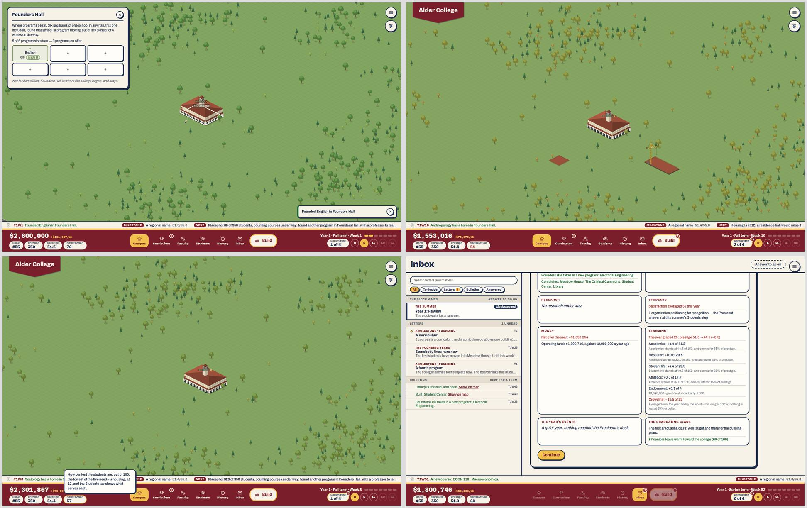
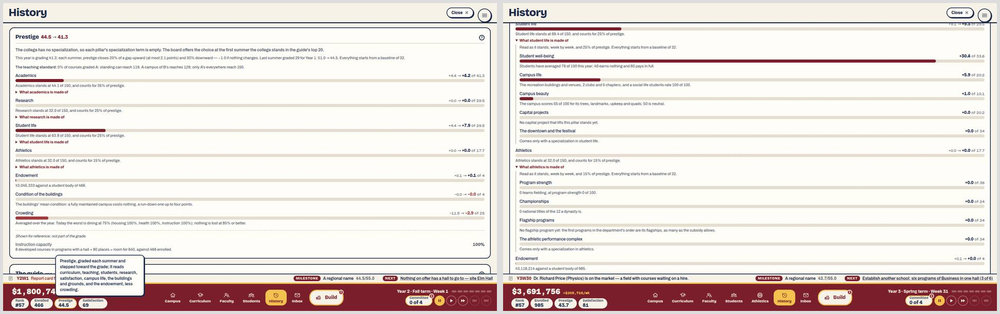
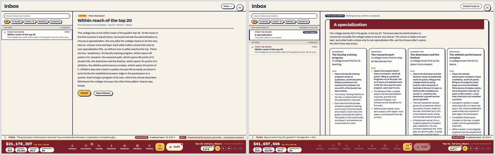
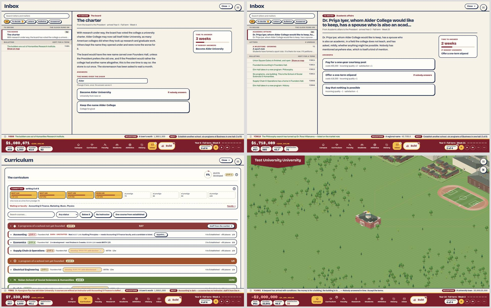
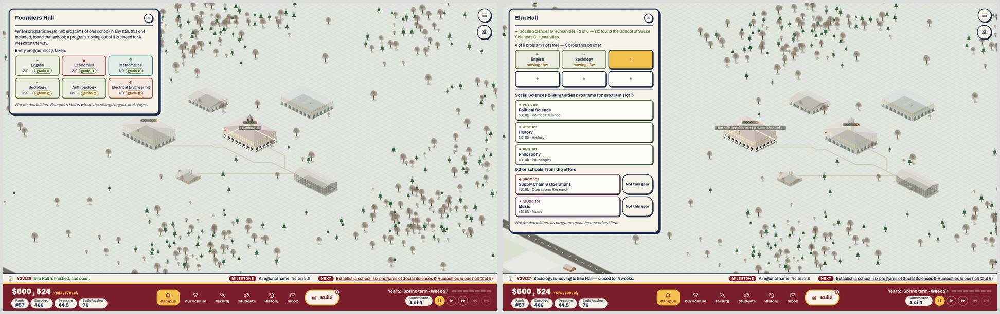

# 3. Intuitive gameplay

Plan 86, area 3. Commit read: `4062bfb`.

**As run.**
- **`npm run newplayer` works again.** Plan 79E taught it the title screen. Run against the production build (`CAMPUS_URL=http://localhost:4173/`), it founded Newcomb College and took the walkthrough's three steps: siting Founders Hall, appointing Dr. Grace Bennett, founding English. It then played year one at 2× and answered every stop. It reached Year 2, Week 1 in 138 seconds and logged no stall.
- **`tools/review/drive.mjs` needed no change.** It has one limit worth knowing. Each call reloads the page, as closing a tab would, and the arrival notice that a paused matter holds is UI state (Plan 78E). So a notice caught at the end of one call is gone at the start of the next, and the matter has to be found in the Inbox. A player who doesn't reload never sees this.
- Neither tool this area owns was edited.

This area asks whether the game teaches itself. As in October, it rests on three sources:

- **A hands-on session.** A new college was played by hand from a clean browser to the first week of Year 5. It was named "Alder University", built in Mission style, in maroon and gold. It was driven a few steps at a time with `tools/review/drive.mjs`, using only what was on screen, at 1440×900, against the production build. Every doubt was logged with a screenshot: 125 across the session and the traces.
- **The nine problem traces again, and three new ones:** how prestige is now made (Plan 85's four pillars), when and why to specialize, and what the inbox (Plan 77) asks of a player. Where the session met a problem, the trace uses that moment. The rest start from scenario saves (`npm run scenario`), loaded with the drive tool's `load=` step: `specialization-notice` (Year 28), `specialization` (Year 31) and `crisis` (Year 16). An unstaffed course was made by hand, by dismissing a professor from the session's Year 5 save.
- **The code behind each answer**, cited, so each "can a player find it?" verdict says where the answer lives.

**The limits.** The reviewer is a model, not a human player. "Doubt" means "the screen did not say what to do or why". Reading time was not measured. The owner's playtest (70L) is still the test of feel.

## The new player's first years

| When | What happened | Doubt? |
|---|---|---|
| Title | The same text menu, with no picture of a campus. | No (area 6) |
| Founding | Typed "Alder University". The facade shows ALDER COLLEGE, and a caption under it now says why: "Every college opens as a College; the board grants 'University' with its first research lab." | No. October's doubt is answered. |
| Y1 W1 | The letter "The doors open" lists three jobs, in order. The four chips now carry their words (Rank, Enrolled, Prestige, Satisfaction). | No |
| Step one | The coach card sits top-right, clear of the ground. Placing says "Click open ground to break ground · R turns it · Esc puts it down", but the button beside it is also called "Put it down", and it cancels. | Mild. Does "Put it down" place it or drop it? |
| Steps two and three | "Appoint the first professor". The picker shows "Appoint · $105k/yr", so the first hire's salary is now shown. Founding English costs $300k, and the coach card explains places ("Each course taught gives the catalog eighty places"). | No. Good. |
| After step three | A NEXT line in year one now: "Places for 80 of 350 students, counting courses under way: found another program in Founders Hall, with a professor to teach it". Each click on it opens Founders Hall. | No. Good (A3-4). |
| Y1 W1–W8 | Founded Economics and Mathematics with the founding market's associates. The fourth slot's three offers (Sociology, Supply Chain, Electrical Engineering) had no candidates: "No Sociology candidates are listed this week…". A ticker line at week 1 announced a Sociology hire, and one was there at week 8. | No |
| Y1 W8 | Satisfaction is 57. Hovering the chip names the lowest need: "the lowest of the five needs is housing, at 12". A click opens Students › Satisfaction breakdown in week one. Basic needs reads "0/350 served" and "Nothing built yet serves this need", without naming what would. | Mild. The breakdown says what is missing, not what to build. |
| Y1 W9 | The letter "Somewhere to sleep, somewhere to eat" gives the figures ("350 students, 0 beds and 0 dining seats"), and its button is "Continue and open Build". | No. Good. |
| Y1 W10 | Siting Meadow House and the Commons. The NEXT line then reads "Housing is at 12: a residence hall would raise it", with Meadow House under construction beside it. At week 28 it reads "Social is at 17: a student center…" with the Student Center under construction too. (image below) | **Yes.** Should I build a second one? (B3-3) |
| Y1 W18 | Developing a second course (ENGL 110) costs $920k and 15 weeks, against $300k for a whole new program. One click, no confirmation. | Mild. Why is a course three times a program? |
| Y1 W44–W48 | No NEXT line: every need is above 50. | No |
| Y1 summer | The Review: "The year graded 29: prestige 51.0 → 44.5 (−6.5)". The rank falls #55 → #57. Every step the game asked for was taken. Research and athletics read "+0.0". (image below) | **Yes.** What did I do wrong? (B3-1) |
| Y1 summer | Each pillar's line says where it stands: "Academics stands at 44.5 of 150, and counts for 35% of prestige". Beside it sits "Academics: +4.4 of 41.3", a second scale. | **Yes.** Which number is the pillar? (B3-2) |
| Y1 summer | Admissions: "The admit rate opens at the founding rate, 86%; admitting more crowds 350 beds." Its projections are weekly net, satisfaction and coverage. | No, in year one |
| Y2 W1 | History › Prestige from the chip: "This year is grading 41.3; … −1.0 if nothing changes." Prestige is set to fall again. | **Yes** (B3-1) |
| Y2 W1 | NEXT: "Nothing on offer has a hall to go to — site Elm Hall". It costs $2.5M with "borrow $699k". Placing it took cash to $0. | Mild. The loan is shown only in the Treasury. |
| Y2 W1 | The Treasury charges "Space beyond need: study space 17.2 times the need" ($5.8k a week) for the Library that the week-9 letter and the year-one NEXT line asked for. | Mild. Was the Library a mistake? |
| Y2 W1–W25 | No NEXT line for 25 weeks. Meanwhile the committee is idle ("0 of 4") and cash passes $1M. The only signal is a "!" on the committee chip. | **Yes.** What now? (B3-9) |
| Y2 W26 | Elm Hall opens with the letter "Moving in": "Social Sciences & Humanities is closest, with three programs in Founders Hall… found its programs into the hall it is growing in, or move them there." NEXT: "Establish a school: six programs of Social Sciences & Humanities in one hall (3 of 6)" opens Founders Hall, where each of the three programs carries a "→". | Mild. The line names the goal, not the move. |
| Y2 W27 | A program tile offers "Move to Elm Hall (Social Sciences & Humanities) · 4w", then "Confirm — English closes 4 weeks". After two moves the line drops to "(2 of 6)" and opens Elm Hall. | **Yes.** Moving programs lowered the count? (B3-4) |
| Y2 W27 | Elm Hall's "+" now offers "Social Sciences & Humanities programs for program slot 3": Political Science, History and Philosophy. Other schools follow under "Other schools, from the offers", each with "Not this year". (image below) | No. October's trap is gone. |
| Y2 W48 | No Philosophy candidate. Posted a search ($207k; the same search was $90k in Year 1). | Mild. Why did searches double? |
| Y2 summer | Prestige 44.5 → 43.7. Admissions opens at last summer's 86%: a class of 603, "982 students next year, for 350 beds and dining for 350". The projections show satisfaction −13 and no prestige figure. | **Yes**, found later (B3-5) |
| Y3 W1 | Three stops in a row: naming the teams, a Hellenic Council and, later, naming rights. Each is clear. | No |
| Y3 W13 | Founded Philosophy, the sixth, and the School of Social Sciences & Humanities is founded in Year 3. October's player was still stuck there in Year 4. The letter: "Prestige target 30.1 → 32.5 … Prestige today 43.7". | **Yes.** The target is 30? Dining was at 36% after the default class. (B3-5) |
| Y3 W14 | "A second school": Business has three programs in Founders Hall, "and Oak Hall is the next hall the college can build ($3,625,000)". The Curriculum heads Business as "3 programs of a school not yet founded". | Mild. The letter names the school; the Curriculum doesn't. (B3-8) |
| Y3 W20 | A matter (a professor's spouse) arrives and the clock pauses. In the Inbox it shows "From Academic affairs to the President", three answers with their costs and effects, "Time to answer 2 weeks" and "If nobody answers: Offer a one-term stipend". | No. Good (A3-3). |
| Y3 W31 | The School's letter had said "NOW OPEN Humanities Research Institute". In the Build menu its tile says "required for capstone courses", not research. Research is 25% of prestige, and History's row reads "0 of the 29 fields the college could research in have a lab". | **Yes.** What does the lab do? (B3-7) |
| Y4 W4 | The lab finishes and the charter arrives as a matter, pausing the clock: "With research under way, the board has voted the college a university charter…". It offers a name field, "Become Alder University" (the default) or "Keep the name Alder College". Chose University. The pennant changed. (image below) | No. Good. Nit: no research was under way yet. |
| Y4 W5 | The letter "The laboratories" explains a project, the Research Park and the first word of a specialization ("only a college that chooses, in time, to specialize in research may build it"). The Research tab opens. | No |
| Y4 W30 | A second matter (the student paper), answered from the Inbox. | No |
| Y4 W44 | $8.6M idle. NEXT has read "Establish another school: Business (3 of 6)" since Year 3, week 14. | Mild |
| Y4 summer | Prestige 44.0 → 45.1; rank #57. After four years the college stands 6.4 below where it was founded. | **Yes** (B3-1) |

**Summary.** October's three trouble spots are mostly fixed.
- Year one now has a NEXT line, a satisfaction hint and the Students tab.
- The move to school halls no longer deadlocks: the first school was founded in Year 3.
- Matters pause the clock when they arrive.

The doubts now gather in three new places:
1. **The opening years mark the college down.** Prestige falls at every one of the first four summers but one, for reasons the screens state without explaining (B3-1, B3-2).
2. **The guidance can't see what is already coming.** NEXT asks for a hall under construction (B3-3). Admissions hides what a big class does to prestige (B3-5).
3. **The words still lag one step behind the rules.** "Establish a school" names the goal, not the step (B3-4). The lab says "capstone courses", not research (B3-7). The Curriculum won't name a school the letters name (B3-8).

## The traces

Each trace follows the route a player would take from the moment the problem shows. Verdict: **yes** (a player finds the answer on screen), **with effort** (it exists but is not signposted), or **no**. The October verdict is in brackets.

| # | Problem | Where the answer lives | Clicks | Verdict |
|---|---|---|---|---|
| 1 | Raise prestige | The prestige chip opens History › Prestige from week one (`statChips.ts`). Four pillars each have a "What … is made of" list of terms and a line on what moves each. The summer Review shows each pillar's standing, not what moves it. Two scales sit side by side (B3-2), and research and athletics sit on their floor with no door named (B3-1, B3-7). | 1–2 | **Yes** for where; **with effort** for how (with effort) |
| 2 | Why a course can't be developed | Hovering a greyed cell: "ECON 120 · Econometrics: Needs MATH 120, cross-listed" (`programProgress.ts`'s `courseHoldReason`), read in the session's Year 5 save. | 0 | **Yes** (yes, one click late) |
| 3 | Why basic needs is low | The chip's hint names the lowest need. Students › breakdown opens in week one. Below 50, NEXT says "a dining hall would raise it" (`nextStep.ts:79`). The card itself says only "Nothing built yet serves this need" (`StudentLifeTab.tsx:208`). | 1 | **Yes** (no in year one) |
| 4 | Cash in the red | The Treasury's paragraph and the board's ladder are unchanged: from Deficit down, "The board has written" heads NEXT (`nextStep.ts:52-53`). The `crisis` save is still synthetic (cash set to −$2M against a +$5.3M week, `tools/scenarios.ts:66-75`). At −$2M it shows **no NEXT line at all**, since no rung has begun. The session's cash touched $0 once, from a loan, and never went below. | 1 | **Yes** by code; not met by hand (yes) |
| 5 | An unstaffed course | Made in the Year 5 save by dismissing the one Accounting professor ("Confirm — 4 courses left unstaffed"). NEXT at once: "Accounting is dark — a course has no instructor; staff it from the market". It opens the Curriculum with the row marked "DARK · UNSTAFFED", an "Appoint…" button and "Staff from the market · 4" (image at the end). | 1 | **Yes** (yes) |
| 6 | A program that can't be founded | Met five times. The picker names the missing field, says "No … candidates are listed this week. The market turns over every week — or pay for a search", and prices the search. The price rose from $90k to $370k in three years with no word why. | 0 | **Yes** (yes) |
| 7 | A school that can't be founded (the split-school trap) | Met in the session at Year 2, week 26 and passed by Year 3, week 13. Elm Hall offered its own school's three programs, and "Not this year" sits under every global offer (`programOffers.ts:131`). The NEXT line names the goal, not the move, and its count fell as programs moved (B3-4). | 1–3 | **Yes** (no) |
| 8 | Satisfaction falling | The chip's hint names the lowest need and its figure. The breakdown shows each need. "Satisfaction target 79 → 79 / Satisfaction today 35" is in the "Effect on satisfaction" panel beside the clubs, not with the needs (the `crisis` save, whose 35 is synthetic). | 1 | **Yes** (yes from year 2) |
| 9 | The rank stalling | The rank chip opens History › The guide. Its hint: "the rank follows prestige, which moves mostly at the summer and rises then by at most 2.1 points". In the session the rank went #55 → #57 → #57 → #58 → #57 over four years. Nothing says why a new college starts above what it can hold (B3-1). | 1 | **Yes** for the rule; **no** for the opening years (with effort) |
| 10 | How prestige is made now (Plan 85) | History › Prestige: four pillars weighted 35/25/25/15, each with its terms, plus endowment, condition and crowding outside them. Each pillar's specialization term is listed with "Comes only with a specialization in …". The panel mixes pillar points and prestige points without naming either (B3-2; area 2's B2-3). The chip's hint and the chart's note list the grade's inputs without athletics (area 2's B2-2). | 1–2 | **With effort** |
| 11 | When and why to specialize | *When*: History says from week one that "The board offers the choice at the first summer the college stands in the guide's top 20". The first lab's letter (Year 4) names the research specialization. The board's notice, "Within reach of the top 20", came at Year 28, week 2, at rank #24 (`specialization-notice` save), and NEXT pointed to it ("The board has written"). *Why*: the choice page (Year 31, `specialization` save) shows each card's pillar, what it opens, the college's standing and rank in the pillar, and its rivals. It gives each share in pillar points ("worth 28 points", "worth 34 points") that are worth 9.8, 7.0, 8.5 and 5.1 points of prestige (area 2, B2-3). | 0–1 | **Yes** for when; **with effort** for why (B3-6) |
| 12 | What the inbox asks of a player | Four kinds of item. Stops ("The clock waits"): the chair's letters, the four summers, the teams' name, the Hellenic Council, the naming-rights offer, a research report. Matters ("The clock runs on"): two in four years plus the charter. Each shows its answers' costs and effects, its time left and its default, and pauses the clock when it arrives (`unseen.ts:57`). Kept letters are milestones, and bulletins last a term. Years 1 and 2 had no matter at all ("A quiet year: nothing reached the President's desk"). | 0–1 | **Yes** |

## Findings

| Id | Finding | Severity | Effort | Continues |
|---|---|---|---|---|
| B3-1 | The first summers mark every college down, and nothing says why | major | S (words), M (balance) | — |
| B3-2 | Prestige's panel can't answer "how do I raise it?" at a glance | major | S | the Review half of A3-5 |
| B3-3 | NEXT asks for a building that is already going up | major | S | — |
| B3-4 | "Establish a school" names the goal, not the step | minor | S | was A3-2 |
| B3-5 | Admissions hides what a big class costs in prestige | major | S | — |
| B3-6 | The specialization says when, not why | minor | S | — |
| B3-7 | The first lab doesn't say it starts research | minor | S | — |
| B3-8 | The Curriculum won't name a school the letters name | minor | S | — |
| B3-9 | Nothing points at an idle committee | minor | S | — |
| B3-10 | Smaller doubts | minor or polish | S | part of A3-7 |

### B3-1. The first summers mark every college down, and nothing says why — major, S (words) or M (balance)

**What.**
- A college is founded at prestige 51.5 (`actions.ts:326`).
- What a new college can earn is far below that. Every pillar starts from a floor of 32 (`prestigeSystem.ts:34`, "Everything starts from a baseline of 32"). Research and athletics stay there until a lab and a varsity team exist: Year 4 and later in the session.
- So the first summer grades 29 and takes prestige from 51.0 to 44.5. A fall closes 30% of the gap, with no limit (`prestigeSystem.ts:42`, `:765`).
- In the session, prestige fell or stood still at the first three summers and was 45.1 at Year 5. The rank went #55 to #57.
- The harness's best players do the same. Guided stands at 45, 46, 46, 44 and 45 through Years 2–6, and regains 51 only at Year 10 ([`data/b3-opening-prestige.md`](data/b3-opening-prestige.md)). Plan 85's retune made it deeper: Guided's Year 10 prestige went from 59.4 to 50.0 (Plan 85D). Area 4 finds the same flat first decade.
- The Review names the grade and the step ("The year graded 29: prestige 51.0 → 44.5 (−6.5)"), and History says "−1.0 if nothing changes". Nothing says that a founding reputation fades, or that this is expected.
- The rank chip's hint explains how fast prestige can rise, not why it fell.

**Why it matters.** The first summer is the first verdict. A player who did everything the letters asked is told the college got worse. The fall goes on for four years, in a game whose loop is "raise prestige". The rank, the headline number, stands still for a decade. The October session didn't meet this: its first decade rose slowly.

**Fix.**
- Words, S:
  - Say it at the first summer: "A new college opens on the goodwill of its founding; until it has a record of its own, the grade will be lower, and prestige settles toward it."
  - Name the floor on History's research and athletics rows with their doors: "research begins with a school's lab"; "athletics begins when a sport club goes varsity".
- Balance, M (the owner's call):
  - Open nearer the first years' grade (around 42), or
  - Carry the founding reputation as a named term ("Founding goodwill") that fades over five years, so the fall is a line the player can read.

### B3-2. Prestige's panel can't answer "how do I raise it?" at a glance — major, S (the Review half of A3-5)

**What.**
- **Two scales, unnamed.**
  - A pillar's header gives its share of prestige ("Academics +4.4 → +4.2 of 41.3").
  - The line under it gives the pillar's own scale ("stands at 44.1 of 150").
  - Its terms are on a third reading, the pillar's 118 points ("Teaching quality +10.1 of 17.6").
  - So a term can be larger than its pillar: "Student well-being +30.4 of 33.6" under "Student life +9.3 of 29.5" (image above).
  - Area 2 found the same in the text (B2-3). This is its cost to a player working out what to do.
- **The summer Review lost its "what moves it" line.** Plan 78C put each term's History detail under it. Since Plan 85B the Review lists the four pillars, and each pillar's line says only where it stands and its weight. What moves it is one tab and one disclosure away, under "What academics is made of".
- **Rows with no door.** Research, athletics and three "Capital projects" rows each read "+0.0" with no way for a young college to fill them, beside the four specialization rows ("Comes only with a specialization in …"). In the first years, 12 of the 19 term rows can't be moved: the four specialization terms, three capital-project rows, research's two and athletics' three.

**Why it matters.** "How do I raise prestige" was trace 1 in October, and it is still the question the game turns on. The answer is now one click from the chip. It takes reading three scales and finding the three rows that can move.

**Fix.**
- Show one scale on the panel, prestige points, and keep the pillar's 0–150 reading as a small "standing" figure (area 2's B2-3 has the wording).
- Under each pillar in the summer Review, show the term with the most room that the college can fill now ("Concentration: found a school — six programs of one school in one hall").
- Fold rows that can't move yet under a single line ("Opens later: research labs, varsity teams, capital projects, a specialization").

### B3-3. NEXT asks for a building that is already going up — major, S

**What.**
- The shortfall reading reads only the satisfaction breakdown (`nextStep.ts:213-221`). A hall under construction serves nobody until it opens, so the need stays low and the line keeps asking.
- In the session, NEXT said "Housing is at 12: a residence hall would raise it" from Year 1, week 10, with Meadow House (350 beds for 350 students) under construction beside it.
- It then said "Social is at 17: a student center…" for ten weeks while the Student Center was under construction.
- In year one this is the only reading after a letter's ask and the places line (`nextStep.ts:281`). So it is the line a new player follows.

**Why it matters.** A player who trusts the line builds the same hall twice ($330k–$350k in the session, a fifth of the cash). A player who doesn't learns to ignore the line.

**Fix.** Skip a need that something under construction will serve. Or name the building: "Housing is at 12 — Meadow House opens in 9 weeks". Effort S: `shortfall` checks `s.tech` for a building under construction that serves the need.

### B3-4. "Establish a school" names the goal, not the step — minor, S (was A3-2)

**What.** Plan 78D made the line say the move ("Move Psychology into Elm Hall"). Plan 80D replaced it with "Establish a school: six programs of X in one hall (n of 6)", which by design "names the school and the count, never a move" (`establish.ts:6-18`).
- In the session, the line opened Founders Hall with each of the three Social Sciences programs marked "→". Nothing said to open a tile and move it.
- After two programs moved, the count fell from 3 to 2 of 6, because a program in transit counts in neither hall. The line then opened Elm Hall and offered its own programs, while the third program, still in Founders Hall, was never mentioned.
- From Year 3, week 14 the line read "Establish another school: … Business … (3 of 6)" for a year and a half. It kept opening a full Founders Hall, whose one Business offer had no candidate.

October's deadlock is gone. What is left is a line a player has to decode.

**Fix.**
- Keep the goal and add the step from the intent the guided player already reads (`establishIntent`): "Establish Social Sciences & Humanities (3 of 6): move Anthropology into Elm Hall", or "…: found History in Elm Hall", or "…: post a search for Marketing".
- Count programs in transit toward the hall they are moving to.

### B3-5. Admissions hides what a big class costs in prestige — major, S

**What.**
- The admit rate opens where last summer set it ("The admit rate opens where last summer set it, 86%; admitting more crowds 350 beds", `yearOverYear.ts`'s `admitRateOpening`).
- In Year 2 that made a class of 603 and 982 students for 350 beds and 350 dining seats. The projections showed weekly net (+$121k), satisfaction (−13) and the tightest need's coverage (`InterruptModal.tsx:378-400`).
- They didn't show prestige. Crowding then cost 14.5 of the grade's 25 penalty points: dining at 36%. The year's target fell from 41.3 to 32.5. The school-founding letter later showed "Prestige target 30.1 → 32.5" against 43.7 today.
- NEXT never mentioned it. The shortfall reading starts at a need under 50, and crowding bites at coverage under 85% ("nothing is lost at 85% or better").

**Why it matters.** Crowding is the largest single term a new player moves, and the summer is when they move it. The decision shows money and mood. The prestige cost shows up only in History, weeks later.

**Fix.**
- Add a projection: "Crowding: −X of prestige's grade (dining 36%)".
- Let NEXT name crowding when a need's coverage is under 85%: "Dining serves 36% — crowding is costing prestige; a dining hall would raise it".

### B3-6. The specialization says when, not why — minor, S

**What.**
- *When* is said well. History says from week one that the choice comes "at the first summer the college stands in the guide's top 20". The board's notice comes about three years ahead, and the choice returns every summer until it is made ("Not this year").
- *Why* is harder.
  - The notice is one paragraph of 150 words, with each share in "points of it" (`specialization-notice`, image below).
  - The choice page gives each card its pillar, what it opens, the college's standing and rank in that pillar, and the strongest rival. It is about 680 words (area 2, B2-3).
  - It never says what the choice is worth in prestige. Each share is in pillar points, so athletics' "34 points" (worth 5.1 of prestige) reads larger than academics' "28" (worth 9.8).
  - The cards don't connect "the college stands #4 in student life" with "so this would lift you most".
- For most players the question is far off. The session's college stood #57 at Year 5. Area 4 finds the choice arriving at years 39–47 for the strategies that differ (B4-3).

**Fix.**
- Lead each card with its prestige worth ("up to 9.8 points of prestige, full in about 10 years").
- Add one line at the top: "The college's strongest pillar is student life (#4); 35 rivals specialize in academics, 19 in student life".

### B3-7. The first lab doesn't say it starts research — minor, S

**What.**
- A school's founding letter lists "NOW OPEN Humanities Research Institute". Its Build tile says "required for capstone courses" (`BuildPopup.tsx:297`), the only line any lab gets.
- Research is 25% of prestige, and History's research rows say "0 of the 29 fields the college could research in have a lab" without naming where a lab comes from.
- The lab's purpose is explained only once it stands, by the letter "The laboratories" (Year 4, week 5).

**Fix.**
- The tile: "starts research · a lab's work lifts research, 25% of prestige". The capstone line goes second.
- History's empty research row: "a school's founding opens its lab".

### B3-8. The Curriculum won't name a school the letters name — minor, S

**What.**
- Until a school is founded, its Curriculum section is headed "3 programs of a school not yet founded" (`CurriculumTab.tsx:995`).
- The letters, the NEXT line and the hall panels all name it ("Business is closest, with three programs in Founders Hall"; "Social Sciences & Humanities · 2 of 6").
- The founding letter makes a virtue of it ("in a color with no name"). But a player told to grow Business can't find Business in the tab where its courses live.

**Fix.** "Business · 3 programs, not yet founded".

### B3-9. Nothing points at an idle committee — minor, S

**What.**
- No NEXT reading covers an empty curriculum committee (`nextStep.ts:290`, the readings in order).
- In the session, Year 2 had no NEXT line for 25 weeks while the committee stood at "0 of 4" and cash passed $1M. In Year 4, $8.6M sat idle.
- The signal is a "!" on the committee chip and the Curriculum tab.

**Fix.** A reading after the shortfall: "The committee has 3 free seats — develop the next course (ENGL 120, $920k)", going to the Curriculum's "Ready to start" filter.

### B3-10. Smaller doubts — minor or polish, S

- **"Put it down"** is both the placing hint's word for cancelling ("Esc puts it down") and a button. A player reads it as "place it". Say "Cancel" on the button and "Esc cancels" in the hint.
- **The Library is charged as excess** ("Space beyond need: study space 17.2 times the need", $5.8k a week), though the year-one NEXT line and the week-9 letter asked for it. Say so on the build tile ("serves 1,200; past 120% of need it costs six times as much to keep"). And use "academic", as the needs are named.
- **A greyed build tile gives its reason only in a native tooltip.** Lakeside House said "$2,080,998 short." Elm Hall offered "borrow $699k", and nothing says why a residence can't be borrowed for. Show the reason on the tile, as Elm Hall's loan line is shown.
- **The charter says "With research under way"** in the week the first lab opens, before any project is commissioned (`eventSystem.ts:71-77` fires on a lab, `eventCatalogue.ts:2559`). Say "With its first laboratory open".
- **The search price climbs unexplained:** $90k in Year 1, $207k in Year 2, $370k in Year 3. Say what sets it in the search button's tooltip.
- **The breakdown's target** ("Satisfaction target 79 → 79 / today 35") sits in the clubs' panel, not beside the needs it is made of. Move the two lines to the breakdown's head.

## The October findings

| October | Title | On `4062bfb` | Evidence |
|---|---|---|---|
| A3-1 | The second hall can deadlock a new player | **Fixed** | Elm Hall offered "Social Sciences & Humanities programs for program slot 3", with other schools under "Other schools, from the offers" and "Not this year" (Plan 78D; `programOffers.ts:131`). The first school was founded at Year 3, week 13. |
| A3-2 | The NEXT line points at the wrong panel | **Partly fixed** → B3-4 | It opens the hall holding the school's programs. Since Plan 80D it names the goal, not the move, and its count drops while programs move. |
| A3-3 | Events pass while the player reads | **Fixed** | Matters paused the clock on arrival three times in the session (Plan 78E, `unseen.ts:57`). The list and the pane share "Final week" (`dueLabel`, `unseen.ts:79`). No matter lapsed unseen. |
| A3-4 | Year one is quiet, and satisfaction falls unexplained | **Fixed**, with a new flaw (B3-3) | NEXT in year one, the Students breakdown from week one, and the chip naming the lowest need. NEXT now asks for buildings already going up. |
| A3-5 | The chips don't lead to their explanations | **Mostly fixed**; the Review half regressed → B3-2 | Rank and prestige open History, and satisfaction opens the breakdown, from week one. The Review's per-term "what moves it" line became a per-pillar "where it stands" line with Plan 85. |
| A3-6 | Jargon in the first minutes | **Fixed** | "Free" boxes, "grade B" chips, the "!" explained, and Founders Hall's panel in plain words. New jargon is the pillar scales (B3-2). |
| A3-7 | Smaller doubts | **Fixed**, apart from one new doubt in the same list (B3-10) | The coach top-right; notes are inbox letters; a greyed cell's tooltip gives the reason; the first hire's salary; the admit-rate line; "crowding eased"; "The first graduating class"; the University caption. |
| Charter | Make it a choice | **Done** | See below. |

## The charter, again

**Now (Plan 78G).**
- At founding: a typed "Alder University" shows ALDER COLLEGE on the facade, with the caption "Every college opens as a College; the board grants 'University' with its first research lab."
- At the first lab (Year 4, week 4 in the session), the board's charter arrives as a matter. It pauses the clock, gives three weeks to answer and offers:
  - a field for the name ("Change it here, once: the answer carves it");
  - "Become Alder University" (the default);
  - "Keep the name Alder College".
- The answer renames the pennant and leaves a bulletin.

**Judgment (the reviewer's).** The recommendation is fully taken, and it works as the player's first ceremony. The caption answers October's "where did my name go?" before it is asked. The matter reads like the real thing ("as many American colleges did when they took up research and graduate work. Others kept the name they opened under"). The one-time rename in the same matter is a good addition. One nit: it says "With research under way" in the week the lab opens, before any research is commissioned (B3-10). Nothing else is recommended.

