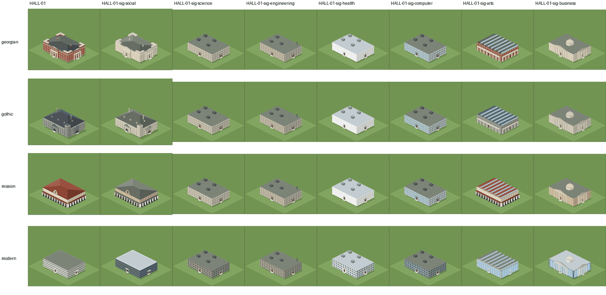
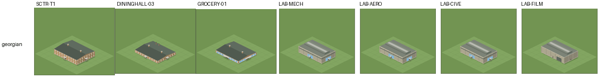
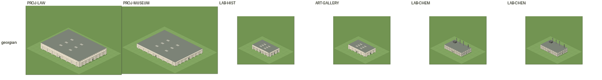
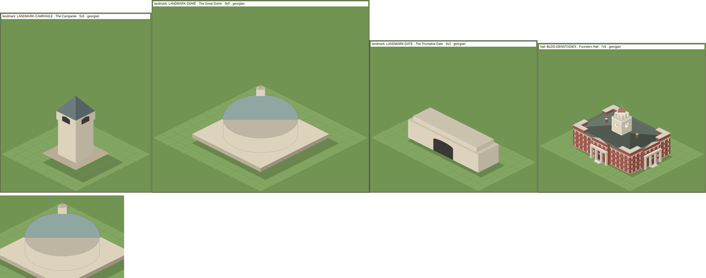
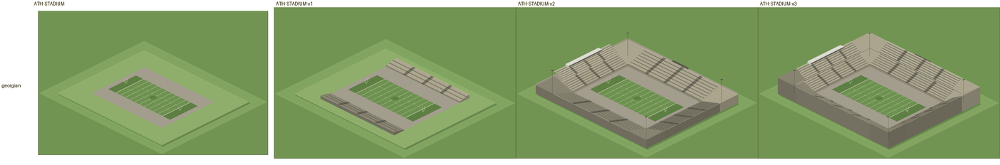
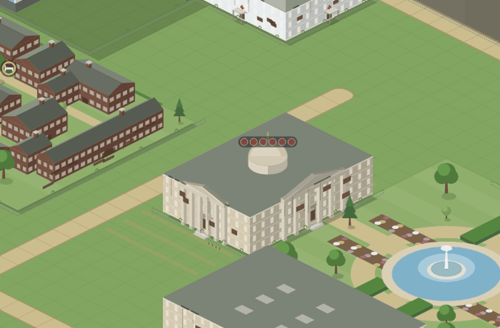
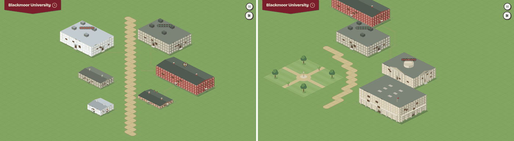
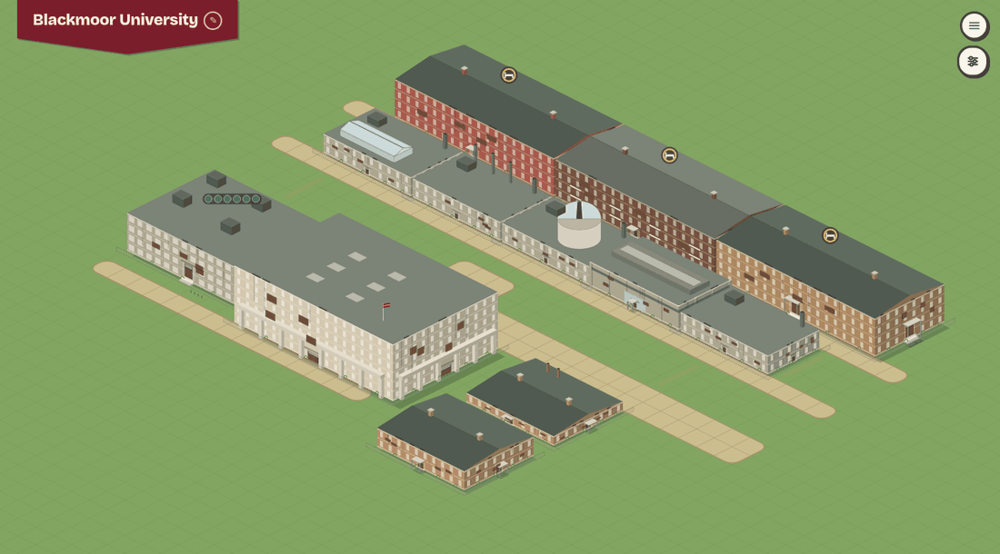

# 1. Aesthetics

Plan 73, area 1. Commit read: `58fa3fd` (main, with Plan 72 B–I and K landed and 72J not). Everything below comes from the game's own renderer: every placeable drawn by itself in all five vernaculars from two cameras (`npm run sheet -- --every`, 108 cells per vernacular and camera), 12 test arrangements in each vernacular photographed from all four views (`npm run review:arrangements`, `npm run review:views`), the doors-and-depth checker over 63 saves (`npm run review:doors`), and three probes written for this review (`npm run review:probe`). Where a finding is a judgment about looks, it is labelled as **the reviewer's eye**. The reviewer is a model, so treat that label as one opinion, not a verdict.

The September visual review (`docs/reviews/2026-09-map-assets-visual-review.md`) rebuilt the venues, the sheds, the roofs and the entrance parts. This review does not repeat anything it fixed. Most of what follows only shows once a campus is grown, or when one building is compared with another.

## What works

These are worth protecting. They are **the reviewer's eye**, checked against the renders.

- **Founders Hall** is the best object on the map. The clock tower and gilded cupola, the porticos and the ranked sash windows read as a real building at every zoom.
- **The residence rungs vary.** Plan 72D gave the eight hall rungs five forms (house, residence hall, suites, apartments, college), so no two neighbouring rungs look alike. The villages read as villages.
- **The full stadium bowl** (after two expansions) and its second deck are the most impressive thing on the map: raked stands, floodlight masts and a press box.
- **The lab features work.** The observatory drum on Physics, the glasshouse on Biology and the flues on Chemistry say what each building is without a label.
- **Depth is right.** Across 63 saves and 4 views each, the checker found no two overlapping things painted in the wrong order, no door that can't be reached on foot and no building walled in.
- **Light and shadow are one rule.** Trees, buildings and props cast shadows away from the same sun.

## Findings

Severity: blocker, major, minor, polish. Effort: S (an hour), M (a PR), L (a plan).

### A1-1. The vernacular restyles only about half of a grown campus — major, M

**What.** The founding screen offers five architectures ("Red brick and white trim, under a gilded cupola"; "Gray ashlar and steep slate, under a spire"). By year 50, about half of what stands on the map looks the same whichever one was chosen.

**Where.**
- Seven motifs are invariant by design (`VERNACULAR_INVARIANT_MOTIFS`, `src/components/buildingSpec.ts:1019`): grounds, bowl, hangar (every shed), works (labs), block (hospital, CS and neuroscience labs), tower and landmark.
- Four of the seven school signature halls use one of these motifs (`SCHOOL_SIGNATURES`, `buildingSpec.ts:115`):
  - Science and Health Science are `block`.
  - Engineering is `works`.
  - Computer Science is a curtain-walled `block`.

  A hall given over to one school is drawn as its signature (`campusLayout.ts:89-92`), and by year 50 the saves hold only two generic halls.
- `npm run review:probe -- vernacular` over four year-40 to year-50 saves counted the buildings (open ground excluded) whose motif varies by vernacular:

  | Save | Buildings | Restyled by the vernacular | Share of footprint area |
  |---|---:|---:|---:|
  | `natural50` (Natural player, year 51) | 60 | 34 (57%) | 45% |
  | `guided50` (Guided player, year 51) | 57 | 31 (54%) | 58% |
  | `sc/y40` (year 41) | 62 | 34 (55%) | 51% |
  | `sc/final` (Completionist, year 50) | 70 | 38 (54%) | 49% |

- 

  The four buildings round the fountain are identical in both. Only the village roofs and the arena roof change.
- 

  Columns 3–6 (Science, Engineering, Health, Computer Science) are the same in every row. Science and Engineering are hard to tell apart even from each other.

**Why it matters.** The vernacular is the first creative choice a player makes, and the only one about how the campus looks. By the end of a game, a player who chose Collegiate Gothic has a campus of flat render boxes with rooftop plant.

**Fix.** Keep the massing of the invariant motifs and give them the vernacular's surface. An invariant building would take:
- the vernacular's roof colour on its parapet and plant screens;
- its trim colour on the cornice;
- its window shape (`paneShapeOf`, `buildingSpec.ts`, now `rect` for every invariant motif);
- its entrance part at the door.

Start with the four school signatures, because by year 50 they are the most-built halls. In one line: a Gothic science block gets merlons and lancets, and a Mission one a tile coping and an arched door.

### A1-2. Different buildings share one drawing — major, M

**What.** Buildings that do different things are drawn identically, so the map can't answer "where is the dining hall?" without a click.

**Where.** Same motif, wall, feature and footprint, from `npm run review:probe -- vernacular` and the contact sheets:
- The Mechanical, Aerospace and Civil Engineering labs are pixel-identical sheds (`RESEARCH_FACILITY_MOTIFS`, `buildingSpec.ts:56`). The Film studio differs only in its door.
- The Student Center, the Commons Cafeteria (DININGHALL-03) and the Grocery share one 5×4 buff-brick pavilion. The grocery's blue shopfront is the only difference, and it is only visible close up.
- The Law School and the Museum share one 11×8 limestone portico.
- Chemistry and Chemical Engineering share one 5×3 block with flues.
- Two pairs share a form and differ only in wall tone: the Humanities Research Institute (LAB-HIST) and the Art Gallery (a 5×3 portico, render against limestone), and the Neuroscience and Computing labs (a 5×3 block).

**Why it matters.** The map is the game's main screen. In a campus of 60–80 buildings, the player finds things by their look.

**Fix.** One signifier per id, the way `LAB_FEATURES` already works (`buildingSpec.ts`):
- the dining hall: a row of kitchen stacks and a terrace awning;
- the student center: a clock or banner on its gable;
- Mechanical: a gantry crane beside the shed;
- Aerospace: a wind-tunnel duct;
- Civil: a test tower;
- the Museum: banners between its columns;
- the Law School: a pediment with scales.

### A1-3. The Great Dome draws its drum's top in front of the dome — major, S

**What.** The Great Dome looks cut in half. Its lower half shows the drum's flat top as a grey ellipse, and the drum below reads as glass: it is the same stone as the plinth, with only a hairline edge.

**Where.**
- `Dome` in `src/components/landmarks.tsx:72-100` draws only the upper half-ellipse above the ring.
- `Drum` (`:58-70`) draws the full top ellipse at `drumTop`, and the dome is placed on that same ring (`:167`, `:171`), so the near half of the drum's top stays visible below the dome.

**Why it matters.** It is the most expensive building in the game, and it looks broken.

**Fix.** Draw the dome's silhouette as the upper half-ellipse plus the near half of its base ring, or skip the drum's top face when a dome sits on it. Shade the drum a tone off the plinth. S.

### A1-4. The grand landmarks look like placeholders — major, M

**What.** **The reviewer's eye:**
- The Campanile is a plain stone box with two belfry slots under a pyramid.
- The Triumphal Gate is a long box with one black arch. In play it also carries the college's name on its attic (`landmarks.tsx:235`). The contact sheet has no name to show.
- The Dome (A1-3) has no ribs.

None has windows, string courses, a clock, pilasters or relief, all things the academic halls beside them have.

**Where.** `landmarks.tsx:105-232` (flat `walls()` faces, no openings except the belfry and the arch). See the image under A1-3.

**Why it matters.** These are the late-game trophies, built at the end of a long game. They are what a player screenshots and what a store page would show.

**Fix.** A detail pass using what the halls already have:
- the campanile: arched belfry openings, a clock face and a string course at each stage;
- the gate: pilasters, a cornice and relief panels;
- the dome: ribs, a peristyle of columns round the drum and a gilded lantern.

M.

### A1-5. The Football Stadium draws as a bare field until it is expanded twice — major, S

**What.** The Football Stadium seats 40,000 from the day it opens (`VENUE_SEATS`, `src/data/facilitiesData.ts:291`). It costs $6.5M and takes 52 weeks (`:280-281`), but it opens as a gridiron on a lawn with a grey apron and no stand. It gets low touchline stands after one expansion and the bowl after two (`src/components/buildingMotifs.tsx:2411-2433`).

**Why it matters.** The payoff for a year's wait is a field next to a Multi-Sport Field that looks grander. The drawing also contradicts the 40,000 seats.

**Fix.** Open with today's stage 1 (the two touchline stands) and let expansions add the ends and then the second deck, so each expansion still visibly adds something. S.

### A1-6. Late campuses end up derelict, and the derelict look is too faint to warn — major, M

**What.** In every simulated 50-year game, most of the campus ends derelict (condition under 0.1, drawn with boarded windows, a fence and weeds). Founders Hall ends at condition 0 in all three games. Maintenance was fully funded throughout.

**Where.**

| Game | Year 21 | Year 31 | Year 41 | Year 51 |
|---|---|---|---|---|
| Completionist, seed 12345 | 0 of 62 | 0 of 71 | 0 of 75 | **50 of 81** |
| Natural, seed 12345 | 0 of 38 | 9 of 57 | 42 of 66 | **44 of 69** |
| Natural, seed 4242 | 0 of 32 | 0 of 57 | 39 of 65 | **52 of 70** |

The table counts derelict buildings (`npm run review:probe -- backlog`).

The cause is a chain:
1. Five event choices add backlog:
   - "Make safe and defer the rest" (storm, `src/data/eventCatalogue.ts:128`);
   - "Fill this one and watch the others" (sinkhole, `:2074`);
   - "Dry out and repair" (flood, `:1937`), whose label says repair but which adds $800k of backlog;
   - "Mothball the unfinished wing" (`:2005`);
   - "Tarpaulin and a fundraising appeal" (`:32`).
2. Their money is scaled by up to 12× with the college's budget (`src/systems/events/catalogue.ts:43`, `:156`). In the probes they added $7M–$22M each.
3. The backlog is spread over every standing building by cost (`catalogue.ts:260-270`).
4. It then compounds at 6% a year (`src/systems/estate/estate.ts:155`). Full maintenance pays each week's upkeep but never pays a backlog down; only a renovation clears it.
5. The file's header says "At full funding nothing here moves" (`estate.ts:13`).

In the year-50 scenario save, backlog stands at $269.5M. Every building from the first seven years carries about twice its cost in backlog.

What the player sees is the second problem. At the default zoom, a derelict building shows brown patches on the walls (the boarded windows), a hairline fence and a few weeds. **The reviewer's eye:** that reads as dirt, not as "this building is failing and costing you prestige".

**Why it matters.** Condition feeds campus beauty (upkeep is 25% of it and scales enclosure, `src/systems/estate/beauty.ts`). Beauty feeds prestige and the applicant pool. So the decay costs the player, it happens at full funding, and the map barely shows it. The events audit (area 2) adds that the town's "eyesore" letter names a random building, not the derelict one.

**Fix.**
- Mechanics (area 7): let full funding pay a backlog down, for example 10% a year, or stop compounding. Relabel "Dry out and repair".
- Look: make the derelict band unmistakable. Use a timber hoarding round the plot, a tarpaulin on the roof and a darker, desaturated wall. Show condition as a coloured outline in the Estate panel's map mode, if the map gets one.

M.

### A1-7. Diagonal and curved walks draw as staircases — minor, M

**What.** A walk is a run of square tiles with no diagonal piece, so a diagonal walk is a zigzag ribbon and a curve is a staircase.

**Why it matters.** Diagonal paths across a lawn (desire lines) are the most campus-like path there is. **The reviewer's eye:** the zigzag reads as a drawing error.

**Fix.** Two options, either about M:
- Draw a walk as a polyline through the centres of its tiles, with rounded joins, over the tiles. The tiles stay the data.
- Fill the triangle between two diagonally adjacent walk tiles.

### A1-8. Doors open onto lawn, seams, trees and bike racks — minor, S/M

**What and where.** The checker (`tools/review/doorsAndDepth.ts`, 63 saves × 4 views) counted:

| Rule | Hits | Buildings | Example |
|---|---:|---:|---|
| door-onto-lawn | 1,555 | 67 | Every save: the game never joins a door to the nearest walk. |
| door-on-seam | 296 | 16 | Every even-length wall (the 9×4 residences, the 5×4 pavilions, the 9×6 library) draws its door on the line between two tiles (`walkRoutes.ts:91`, `entrancesOf`). |
| door-behind-mass | 118 | 15 | The clinic's west door opens into the Medical Center's wall. |
| door-onto-ground | 53 | 14 | One hall's door opens onto the tennis courts, another's onto the pool, a residence's onto the quad. |
| door-under-tree | 45 | 10 | The Law School and chapter houses in `natural50`. |
| door-under-prop | 22 | 5 | Bike racks on the Gym's and the Grand Table's north doors; a lamp on Founders Hall's. |
| prop-on-tree | 11 | 3 | The flag or a rack on a tree. |
| overhang | 39 | 9 | Mission halls and porticos draw 9 px past their sides over a flush neighbour; LAB-MECH 4 px over the next lab. |

**Why it matters.** Doors are how a building meets its campus. A door onto grass, into a wall or under a tree breaks the one bit of logic a player can see.

**Fix.**
- Put an even wall's door on the tile nearest a walk, not on the seam (S).
- Clear trees from a door's tile when the building is placed, and have racks and the flag skip door tiles and trees (`src/components/dressing.tsx`) (S).
- Draw a short path from each door to the nearest walk (M).

### A1-9. Style slips within a vernacular — minor, S

- **Mission's red tile stops at the halls.** The Social Sciences hall and the Business exchange wear grey roofs (the limestone material's), though Mission promises "cream stucco and red tile". The limestone material needs a vernacular roof.
- **The Gothic library is not Gothic.** The library and gallery are pale flat-roofed porticos in every vernacular except Modern. In Collegiate Gothic, the library is the signature building; think of Yale's Sterling Memorial or Chicago's Harper. **The reviewer's eye.**
- **The Modern generic hall reads as a parking garage.** It has horizontal bands and one small door per face. **The reviewer's eye.**
- **Benches and arcades lose their shape at the opening zoom.** Benches read as sticks, and a Mission arcade reads as a barcode strip. Polish.

### A1-10. The map never changes with time — minor, L

**What.** Beyond the buildings themselves, the map shows only:
- trees, in three species;
- walks, lamps and benches, placed by the player;
- bike racks, which appear at 2,000 students (`dressing.tsx:18`);
- the flag over Founders Hall;
- quad planting, by tier;
- crowds in the stands on home game weeks;
- banners on the lamps in commencement week;
- walkers;
- weathering.

There are no seasons, no weather, no night, no water beyond fountains and pools, and no roads or cars. The calendar has a fall and a spring term and a summer, and none of it shows.

**Why it matters.** This is **the reviewer's eye**. The campus is what the player looks at for hours. A map that turns gold in the fall and white in the winter would mark the year's rhythm (terms, the summer beats) and would also be the best free marketing screenshot the game could have (area 6). The seasonal events already assume seasons (area 2 found their winter check is inverted).

**Fix.** A season tint on trees, lawns and roofs by week: leaves turning through the fall term, snow on the roofs at the turn of the year, bare trees into the spring term, and green again for the summer. Later, a dusk tint over the summer beats. L (a plan), because it touches every palette.

## Each vernacular against its style

**The reviewer's eye**, from the contact sheets. Each is judged against the style it claims and a well-known campus in it. "Has" lists what the renderer draws on the vernacular's own buildings. It leaves out the invariant half (A1-1), which looks the same in all five.

| Vernacular | Reference | Has | Missing, most visible first |
|---|---|---|---|
| Georgian | Harvard's Massachusetts Hall; Penn's College Hall | Red brick, white trim, hipped roofs behind a parapet, porticos, sash windows, chimneys, pavilion ends, gilded cupola | Fanlights over the doors; quoins at the corners; a white cornice under the eaves of the residences; shutters or glazing bars, which are too small to read, so a colour change on the frames would do |
| Collegiate Gothic | Yale's Sterling Memorial Library; Chicago's Harper Library | Grey ashlar, steep slate, lancets, crenellated corner towers, stepped buttresses, stair turrets, a spire | A Gothic library and gallery (both are pale flat porticos, A1-9); gables with finials on the residences; pointed-arch doors (the entrance is a porch); tracery or an oriel on the halls. The dark-brick residences (`brickDark`) read as sooty beside the stone |
| Classical | Columbia's Low Library; Virginia's Rotunda | Limestone, copper roofs, six-column porticos with pediments, balustrades, a stone dome | Very little. The pavilions all carry a portico (30 of 69 non-ground placeables), which flattens the hierarchy: a grocery has the same portico as a hall |
| Mission | Stanford's Main Quad | Cream stucco, red tile, arcades, arched windows, bell-gables, an arcaded campanile | Red tile on the limestone buildings (the pitched Social Sciences hall and Business wear the flat-deck grey, `buildingSpec.ts` `MISSION_MATERIALS.limestone`); courtyards, which are what Mission campuses are built round; exposed rafter tails. The arcade goes on 28 of 69 buildings and reads as a barcode at the opening zoom |
| Modern | IIT's Crown Hall; MIT's Baker House | White panel, glass, burnt-orange brick, flat roofs, ribbon windows, canopies, a stair core | Pilotis or a cantilever on the halls; the generic hall reads as a parking garage (A1-9). Modern is the one vernacular in which the invariant half fits, so it suffers least from A1-1 |

## Repetition across the catalogue

`npm run review:probe -- catalogue` counts the 78 placeables by motif:

| Motif | Count | What it covers |
|---|---:|---|
| pavilion | 15 | eight dining rungs, the grocery, two student centers, two health rungs, the chapel, the Economics lab |
| hangar | 10 | three engineering labs, film, two rec rungs, the gym, the arena, the natatorium, the field house |
| grounds | 9 | pool, courts, field, diamond, two quads, statue, fountain, garden |
| residential | 8 | seven residence rungs and the Graduate College |
| hall | 7 | Founders Hall and the six academic halls, until a school claims them |
| works, portico, block | 6 each | labs; the civic set; hospital, apartments, CS, neuroscience, Business |
| tower, landmark | 4 each | the towers; the bell tower and the three grand landmarks |
| village, bowl | 2, 1 | |

In every vernacular:
- 21 of the 69 non-ground placeables share one wall (render, `#b0a992`).
- 33 have no entrance part at all, because the invariant motifs get none (`entrancePartOf`).

The pavilion does most of the work. One low buff-brick form stands for eating, shopping, student life, health and worship, which is why A1-2 finds the student center, a dining hall and the grocery identical.

## Construction sites and walkers

- **Sites don't grow.**
  - A hall or residence under construction is a hatched slab with a tower crane (`buildingMotifs.tsx:3344-3347`). In the contact sheets, the labs and pavilions get the slab alone.
  - It looks the same from the first week to the last. Only the grand landmarks rise in stages (`landmarks.tsx`, footings, half, all but the crown), and the stadium adds stands with each expansion.
  - For a 26-week hall or a 52-week stadium, the map shows no progress beyond the site's progress bar. Minor, M: reuse the landmarks' three stages (footings, frame, closed and scaffolded) for every building.
- **Walkers work.** Students walk the lawns and wear faint desire lines into the grass. At the opening zoom they are specks of two or three pixels; at zoom 3 they read as people. Nothing to fix; they would carry the seasons of A1-10 (coats, umbrellas) cheaply.

## Decorative assets worth adding, ranked

Value is **the reviewer's eye**, judged by how often a player would see the thing and what it tells them. Cost is the effort scale.

| Rank | Asset | What it adds | How it fits the drawing system | Cost |
|---:|---|---|---|---|
| 1 | Seasons (A1-10) | The year's rhythm on the main screen; the store page's best screenshot | A tint by week on the tree, lawn and roof palettes (`styles.css` variables and `trees.tsx`'s crowns), snow as a roof overlay | L |
| 2 | Water: a pond or a lake edge, with a boathouse | A second natural material, a place for the rowing team, reflections under the bridges of a path | A new tile kind beside the road (`isLand`, `campusMap.ts:203`), drawn as a flat inset like the pool deck; paths cross it on a bridge piece | L |
| 3 | Walls and gates at the campus edge | The campus reads as a place with a boundary; the road side gets a front | Props along the road row (`ROAD_FIRST_ROW`), like the dressing's lamps, with a gate piece where a walk meets the road | M |
| 4 | A bandstand or a quad clock | A focal point for a quad that is not the fountain again (the fountain and statue already recur) | A `grounds` amenity with a raised prop, as the statue is drawn | S |
| 5 | Sculpture, several kinds | Variety where the one Founder's Statue repeats | The statue's prop with three or four silhouettes picked by a hash of the tile, as trees pick species | S |
| 6 | Parking beside the road | Realism for a big school; room for cars in the walkers' world | A `grounds` lot with stall markings, placeable only against the road | M |
| 7 | Signage: a sign at each building's door naming it | Legibility, the problem of A1-2, without a click | A small plate by the door tile (`entrancesOf`), text at zoom 3 and above only | S |

Benches, lamps and bike racks already exist. They need the fixes of A1-8, not more kinds.

## How to look again

The tools are listed in the README. For this area:
- `npm run sheet -- --every --azimuth 45 --pitch 30` (then `--azimuth 225`), and `npm run sheet:shot -- <sheet.html> <dir> --cells`.
  - The sheet now draws each school's signature hall and each venue at each of its expansions, as well as every placeable.
- `npm run review:arrangements`, then `npm run review:views -- node_modules/.tmp/arrangements/*.json --zoom=3`, for placement in context.
- `npm run review:doors` for the table in A1-8.
