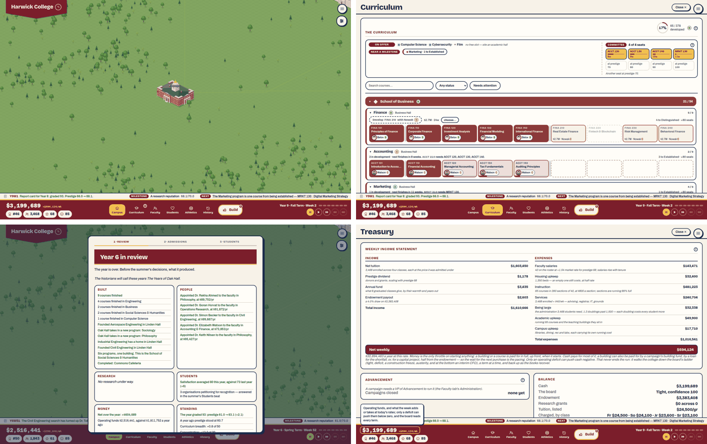
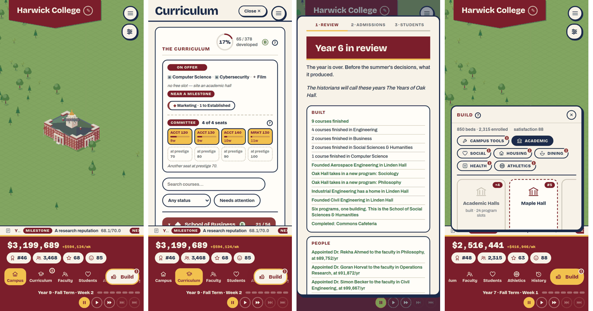
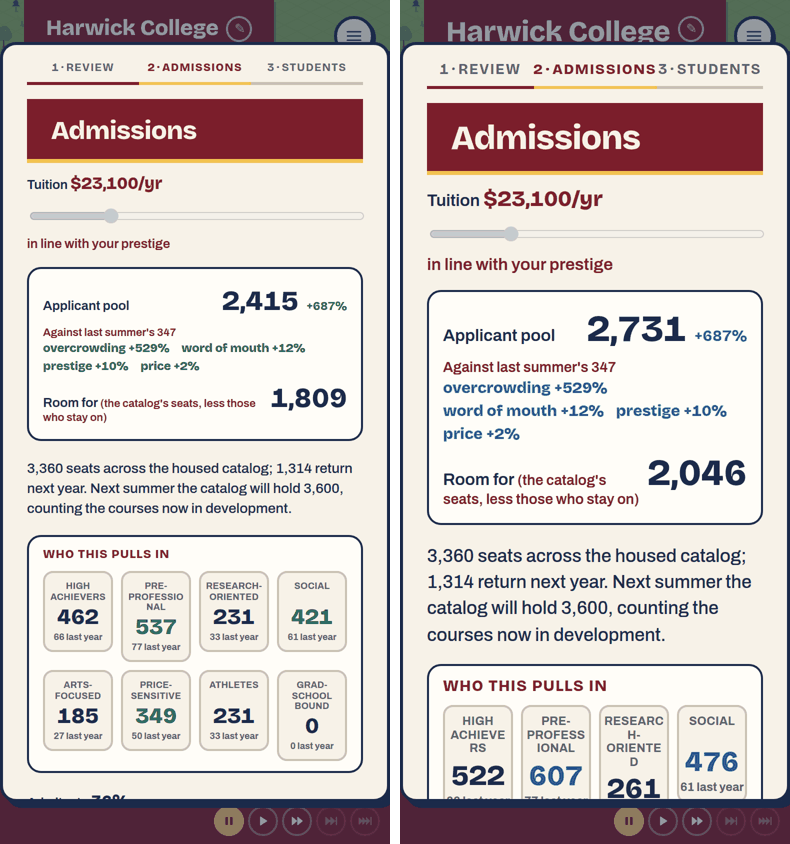

# 2. UI and text

Plan 73, area 2. Commit read: `58fa3fd`.

**What was done.**

| Pass | Tool or method | What it covered |
|---|---|---|
| Screen gallery | `npm run review:gallery` | 284 captures of every tab, the Build menu, the main menu, Settings, a hall panel and each modal held in eleven scenario saves (year 1 to year 50), at 1440×900 and 390×844. Each capture is counted for words, controls and scrolling. Full table in [`data/gallery.md`](data/gallery.md). A second pass ran at the largest text size, with colour-safe signals and reduced motion. |
| String table | `npm run review:strings` | Every player-facing string in `src/`: 6,821 strings, 47,015 words, tagged by screen, with the house style's automatic checks. |
| Consistency | an audit | Against `docs/architecture/ui-shell.md` and Plan 47 → [`2c-consistency.md`](2c-consistency.md). |
| Voice | an audit | 3,711 strings (20,138 words) outside the events and courses, read end to end → [`2d-voice.md`](2d-voice.md). |
| Course descriptions | an audit | All 431 sentences, school by school → [`2a-course-descriptions.md`](2a-course-descriptions.md). |
| Flavor against the code | an audit | Every blurb, letter, promise, hint and event that could imply a mechanic, 1,261 claims → [`2b-flavor-and-mechanics.md`](2b-flavor-and-mechanics.md), row-by-row verdicts in `data/`. |
| Hands-on | area 3's session | Where the words and controls helped or got in the way. |

The four audits were each done by a separate reader working from the same instructions. This file checks their headline claims against the code and summarizes them. Every row in the appendices cites a file and line.

## The screens

**Words and controls per screen.** The top layer only (the open dialog or tab) is counted. The word counts include everything reachable by scrolling.

| Screen | Year 1 | Year 8 | Year 16 | Year 25 | Year 30 | Scrolls |
|---|---:|---:|---:|---:|---:|---|
| Map and dock | 35 w / 15 c | 101 / 44 | 169 / 86 | 198 / 100 | — | no |
| Curriculum | 298 / 37 | **2,244 / 282** | **3,649 / 474** | 1,340 / 181 | 573 / 74 | yes |
| Faculty | 297 / 26 | 671 / 72 | 758 / 84 | 753 / 84 | 759 / 84 | yes |
| Students | — | 603 / 9 | 679 / 9 | 900 / 9 | 866 / 9 | yes |
| Athletics | — | 263 / 20 | 611 / 50 | 1,144 / 65 | **1,781 / 112** | yes |
| History | — | 1,227 / 8 | 1,720 / 8 | 1,982 / 10 | **2,166 / 10** | yes |
| Treasury | 423 / 16 | 526 / 21 | 545 / 13 | 586 / 21 | 586 / 21 | yes |
| Build menu | 26 / 7 | 117 / 21 | 71 / 12 | 35 / 12 | 35 / 12 | no |
| Summer (Review, Admissions ×2, Students) | — | — | — | — | 303 + 32 + 199 + 82 | Review, reveal |

The Curriculum's count falls in the late saves because finished programs collapse. The year-6 summer ran 410 + 32 + 200 + 86 words.

**Load by moment.**
- **The first hour.** The walkthrough (307 words), the founding notes (113), the year-one letters (about half of the opening letters' 784), the first milestone notes and the first summer (about 700). That makes roughly 1,500–2,000 words before year two. **The reviewer's judgment:** about right for the genre, and well paced by the letters.
- **The busiest moments** are the tabs a player opens to act: the Curriculum at years 8–16, and History and Athletics from year 25. They are single scrolling pages of 2,000–3,600 words, and the one screen that must be read, the Curriculum, is the heaviest.
- **A summer** is 600–730 words over four beats. It is the best-paced text in the game.

**What earns its place.** Each screen rated compelling, useful or superfluous. This is **the reviewer's judgment**, from the gallery and the session.

| Screen | Rating | Why |
|---|---|---|
| Campus map | Compelling | The game's face. Area 1 covers what it lacks. |
| Summer Review | Compelling | The year as a story, with its numbers; the payoff of each year. |
| Admissions beat | Compelling | The year's one big decision, well explained (pool, factors, cohorts, projections). |
| Event panel | Compelling, when seen | Good prose and honest effect lines (area 3's A3-3 covers when it isn't seen). |
| Founding form | Useful | The facade preview is a delight; the name rule is silent (area 3). |
| Opening letters and walkthrough | Useful | They teach; the stale price (A2-2) and jargon (area 3) are the exceptions. |
| Students tab | Useful | The breakdown answers "why"; it should open in year one (A3-4). |
| History › Standing | Useful, buried | The only explanation of prestige, inside a 2,000-word tab with the chronicle and the rivals. |
| Treasury | Useful, dense | Every line explains itself. The 90-word paragraph under the statement could fold after a first read. |
| Curriculum | Useful, overloaded | See A2-1. |
| Faculty, Athletics, Research | Useful | Athletics grows to 1,781 words by year 30. |
| Build menu | Useful | Red "!" badges on nearly every category mean nothing (area 3). |
| Milestone notes | Mostly superfluous | Up to 85 a run (area 4); fold into the summer. |
| Research-complete modals | Superfluous | Up to 52 a run (area 4); a log line would do. |
| Activity log | Useful, noisy | Market notices ("Dr. X (Physics) is on the market") are most of it. |
| Final Report | Compelling in idea | Its titles misread strategies (area 4, A4-4). |

## Findings

### A2-1. The Curriculum tab is the heaviest screen, and the one a player must use — major, M

**What.**
- At year 8 the tab is 2,244 words and 282 controls on one scrolling page. In the year-16 save it is 3,649 words and 474 controls.
- It carries the course cards, the develop buttons, the instructor chips, the committee and the offers.
- Its "Needs attention" filter flags only D and F courses (`CurriculumTab.tsx:987`). The B and C courses that cap prestige have no filter (area 4).

**Fix.**
- Collapse each program to one line: the grade, "n/9", the next course, and its one action. Expand only on demand.
- Add grade filters: "below A", and "no instructor".
- Keep the committee and offers pinned at the top.

M.

### A2-2. Flavor text promises mechanics the game doesn't have — major, M

**What.** Three readers checked every line of flavor that could imply a mechanic against the code that runs:

| Scope | Claims | True | False | Vague |
|---|---:|---:|---:|---:|
| Building blurbs, identity tags, quirks, research, clubs, Final Report phrases | 773 | 712 | 17 | 44 |
| Letters, promises, campaigns, seats, ladder, figure hints, help hints | 215 | 141 | 26 | 48 |
| The event catalogue (154 events, 112 tellings, 373 choices) | 273 | 100 | 66 | 107 |
| **Total** | **1,261** | **953** | **109** | **199** |

The worst, each verified against the code:

- **The letter "A hall of its own" quotes a stale price.** It says "three quarters of a million, sixteen weeks to build" (`eventData.ts:1150`). The build menu says $2,500,000 and 26 weeks (`techData.ts:77-79`). Every player reads it in year two.
- **Event choices contradict their labels.**
  - "Cut this year's spending" costs $1.5M (`recession`).
  - "Dry out and repair" adds $800k of backlog (the flood, `eventCatalogue.ts:1948`; see area 1's A1-6).
  - "Let the boosters pay for the scoreboard" pays the college and buys nothing.
  - "Fill the post", "Hire, whatever it costs" and "Deny, with a year to find something" hire or remove no one.
  - "Teach out … and close it", the default in `program-thin`, can't happen, because programs can't close.
  - The underlying facts: no event effect can hire, retire, open or close anything, or place anything on the map, and the game never remembers which answer was chosen (`catalogue.ts:260-347`).
- **Placeholders point at the wrong thing.**
  - `{building}` is any roofed building (`catalogue.ts:210`). So the town's "eyesore" letter, which fires because *some* building is derelict, named buildings at condition 0.94 and 0.74 in the simulated runs.
  - `{faculty}` is any professor, described as "on leave" or as the star.
- **Money promise titles give the wrong target.** "A hundred million in the fund" is judged against $100M times a price scale of 0.2–12×, which rises with the college's budget (`catalogue.ts:147,156-159`). The title is the player's only statement of the goal.
- **Campaign money for "the beds it paid for" funds whatever building comes next** (`techSystem.ts:260,298`). The Restoration Campaign can never fund a renovation, which is cash only (`reducer.ts:346-354`).
- **Board confidence, which many answers move, matters almost nowhere.** It gates six events and one promise goal and is shown in the Treasury. No rung, budget or dismissal reads it (`distress.ts:181-189`).
- **Two identity tags claim effects that don't reach the game.**
  - Teaching College says "one point less attrition a year". The point shows in the admissions preview but isn't applied when the class is admitted (area 7).
  - Jock School says "every team six points stronger". The six points never reach a team's quality (`2b`, blurbs section).

**Why it matters.** The code states the rule itself ("apply() does exactly what this says", `eventData.ts:215`). 109 false claims teach players that the text lies, and then they stop reading it.

**Fix.** Fix each false claim in the appendix, by changing the words or the effect. Then add a test that fails when an event choice's label names a lever (hire, close, draw, salary, repair) its effects don't touch. M.

### A2-3. Money and figures are written several ways — major, S

**What.**
- Build tiles say "$3,000,000 · 26w". Curriculum cards say "$2.7M · 24w". A coach's salary is "$…k/yr" in the team row and "$85,400/yr" in the market below it (`BuildPopup.tsx:455/457`, `AthleticsTab.tsx:77/176`).
- Prestige reads "68" in the dock and "68.1/70.0" in the ticker. At 69.5 the dock rounds to 70 while the 70.0 milestone is still unmet (`AnimatedNumber.tsx:67` against `LogTicker.tsx:26`).
- Below 55, the dock's satisfaction figure turns a pink meant for the dark band, on a cream chip: a 1.57:1 contrast, and 1.42:1 in colour-safe mode (`StatusHeader.tsx:145`, `styles.css:185`). The warning goes pale just when it should stand out.

**Fix.**
- One money helper: long form in statements, short form everywhere a price is compared.
- One precision per figure.
- A dark red on cream for the low-satisfaction state.

S.

### A2-4. The voice slips in the places every player reads — minor, M

From [`2d-voice.md`](2d-voice.md): 172 issue rows over 155 strings.

- **Engine words in the prose.** "The weekly tick", "the run", "Students beat", "interrupts play", "revealed", "throttle", "pacing". The speed setting is also described as if the college's year ran faster: "The year can run at up to eight times."
- **One thing, many names.**
  - A hall's places are "slots" in 19 strings and "rooms" in others, one line apart (`ladderData.ts:125-126`).
  - "Seat" has five meanings.
  - "Ladder" names two systems.
  - Code names leak through: "the wall", "housed", "recreation chain", "cohort signal".
- **The rankings and admissions modals cheer.** "You've entered the rankings", "you're ranked", "Big movers", "sticker shock will bite". Every player sees these, and they are the only place the game calls the college "you".
- **British English.** 40 rows on these screens (9 of the scanner's flags confirmed, 21 more found), and more in the events ("car park", "lift", "rota", "porters", "queue", "torch") and in the courses ("analyses" ×23).
- **Plan 47's own rules slipped.** The summer Review labels catalogue letters "from the board" (`yearInReview.ts:228`). "Keep {weeks} wk" breaks the "Nw" rule. Three confirm labels don't say what is lost. Starting over has three names: "New game", "Found a new college" and "Found another college".

**Fix.** A glossary in Plan 47, one word per thing. A pass on the rankings and admissions modals in the house voice. The missed words added to `tools/review/strings.ts`'s checks, so they stay caught. M.

### A2-5. Course descriptions: good overall, with real errors in places — minor, S

From [`2a-course-descriptions.md`](2a-course-descriptions.md):

| School | Courses | Flagged | Notable |
|---|---:|---:|---|
| Social Sciences & Humanities | 66 | 22 | The JD lacks Professional Responsibility; one survey template reused across majors; "the constitution" in lowercase. |
| Engineering | 58 | 24 | Prerequisites out of order (CHEN110/130, CIVE110/130); AERO101's title is an advanced course; Chemical Engineering's major is not a plausible sequence. |
| Science | 58 | 22 | Three wrong closing phrases: MATH220 "the impossibility of solving the quintic" (by radicals); MATH230's topology "classifies" surfaces and knots; CHEM220 "the crystallography behind" spectroscopy. Biology uses "from X to Y" in five of nine. |
| Health Science | 70 | 18 | The MD is the weakest program: MED550 and MED610 misplace the clerkships and the sub-internship, and there is no internal medicine, pediatrics or obstetrics. Nursing does not read as a BSN. |
| Arts & Media | 58 | 5 | The cleanest school; a music-history survey skips the Baroque. |
| Business | 63 | 16 | Advanced Microeconomics at 130; Strategic Management (a capstone) at 140; no Intermediate Accounting. |
| Computer Science | 58 | 19 | OS and web development levels swapped; one doctoral template shared by all six doctorates' 730 course. |
| **Total** | **431** | **126 (29%)** | 24 accuracy flags, 22 level or sequence flags, the rest voice and repetition. |

Across the catalogue:
- No course is numbered above 200 (no 300- or 400-level work).
- "From X to Y" is overused (27 of 108 in Engineering and Science).
- The repo's own test misses sentences that restate their title.

**Fix.** The appendix gives a proposed sentence for every flagged course. S per school.

### A2-6. Buttons and headings have no system — minor, M

From [`2c-consistency.md`](2c-consistency.md), 58 departures:
- 39 distinct button looks in 14 families over 213 buttons. "Quiet" buttons (New game, Put it down, Wind up, the Settings options) wear the pale outline that means disabled. "Show the rest of the market (38)" is a browser-default grey box (`AthleticsTab.tsx:200`).
- Close controls come in six looks with two glyphs.
- Confirmations are built by hand outside `ConfirmButton`, with labels that don't say what is lost.
- Screen titles range from 13 px capitals to 44 px, and the Faculty tab mixes a small-caps eyebrow with unstyled browser-bold h3s.
- 17 font sizes (9 off the scale) and 30 spacing values, with no spacing scale.

**Fix.** One button base (outline, offset, fill by role), one close control, `ConfirmButton` everywhere, a heading scale. M.

### A2-7. The phone layout crowds the map and breaks words — minor, S

- The dock (figures, tabs, clock) takes about 30% of the screen. The Build button overlaps the last visible tab ("A[thletics]").
- The admissions cohort labels break mid-word, even at normal text size ("PRE-PROFESSIO NAL"). At the largest size it gets worse ("HIGH ACHIEVE RS", "RESEARC H-ORIENTE D"), and the beat headers run together ("2·ADMISSIONS3·STUDENTS").
- The Build menu's cards are cut off by the dock, showing one and a half cards.
- A long college name wraps the pennant to four lines, which covers the menu and map-tools buttons.

**Fix.**
- Hyphenate or shorten the cohort labels ("Pre-prof.").
- Make the beat headers wrap.
- Let the dock collapse to the figures while a panel is open.
- Cap the pennant at two lines with an ellipsis.

S each.

### A2-8. The register is out of date — polish, S

`docs/architecture/ui-shell.md` no longer matches the code on:
- the tabs (one Students tab, four gated tabs);
- the speeds (five gears, 8× on key 4);
- the toasts (6 seconds, at most 4);
- `--mono` (Azeret Mono);
- the palette (more than "one red");
- the camera (touch buttons);
- the `L` key.

Plans 18 and 22 each make a claim that no longer holds (`2c-consistency.md` §5). Fix: update the register when A2-6 lands. S.
