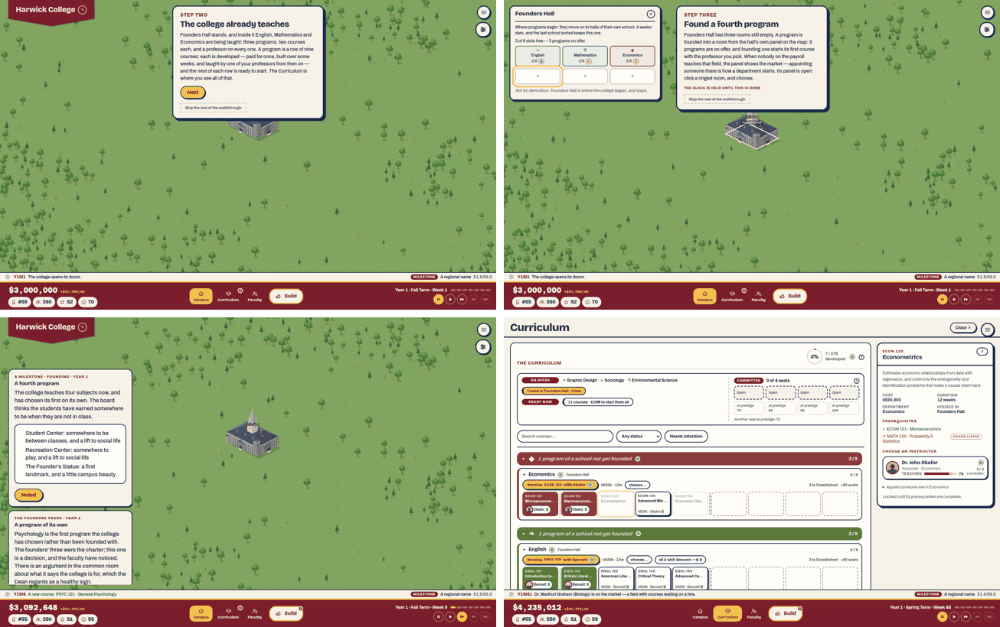
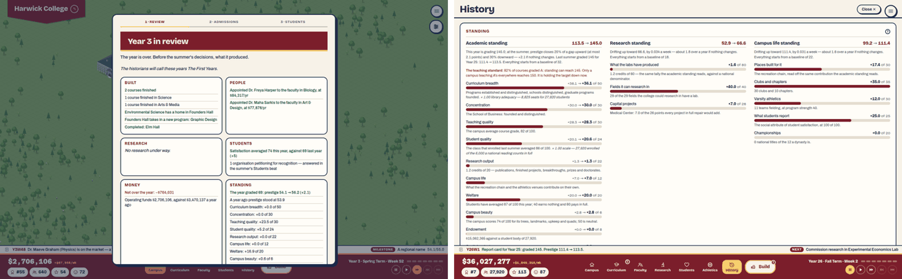
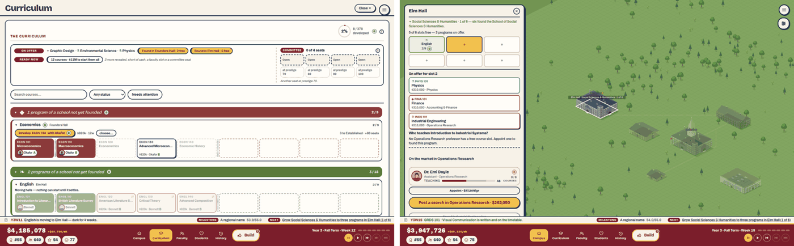
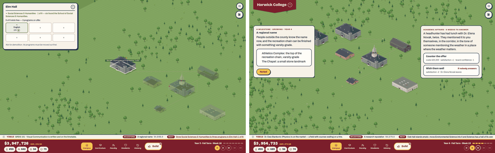

# 3. Intuitive gameplay

Plan 73, area 3. Commit read: `58fa3fd`.

This area asks whether the game teaches itself. It rests on three sources:

- **A hands-on session.** A new college ("Harwick", Collegiate Gothic, maroon and gold) was played from a clean browser to the fourth year. It was driven a few steps at a time with `tools/review/drive.mjs`, using only what was on screen, at 1440×900. Every doubt was logged with a screenshot, 80 in all.
- **The nine problem traces the plan names.** Where the session met a problem, the trace uses that moment. The others start from scenario saves (`npm run scenario`), loaded with the drive tool's `load=` step.
- **The code behind each answer**, cited, so each "can a player find it?" verdict says where the answer lives.

**The limits.** The reviewer is a model, not a human player. "Doubt" means "the screen did not say what to do or why". Reading time was not measured. The owner's playtest (70L) is still the test of feel.

## The new player's first years

| When | What happened | Doubt? |
|---|---|---|
| Title | A text menu with no picture of a campus. "Found a new college". | No, but see area 6: nothing on the first screen shows what the game looks like. |
| Founding | Typed "Harwick University". The stone facade preview shows HARWICK COLLEGE, and nothing says why "University" went. This is by design (`StartupScreen.tsx:14-17`: "The player writes only half the name… no caption is needed"). The vernacular gives no hint that it is looks only. There are eight colour pairs (the docs say ten). | **Yes.** Where did my name go? |
| Y1 W1 | The letter "The doors open" is clear, and the clock is held. The four stat chips (#55, 350, 52, 70) have no labels; the words appear on hover only. | Mild |
| Walkthrough step two | The coach card is pinned top-centre and covers Founders Hall the moment it is placed (image below, top left). | **Yes.** I can't see what I built. |
| Walkthrough step three | Founders Hall's panel says "4 weeks dark, and the last school sorted keeps this one". The offers show a field and a cost, not the school they belong to. | **Yes.** Jargon in minute two. What does the choice mean? |
| Founding the fourth program | "Who teaches General Psychology? Dr. Elena Novak". Her salary isn't shown and she is hired silently. Later hires do show a salary. | **Yes.** Is she mine? What does she cost? |
| After step three | The walkthrough ends and the clock runs. There is no NEXT line in year 1 between letters (`nextStep.ts:254`). Weeks 5–9 have nothing to do. Satisfaction falls from 70 to 55 and prestige from 52 to 51. | **Yes.** Why is it falling, and what should I do? |
| Y1 W4 | Two notes stack on the left. The second's "Noted" button falls behind the dock at 1440×900 (image, bottom left). | Yes |
| Y1 W9 | The letter "Somewhere to sleep, somewhere to eat" explains, and asks for a dorm and dining. | No. Good. |
| Y1 W28 | Satisfaction is at 43 after the dorm opened. The Students tab, which holds the breakdown, opens only at the first commencement (`ladderData.ts:112`). The chip's tooltip is generic. | **Yes.** No way to see why in year 1. |
| Curriculum | ECON 120 is greyed and the card says nothing. A click opens a drawer showing prerequisite MATH 120 (cross-listed) ✗ (image, bottom right). | Mild; one click. |
| Y1 summer | The review beat is rich, though it has "The class of 1". The blind price comes with tier text. The pool is 285 and the room 297, yet the admit rate opens at 36%, taking 103. The Students beat's causal hint is good ("clubs form once the campus has a Student Center"). | Mild: why is the default admit rate low? |
| Y2 | The NEXT line appears. The Students tab gives served counts and sources. Good. | No |
| Y2 letter "A hall of its own" | Says "three quarters of a million, sixteen weeks to build". The build menu says $2,500,000 and 26 weeks. The letter is stale (area 2). | **Yes.** Which is true? |
| Y2 admissions | The pool is 1,406 (+393%), with "overcrowding +312%". That reads as crowding tripled, but it means crowding eased. | Yes |
| Y3 W11 | The letter "A school takes shape" says to found every Social Sciences program into Elm Hall and anything else into Founders Hall. TO DO: grow Social Sciences to three programs in Elm Hall. | No |
| Y3 W12 | None of the three offers (Graphic Design, Environmental Science, Physics) is Social Sciences (image below). | **Yes.** How do I grow it? |
| Y3 W12 | Physics can't be founded: no Physics professor is free and "No Physics candidates are listed this week… or pay for a search ($279,130)". | No. A clear answer. |
| Y3 W12 | Founded Environmental Science, then Graphic Design, into Founders Hall. The refills drew Finance, then Industrial Engineering. Still no Social Sciences, and Founders Hall is full. | **Yes** (trace 7) |
| Y3 W18 | Six weeks at 1×: the offers haven't changed. Elm Hall's panel offers Industrial Engineering for its slot 2 and gives no warning. | **Yes.** The trap is one click away. |
| Y3 W18 | Clicking the NEXT line ("Grow Social Sciences & Humanities to three programs in Elm Hall (1 of 6)") opens Elm Hall, where nothing Social Sciences can be done. The step that can be taken, moving Sociology out of Founders Hall, is in another panel. | **Yes** |
| Y3 W18 | After moving Sociology by hand, the line becomes "Science has no hall of its own — site Oak Hall". Placing is clear ("Click open ground to break ground · R turns it · Esc puts it down"). | No. Good. |
| Y3 W27 | At 2×, "A tenure case has reached the President's desk. — Nobody answered in time: Deny, with a year to find something." I never saw it. | **Yes.** A decision made for me. |
| Y3 summer | The Review lists ten prestige terms, including "Curriculum breadth +0.0 of 50", with nothing on what moves them. The Admissions beat is the first place that says "688 students next year, for 350 beds". | Yes |
| Y4 W11 | At 2×, a student's national prize: "Nobody answered in time". | **Yes** |
| Y4 W19, W28 | Two events caught on screen, each reading "0 weeks to answer". | Mild. "0 weeks" means "last week". |

**Summary.** The game teaches its first moves well: the three-step walkthrough, the letters, placing, and the summer. The doubts gather in three places.
1. **The first year.** Nothing to do between letters, and satisfaction falls with nothing to read about why.
2. **The move from Founders Hall to school halls.** It rests on a random offer queue the player can't steer.
3. **Events that pass while the clock runs.**

## The nine problems, traced

Each trace follows the route a player would take from the moment the problem shows. Verdict: **yes** (a player finds the answer on screen), **with effort** (it exists but is not signposted), or **no**.

| # | Problem | Where the answer lives | Clicks | Verdict |
|---|---|---|---|---|
| 1 | Raise prestige | The summer Review lists the ten terms of the grade, without the "how". History › Standing lists each term with a line saying what moves it, plus the rule that prestige closes 20% of the gap each summer, at most 2.1 points (`prestigeSystem.ts:364-380`). The prestige chip's tooltip names the inputs but doesn't point there. History opens only at the first commencement. | 1–2, once History exists | **With effort** |
| 2 | Why a course can't be developed | The course card is greyed and silent. Its drawer lists prerequisites with ✓/✗, and cross-listed ones are marked. | 1 | **Yes**, one click late |
| 3 | Why basic needs is low | Students › Satisfaction breakdown: each need's weight, "served / enrolled", and "Show sources". From year 2 only (`ladderData.ts:112`). | 1 | **Yes** from year 2; **no** in year 1 |
| 4 | Cash in the red | The Treasury explains it in its own words: "Only an operating deficit can push cash negative. That never ends the run: it walks the college down the board's ladder…". The board writes from the Deficit rung down (`distress.ts:12-14`), and "The board has written" tops the NEXT line (`nextStep.ts:44`). The scenario save (`crisis`) is synthetic: cash −$2M against a +$5.2M week, so no rung had begun. | 1 | **Yes** |
| 5 | An unstaffed course | The NEXT line's first rule: "X is dark — a course has no instructor; staff it from the market", marked urgent (`nextStep.ts:209-219`). The Curriculum tab has an "Unstaffed" filter and a "Needs attention" toggle. Not met in the session. | 1 | **Yes** (by code and filter) |
| 6 | A program that can't be founded | Met in the session. The founding panel names the missing professor, says the market has none this week, and offers a paid search. | 0 | **Yes** |
| 7 | A school that can't be founded (the split-school trap) | Met in the session (A3-1). The ask can't be served from the offers, the offers refill only on founding, and the claimed hall offers other schools' programs without a warning. The NEXT line does name the way out ("site Oak Hall"), but only after a move the line never mentioned. | — | **No**, until the second hall |
| 8 | Satisfaction falling | Students › breakdown, plus "Satisfaction target 71.7 → 77.7 / Satisfaction today 35.0" (the `crisis` save): today drifts toward the target, so the gap says how far and which way. Student demands appear below 60. | 1 | **Yes** from year 2 |
| 9 | The rank stalling | History › Standing: prestige moves only at the summer, by at most 2.1 points (at year 25: 113.5 grading 145). The rank chip's tooltip ("Place among 100 colleges… sorted by prestige") doesn't say that rank follows prestige's summer step. | 1–2 | **With effort** |

## Findings

### A3-1. The second hall can deadlock a new player — major, M

**What.** "A school takes shape" asks the player to grow a school in its new hall. Three things stand in the way:
1. The offer queue serves the ask only by chance. It is three programs, weighted by each started school's housed majors squared (`programOffers.ts:13-21`), with "No reroll, no decline" (`:8-11`). It refills only when a program is founded.
2. Once Founders Hall is full, the only free slots are in the claimed hall.
3. That hall's panel offers other schools' programs for its slots, with no warning that one would take a room the school needs.

In the session:
- The three draws gave Graphic Design, Environmental Science, Physics, then Finance, then Industrial Engineering. Social Sciences had two majors housed and Science three, so Science outdrew it.
- Six weeks of waiting changed nothing.

**Why it matters.** It stalls the game's central loop, building schools, at its first real decision. The easy mistake (founding the offered program into Elm Hall) is the split-school trap the plan names.

**Fix.**
- A claimed hall's "+" should offer its own school's revealed programs, not the global three.
- Let the player decline one offer a year.
- Confirm before a program goes into another school's claimed hall: "This takes one of the six rooms Social Sciences needs."

M.

### A3-2. The NEXT line points at the wrong panel — major, S

**What.**
- The "school takes shape" ask always goes to the claimed hall (`eventData.ts:1236-1237`, `go: 'hall', hallId: claim.hallId`).
- Its intent may be a move from another hall (`moveIntent`, `:1238`). The text never says "move Sociology".
- So a click on the line opens a panel where nothing can be done (image below, left).

**Fix.**
- When the intent is a move, name the program ("Move Sociology into Elm Hall") and open the hall it is in, with its move button showing.
- When the intent is `wait`, say what is being waited for: "…when a Social Sciences program is offered; founding anything draws the next offer".

S.

### A3-3. Events pass while the clock runs — major, M

**What.**
- Inline events never stop the clock (`catalogueEngine.ts:12-16`). Each takes its default after 2 to 6 weeks: 92 of the 154 catalogue events after 3 weeks, 26 after 2.
- In weeks of real time, 3 weeks is:
  - 15 seconds at 1×;
  - 7.5 seconds at 2×;
  - under 2 seconds at 8×.
- At 2× in the session, two of the four events in a year and a half were decided by default before I saw them: a tenure denial and a student's prize.
- The panel says "0 weeks to answer" in the last week, because the countdown is `timeoutWeeks − elapsed` (`EventPanel.tsx:104`) and the default is taken when it reaches zero.

**Why it matters.** A decision the player never saw arrives as a log line reading "Nobody answered in time". Some of these defaults cost the college a professor.

**Fix.**
- Give each event a minimum real-time window, such as 20 seconds, whatever the speed.
- Or pause at 4× and above when one arrives. Players of fast-forward sims expect that.
- Say "last week to answer" for the final week.
- The seats already answer by policy, which is the right answer for a player who doesn't want the decisions.

M.

### A3-4. Year one is quiet, and satisfaction falls unexplained — major, S

**What.**
- After the walkthrough, year one has no NEXT line between letters (`nextStep.ts:254`: year 1 shows only a letter's ask).
- Satisfaction falls from 70 to 43 as the first students crowd in.
- The breakdown that would explain it is on the Students tab, which opens at the first commencement (`ladderData.ts:112`).
- The satisfaction chip's tooltip is generic.

**Why it matters.** The first year is where a new player decides whether they understand the game. It shows a number falling and nothing to read or do about it.

**Fix.**
- Open the Students tab's breakdown from the start (keep the guidebook, identity tags and clubs gated if that is the point).
- In year one, let the NEXT line fall back to the shortfall rule ("Housing is at 38 — build for it") between letters.

S.

### A3-5. The chips don't lead to their explanations — minor, S

**What.**
- The prestige, rank and satisfaction chips have tooltips, not destinations. The Treasury chip does open the Treasury.
- The answers to "how do I raise prestige?" and "why is my rank stuck?" are one tab away, in History › Standing. That tab exists only from year two.
- The summer Review lists the ten terms without the one line each that says what moves it. The line exists: it is the detail text on History › Standing.

**Fix.**
- Clicking the prestige or rank chip should open History › Standing. Clicking the satisfaction chip should open Students › breakdown.
- Show each term's detail line under it in the summer Review.

S.

### A3-6. Jargon in the first minutes — minor, S

- "4 weeks dark, and the last school sorted keeps this one" (Founders Hall's panel, step three).
- "Committee 0 of 4 seats" with four boxes marked "Open". It means none in use, and reads as none available.
- Unlabelled "B" grade chips beside counts ("8 / 378 developed B").
- Red "!" badges on every Build category at once, with no key.

Area 2's voice audit lists the rest. Fix: plain words at first use ("a moving program closes for four weeks"; "whichever school leaves last keeps Founders Hall"), a label on each chip, and one badge meaning ("something new to build here") explained in the Build menu's help.

### A3-7. Smaller doubts — minor or polish, S

- The coach card covers the building it has just asked for. Pin it away from the placed building, or to the side.
- Stacked notes overflow behind the dock at 1440×900. Cap the stack at two and collapse the rest.
- A greyed course card says nothing. Put the drawer's reason in its tooltip ("needs MATH 120, cross-listed").
- The founding form drops "University" silently. See the charter below.
- The first hire's salary isn't shown ("Who teaches General Psychology? Dr. Elena Novak"). Later hires show "Appoint · $84,317/yr". Show it here too.
- The admissions default leaves seats empty (21% admitted when 38% fills the room) and doesn't say why. If the reason is beds, say so: "admitting more crowds 350 beds".
- "overcrowding +312%" names a factor without its direction. Say "crowding eased: +312%".
- "The class of 1" and "The class of 3" read as a count. Say "The first graduating class", "The class of Year 3".

## The charter: College, then University

**Now (Plan 72E).** Every college opens as "X College". When a first lab is at work, the trustees grant the charter in a quiet week, with a log line and a rename on the pennant. The player types only the first half of the name, and the founding facade shows "X COLLEGE" whatever was typed.

**Against real practice.** Renaming on a change of status is common in the United States:
- Trinity College became Duke University (1924).
- The Rice Institute became Rice University (1960).
- Many state colleges became universities in the 1950s to 1970s, when they added graduate work.

Keeping "College" is just as real: Dartmouth College, Boston College, the College of William & Mary. Tying the step to research, and so to graduate work, is sound. **The reviewer's judgment:** the milestone is meaningful. What is arbitrary is taking the choice from the player twice. They can't type the name they meant, and they can't keep the name they have.

**Recommendation.**
1. **At founding**, let the player type any name. If it ends in "University", show a one-line caption under the facade: "Every college opens as a College; the trustees grant 'University' with its first research lab." Keep the facade honest.
2. **At the charter**, make it a short letter with a choice rather than a log line: "Become X University" (the default) or "Keep the name X College". Keep the log line for players who have skipped the letters.
3. Leave the timing (first lab at work) as it is.

This costs one letter and a caption, S, and turns an arbitrary rename into the player's first ceremony.
